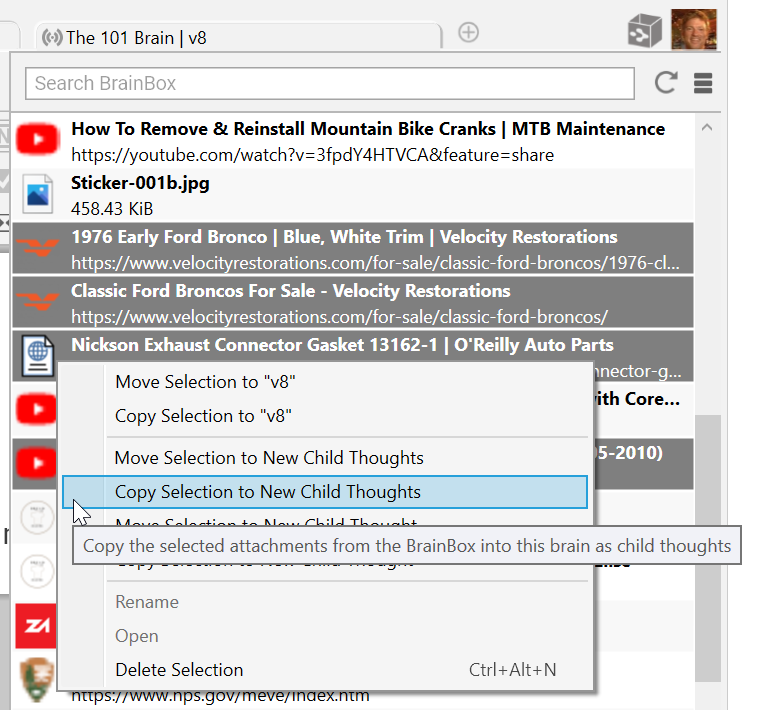

## **BrainBox**

BrainBox lets you send information to your brain quickly and easily. Just click the icon in the top-right corner of TheBrain for Windows or macOS for instant access. Use BrainBox for adding information on the go, from your desktop, from the web, anything that you want to quickly capture into your brain, to be categorized later.

To add content from the web tnsion in

your preferred browser. Go to and follow the instructions there.

**Accessing BrainBox**

**The BrainBox Button**

At any time, when you have a brain open, use the **BrainBox** button in the upper-right corner of the window to add previously captured content into your brain. 1. Click on a brain to open it.

2. Navigate to the desired thought where you want to add your content. 3. Click on the BrainBox icon to display its content.

4. Hover over or click any item to display the choices for the item.

**Figure 260. The BrainBox Button**

5. From here, the file or web page can be:

- Added as an internal attachment on a new child thought below the current active thought. The new thought name will be the file or web page name

- Added as an internal attachment to the active thought

- Opened in its default application

- Renamed, deleted and other actions applied from the context menu button

- The context menu will also allow you to either **Move** from BrainBox to the active thought or **Copy** from BrainBox

**The BrainBox Tab**

An alternative way to view and manage the content of your BrainBox is available by opening BrainBox in its own tab.

**To open BrainBox in its own tab:**

- Click the **Open BrainBox** button, click the drop-down **Show Commands** menu, then select **Open BrainBox in New Tab**.

**Figure 261. The BrainBox Tab**

Use the **BrainBox** tab to review, edit or delete existing content in your BrainBox. If you move your BrainBox tab to a new window, you can then drag and drop items into another Brain. You may also select multiple items in BrainBox at a single time to drag into a Brain or right click and delete.

**OR on**

**mouseover**

**Figure 262. Editing Content of The BrainBox**

1. Point to or click an item listed in the BrainBox to select it.

2. Use the context menu or the choices that appear on mouseover to: - Open item in its native application for preview

- Edit the file or link name

- Edit the URL

- Open in Explorer or Finder

- Delete the item from your BrainBox

Multiple items can be selected in BrainBox allowing you to move, copy or delete multiple items at one time

.

**Figure 263. Working with Multiple Attachments in BrainBox** Additionally, from the BrainBox **Show Commands** menu, you can access the cumentation available at

**Sending Web Pages to BrainBox**

Add information from any web browser with a single click. When you find a page you want to capture to be organized later in TheBrain, just click the BrainBox extension button or bookmarklet (depending on your browser).

You must be logged into your brain account at in the browser you are using in order for the web pagd into your BrainBox. If you are not logged in, clicking on the BrainBox extension from your browser will prompt you to do so in the status screen. Once you have logged in, return to the desired web page and click the BrainBox button again.

You can use the browser extension or bookmarklet from any computer, even if TheBrain application is not installed on that device.

**Figure 264. Clicking on the BrainBox Extension**

**Sending Files to BrainBox**

Send copies of individual files into your BrainBox to be organized and associated with thoughts at a later time. No additional setup for this feature is required.

**Windows File Explorer *Send to* Integration**

From Windows File Explorer, right-click on any file and select **BrainBox** from the **Send to** submenu. TheBrain will be started if it is not already running and the file will be added to BrainBox. To set up the Windows File Explorer integration, install and run TheBrain 13.

**Figure 265. Sending a File to BrainBox**

**macOS Dock Drag and Drop**

Launch TheBrain application if it is not running already. From any Finder window, drag and drop any file to TheBrain icon in the macOS Dock. The file will be added to BrainBox. You can also drag the icon from the title bar of many macOS apps.
