## **Customizing Thought and Link Properties**

You can change the colors of thoughts and links globally using the **Brain Theme** dialog box (see the Customizing a Brain’s Appearance section on page

42). This section explains how to view and manage the properties of individual

and selected thoughts and links. Changed settings override the global defaults.

**Changing the Properties of a Thought**

**To open the Thought Properties dialog box, use any of these methods:**

- Click the active thought, or

- Click the thought once to select it, then a second time to open the box, or

- **Alt**-click the thought (whether or not the thought is active), or

- Right-click the thought, then click **Show Thought Properties** on the context menu, or

- Click the thought to select it, click the **Thought** menu in the menu bar, then click the **Show Thought Properties** command

**Figure 122. Thought Properties Dialog Box**

Press the **Enter** key or click anywhere outside of the dialog box to close it and

save any changes.

You can use the **Thought Properties** dialog box to:

- Rename a thought

- Add or edit a thought Label

- Add or change a thought Type

- Add or change a thought Tag

- Mark the thought as Private or Public

- Customize the thought text or background color (just this thought; global

changes are done in the **Themes** window)

- Add or change the thought's icon

- Review the thought's creation/modification history and ID. The ID is not

normally needed but may be useful when troubleshooting.

- And, using the **Thought Properties** Actions Menu button (three horizontal

lines):

o Forget the thought

o Create a Pin

o Set as the Home thought

**Changing the Colors of a Thought**

While thought colors are set globally in the **Brain Theme** box, you can override

these settings for individual thoughts. To begin, activate the thought, then click

on it or **Alt-**click on any inactive thought.

Note that the individual changes you may make to thoughts, such as their color

and background, override the settings in the **Brain Theme** box.

**To change the text color of a thought:**

- In the Thought Properties box, click the upper color square, click the color of

your choice, then click outside of the box of colors.

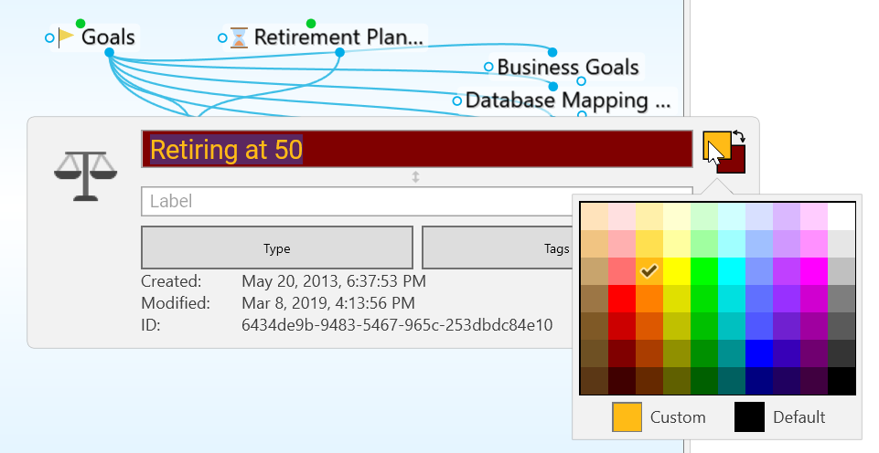

**Figure 123. Text Color in the Thought Properties Dialog Box**

**To change the background color of a thought:**

- Click the lower color square, click the color of your choice, then click outside of the box of colors.

**Figure 124. Background Color in the Thought Properties Dialog Box**

**To swap a thought’s text color with its background color:**

- Click the double-headed arrow next to the two color sample squares in the top-right area of the **Thought Properties** dialog box.

**Figure 125. Swapping Text and Background Colors**

You can use the same techniques to fine-tune new colors for thought text and

background as you can use to define colors globally in the

**Brain Theme**

box. Please see the Defining and Selecting Additional Colors section on page 45 for details.

**Adding a Label to a Thought**

Labels are hints that appear below thoughts when you point the mouse at the thought.

**Figure 126. A Thought Label**

**To add a label during thought creation:**

1. While typing a new thought name, add a pipe symbol (|) and anything after will become the thought’s label.

**Figure 127. Adding a Pipe Symbol During Thought Naming**

**To add a label to an existing thought:**

1. Activate the thought, then click on it or **Alt-**click on any inactive thought.

2. Type the text for the label in the **Label** field, then press the **Enter** key. When you point at the thought, the label text will appear in a box below the thought.

**Figure 128. Label Field in Thought Properties Dialog Box**

**Swapping a Thought’s Name with its Label**

You can swap a thought’s name with its label by clicking the **Switch** button (double sided arrow) in the **ThoughtProperties** dialog box. This can be very useful when the default label and name are assigned based on a URL and the automatic naming isn’t optimal for your purposes.

**Figure 129. Swapping Label and Thought Names**

**Adding an Image to a Thought**

In any thought, you can attach an icon from TheBrain’s built-in selection, an image from a file of your own, an image from notes or attachments in the active thought, or a screen capture. These pictures provide a visual boost to your brain. When you point to the icon next to the thought, the picture zooms to a larger size automatically.

**Figure 130. A Thought Icon**

**To insert an icon from TheBrain’s built-in icon library:**

1. Click the thought icon box in the upper left of the **Thought Properties** box, then click the **Select Stock Icon** command.

**Figure 131. Select an Icon from the Built-in Library**

2. With the Browse radio button selected, click any of the categories in the left panel. (See the TheBrain Icons section on page 236 for more about icon choices.) Click an icon of your choice to add it to the thought. The **Thought Properties** dialog box will close automatically when an icon is selected.

**Figure 132. Icon Choices**

**To insert an image from a file as a thought icon:**

1. Click the thought icon box, then click the **Choose File** command.

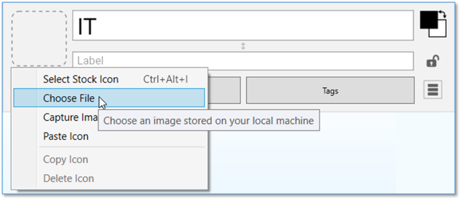

**Figure 133. Choose a File to Use as an Icon**

2. Navigate to the file of your choice, then click the **Open** button. Supported file formats for images include .jpg, .png, and .gif.

**To create a thought icon from an image in the Content Area:** - Click the image to select it, right-click it, then click the **Copy to Icon** command in the context menu.

**Figure 134. Copy to Icon Command in the Image’s Context Menu**

**To create a thought icon from one of its attachments:**

- Right-click the attachment, then click the **Copy to Icon** command in the context menu.

**Figure 135. Copy to Icon Command in the Attachment’s Context Menu**

The new icon will appear to the left of the thought name at the top of the content area and on the active thought in the plex.

**Figure 136. Thought with its New Icon**

**To insert a screen capture of an image as a thought icon:**

1. Make sure the screen item you want to capture is visible, then activate the thought and click on it or **Alt**-click on any inactive thought.

2. Click the thought icon box, then click the **Capture Image** command.

**Figure 137. Capture Something on the Screen to Use as an Icon**

3. Your brain will be hidden temporarily and red cross hairs will appear on the screen. Drag a rectangle around the area to be captured by dragging the mouse in a diagonal line from one corner of the rectangle to the opposite corner, then releasing the mouse button.

**Figure 138. Using the Crosshair to Capture an Image**

4. When you release the mouse, the image will be in the Icon area of the **Thought Properties** dialog box.

**Tip:**

To capture from the Brain window itself, press the

**Tab**

key to toggle its visibility. You will see the crosshairs and you can drag to select the area of your choice.

While the captured item will become a picture, the source can be anything―a company logo, a photo, or part of an Excel worksheet or PDF file.

**To paste an image you copy from somewhere else:**

1. Copy the image using standard techniques. For example, you may right- click an image on a web page, then click the **Copy Image** command.

2. After the image is copied, from the **Thought Properties** dialog box, click the thought icon box or right-click on a thought in the plex and select the **Paste Icon** command.

**Figure 139. Capture Something You’ve Copied to Use as an Icon**

**To copy an image from the thought to someplace else:**

Images you capture can be copied and pasted as attachments, pasted into notes or the plex, or used as icons.

1. Click the thought icon box, then click the **Copy Icon** command.

**Figure 140. Copy the Icon to Use Elsewhere**

2. The icon you copied can be pasted elsewhere, such as in a thought’s content area or elsewhere on your computer.

Favicons being displayed as the thought icon can be copied as well.

To change a thought’s icon, repeat the steps above. The icon will be replaced.

**To delete a thought’s icon:**

- Click the thought icon box, then click the **Delete Icon** command.

**Figure 141. Removing a Thought Icon**

**Displaying Inherited Properties**

All inherited properties, such as from a thought type’s icon, label or colors, are displayed in the properties dialog.

Thought types or tags are also clearly indicated.

**Figure 142. Properties Dialog Improvements**

**Making Thoughts Private**

Thoughts may be marked “Private.” Private thoughts will appear with a small lock icon shown below and to the right of the thought. The lock appears whether the Private thought is active or not. If you make your brain publicly viewable on the web, private thoughts remain hidden from view by read only visitors. To mark a thought as “Private,” click the lock icon in the **Thought Properties** dialog box.

**Figure 143. A Private Thought**

**Using Thought URLs**

Each thought in TheBrain is available via a unique URL. A thought URL can be used to create links to thoughts from external third-party applications or from other brains. Thought URLs can also be used within TheBrain as another way to connect thoughts via links within notes or as attachments to thoughts.

Thought URLs can be added as hyperlinks in many third-party applications so that when the link is activated, TheBrain will go to the referenced thought.

**To copy a thought URL:**

- Right-click the thought (or click the **Edit** menu), then click the **Copy Local** **Thought URL** command.

**Figure 144. Copying a Thought URL**

**To paste a copied thought URL so it will be another thought’s attachment:**

1. Activate the thought to which it should be copied (which may be in the original brain or any active brain), then right-click the thought (or click the **Edit** menu).

2. Click **Add Attachment** and select the **Paste Web Link** command. The URL will be added to the thought as an attachment.

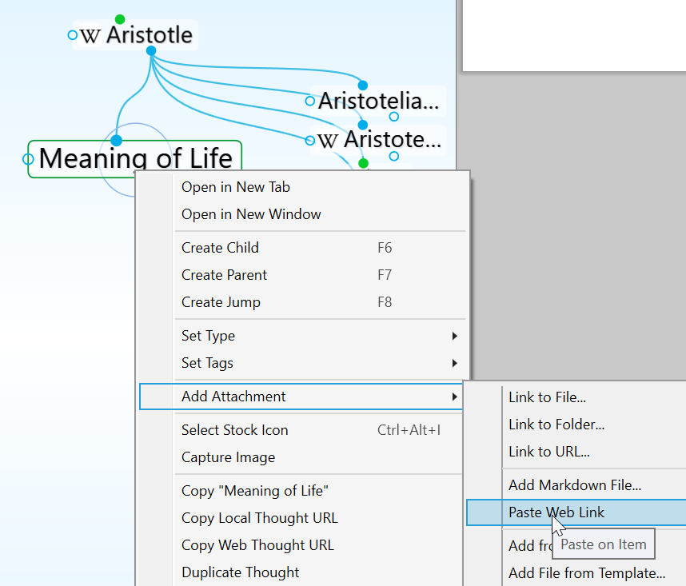

**Figure 145. Pasting a Thought URL**

**To paste a thought URL after it has been copied so that it becomes a hyperlink in a note:**

1. In the note, select the text that will be the link using one of the two methods below:

- If the text happens to be the name of a thought you want to link to, it will have a dotted underline—click within the underlined text

- If the text isn’t the name of a thought, just drag through it to select it

2. Click the **Insert Thought or Web Link** command in the content area toolbar (or right-click and select it from the context menu).

3. Select the thought in the drop-down list, then click outside of the list to close it and create the link.

When you click the link, the thought will open and you can click its attachment(s) to view them in the content area.

**Figure 146. Inserting a Hyperlink in a Note**

**Thought Types and Tags**

If you have several thoughts with which you want to share common attributes, such as color and an icon, you may want to create a thought type so that these attributes can be easily applied to many thoughts. This is one use of thought types.

For example, you may want to create a “person” type for all thoughts that

represent people in your brain. This type might have a label— “Person”—and a specific color and icon so that all people in your brain stand out and can be easily recognized.

Type thoughts can be edited by activating them and using the **Thought**

**Properties**

dialog box, just as you would for any other thought. You can assign attributes, such as icons, notes, and attachments, to type thoughts.

**Figure 147. Three “Person” Type Thoughts**

Once a type has been applied to a set of thoughts, it can also be used to create reports of all thoughts of that type.

When a type has been assigned to a thought, that thought is said to be an “instance” of the type. For example, if you have a thought named “Jane” of the “Person” type, the Jane thought is said to be an instance of the Person type.

**Creating a Thought Type**

Thought Types can be created from the **Activate Type** button in the main toolbar.

1. Type the new Thought Type name or type multiple new Thought Types separated with a semicolon

2. Select New Type

**Figure 148. Creating a New Thought Type**

To create a thought type from within the plex:

1. Activate the thought you want to be the first instance of the new type, then click the thought to open its **Thought Properties** dialog box.

2. Click the **Type** button, then click the **New Type** command. Alternatively, you can right-click the thought, click the **Set Type** command, then click the **New Type** command.

3. Enter the name of the type you want to create, then press the **Enter** key. Click outside of the **Thought Properties** dialog box to close it.

4. If you used the context menu to create the new type, the type will appear as a thought in the plex. Type thoughts are special and have an oval border when active and inactive to distinguish them from other thoughts.

**Figure 149. An Active Type Thought (“Person”)**

**To do this ...** **Do this ...**

Locate and

Activate a Type

thought

Delete the active

Type thought

Enter the Type’s name in the Search box as you would to search for any other kind of thought, then click the

matching result in the drop-down list.

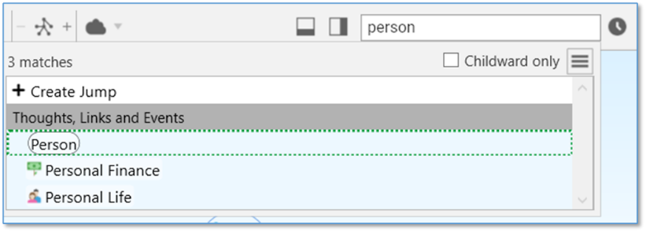

OR

Activate any thought associated with that type, and click on the Parent thought Type if it is visible.

OR

Click the **Activate Type** button in the menu bar, then click the type of your choice or begin typing the name of the type to locate it quickly if the list is long.

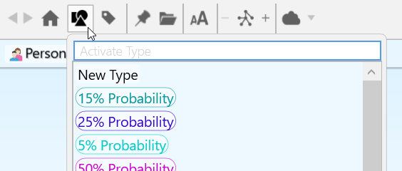

Click the active Type thought to open its **Thought**

**Properties** dialog box, click the menu button, then click the **Delete *thought name*** command.

Note that unlike normal thoughts, types cannot be forgotten and remembered. Deleting a type removes it from your brain permanently.

**To do this ...** **Do this ...**

Set a thought’s

Type

Set a thought’s

Type during

thought creation

Remove a Type

from a thought

Create new

thoughts linked

to the active

Type thought

Create a Super

Type

Reuse a Type in

another brain

Use any of these methods:

- Open the thought’s **Thought Properties** dialog box,

click the **Type** button, then click the type of your

choice, or

- Right-click the active thought, click the **Set Type**

command, then click the type of your choice, or

- Click the **Thought** menu when the thought is active,

click the **Set Type** command, then click the type of

your choice

- Link the thought as a child of the type

Click the **Set Type** button in the **Thought Creation** dialog

box, then click the type of your choice.

Use any of these methods:

- Open the thought’s **Thought Properties** dialog box,

click the **Type** button, then click the **Untyped** button,

or

- Click on the checked Type to unselect it, or

- Right-click the active thought, click the **Set Type**

command, then click the **Untyped** button, or

- Click the **Thought** menu when the thought is active,

click the **Set Type** command, then click the **Untyped**

button

- Unlink the Thought as a child of the type

Drag down from the Type thought’s child gate and

continue creating the thought as usual.

Drag up from the parent gate of a Type thought, then

continue creating as usual or link to another existing Type

thought.

Copy and paste type thoughts from one brain to another

the same way you copy and paste other thoughts.

**Tip:**

To arrange your display by thought types, right-click on the plex background, click

**Arrange Thoughts by**

, then click

**Type**

.

Attributes that are assigned to a thought type are inherited by all instances of the Type but will be overridden if there are attributes assigned directly to the thought itself. For example, if you have a thought named “Jane” of the type

“Person,” you can assign an icon of a smiley face to the Person type and it will

appear next the Jane thought and all other instances of the Person type. But, if you then assign a picture of Jane as the icon for that thought, the picture will appear on that thought (only) instead of the smiley face. Likewise, a label assigned to a specific thought would override the label of any thought type assigned to that thought.

**Super Types**

TheBrain supports multiple levels of types for advanced modeling. Just like a thought can have a type, each type may in turn have a super type. To set a super type, open a thought type that should have the super type, then click the **Type** button. The new type will be a parent (or super) type of the active type. The attributes assigned to a super type are inherited by its sub types and instances.

Super types can be used when there is a category of thoughts which is a subset of a larger category. For example, the thought type “Person” could be the super type of the type “Executive.”

To see how to find groups of thoughts that share one or more of the same Type, please see the Producing Reports section beginning on page 218.

**Dynamic Wallpaper**

Another advantage of using thought types in your brain is being able to utilize dynamic wallpaper. This enables you to change the wallpaper of the plex, based on the type of the current active thought.

To set up a dynamic wallpaper:

1. Navigate to a thought type.

2. Right click and select Set Dynamic Wallpaper

3. Navigate through your machine to locate the desired wallpaper image and click Open.

**Figure 150. Setting Up Dynamic Wallpaper on a Thought Type**

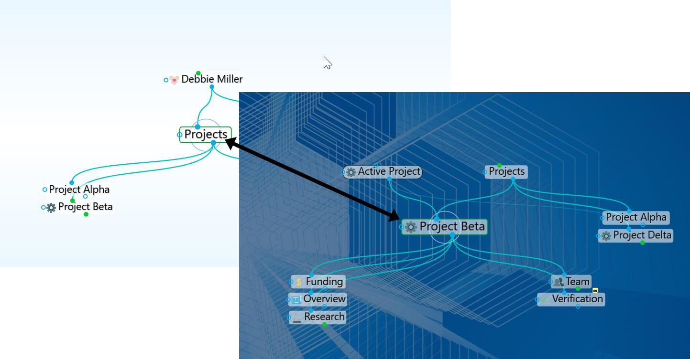

**Figure 151. Navigating to a Thought with a Dynamic Wallpaper assigned to its Type**

Navigating to any thought that is associated with a Thought Type containing Dynamic Wallpaper will fade the current background and transition to the Thought Type Wallpaper.

**Using Thought Tags**

If there are multiple attributes you would like to add to your thoughts, you can create thought *Tags*. Tags are useful for flagging thoughts that you want to be able to reference as a group, without them having to share a common parent. For example, you may want to create a “To do” Tag so you can get a list of all of these thoughts very quickly.

Tag thoughts can be edited by activating them and using the **Thought**

**Properties**

dialog box, just as you would for any other thought. You can assign attributes, such as icons, colored text and colored backgrounds to Tag thoughts.

Thoughts can have one or many Tags at the same time. Tag thoughts are global for a brain and displaying Tag text and icons can be toggled on and off in the **Look & Feel** tab of the **Preferences** window.

**Figure 152. A Thought with a Tag**

**To create a thought Tag:**

1. Activate the thought to which you want to attach a Tag, then click the thought to open its **Thought Properties** dialog box.

2. Click the **Tags** button, then start typing a name for your new Tag.

Alternatively, you can right-click the thought, click the **Set Tags** command, then click the **New Tag** command and start typing a name for your new Tag. You can also create multiple Tags at the same time by typing a semi-colon between each Tag name, just as you can do to create multiple regular thoughts at the same time.

3. Press the **Enter** key. Click outside of the Tags list to close it, then click outside of the **Thought Properties** dialog box to close it. The new Tag will be attached to the active thought.

**Figure 153. Creating a New Tag**

Alternatively, you can right-click the thought or click the **Thought** menu, click

the

**Set Tags**

command, then click the

**New Tag**

command and start typing a name for your new Tag. Press the

**Enter**

key when you’ve finished.

You can also assign one or more Tags to a thought (regular or Type thoughts) while you’re creating the thought by clicking the

**Tags**

button in the

**Thought Properties**

or

**Thought Creation**

dialog box.

**Assigning and Removing Tags**

You can assign and remove Tags using the same general technique as for creating them. The only difference is that instead of typing a new name, you select (to attach) or deselect (to remove) the Tag name(s) in the list.

As shown below, currently assigned Tags are preceded with a check mark. Click an assigned Tag to remove it and click any Tag in the list to assign it to the active thought. This makes it easy to assign and remove multiple Tags at a time.

**Figure 154. Assigning and Removing Tags**

**Assigning Tags to Multiple Thoughts at One Time**

If you want to assign Tags to multiple thoughts at once, first select them, then right-click in the **Selection** panel. Click the **Set Selection Tags** command, then click the **New Tag** command or on any of the Tag names in the list.

**Deleting a Tag**

1. Click the **Tags** button on the toolbar, then click the Tag of your choice to activate it.

**Figure 155. Opening the Tags List**

2. Either right-click the thought or click the **Thought** menu, then click the **Delete “Thought name”** command. You can also open its **Thought Properties** dialog box, click the menu button, then click the **Delete**

**“Thought Name”** command.

**To delete multiple Tags at one time:**

1. Click the **Tags** button on the toolbar to display all Tag names in your brain.

2. **Ctrl**-click each Tag you want to delete. The Tag is added to the **Selection** tab to the left of the list.

**Figure 156. Deleting Multiple Tags List**

3. When all the Tags you want to delete are selected, right-click in the Selection tab, then click the **Delete (#) Thoughts** command. (Remember that Tags are also thoughts themselves.)

Unlike normal thoughts, Tags cannot be forgotten and remembered. Deleting a Tag removes it from your entire brain permanently.

**Renaming and Adding Attributes to a Tag**

You can change the properties of Tags, just as you change the properties of regular thoughts—colors, icons, and attachments.

1. Click the **Tags** button on the toolbar, click the Tag of your choice, then click the Tag thought to open its **Thought Properties** dialog box. You can also click any tag that is visible in the plex to navigate to that tag thought.

2. You can make the same customizations as you can to any thought while you’re in the Tag’s **Thought Properties** dialog box. When you’re finished making revisions, press the **Enter** key.

Renaming a Tag changes the Tag throughout your entire brain.

**Displaying Thoughts Based on Their Tags**

You can show all thoughts with the same Tag by using Search:

- Begin typing the Tag name in the Search box, then click the Tag name when it appears. Tags may be indicated with any icon that has been assigned to them. When you click the Tag name in the Search hit list, all thoughts assigned to that Tag will be displayed in the plex.

**Tag Abbreviations**

Along with adding icons to Tags and customizing their names with color, you can also attach an “abbreviation” for the full Tag name. Abbreviated forms of the name can serve as hints for what the Tags represent while giving the plex a cleaner appearance.

In the **Look & Feel** tab of the **Preferences** window, you can change the Tags

text setting to “Show always” if you want the abbreviations to show. Hovering over a thought with Abbreviated Tags or Tag icons will then display the full Tag name.

**Figure 157. Tag Icons and Abbreviations**

**Figure 158. Pointing at a Thought Hides the Abbreviation and Shows the Full Name**

**To enter a Tag abbreviation:**

- In the Tag’s **Thought Properties** dialog box, type the abbreviation in the field below the Tag’s name, then press the **Enter** key.

**Figure 159. Creating a Tag Abbreviation**

**Additional Thought Type and Tag Features**

**Visible Thought Types and Tags**

Types and tags can be visible in the plex. Want to see a type or tag as a child thought? Just link any existing type or tag thought as a child, or as a jump. Optionally, types are visible as parent thoughts as well.

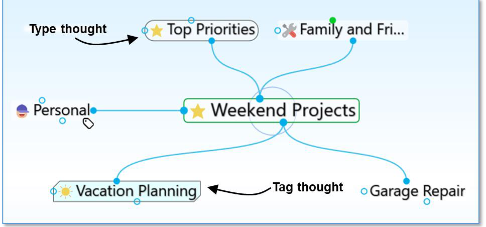

**Figure 160. Visible Parent Type and Child Tag**

Linkable types and tags eliminate the need to create two thoughts when you want to show all instances of a type or tag within the plex.

- Types are visually distinguished by rounded sides.

- Tags are visually distinguished by chamfered (diagonal) corners.

**Hiding Visible Thought Types**

Thought types being visible in the plex is optional.

- To prevent a thought type from being visible in the plex, right click on a

thought type and uncheck the option for **Visible when Parent of Active**

**Thought**

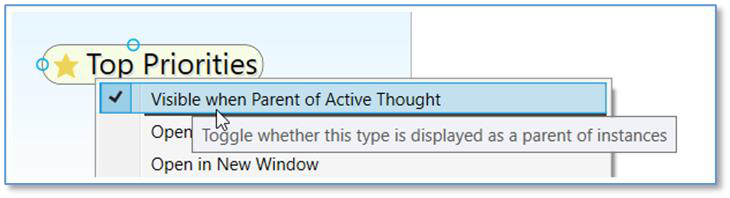

**Figure 161. Toggling the Visibility of a Thought Type**

- This setting can also be modified globally by clicking on **File**, selecting

**Utilities** and clicking on **Make All Types Visible/Hidden as Parents**

**Converting Thoughts to Type or Tag**

You easily change a normal thought into a type or tag at any time:

- Right-click on a thought and select **Convert to Type or Tag**

**Figure 162. Convert to Type or Tag**

- Tags and types can easily be changed into a normal thought

**Clickable Tags**

Tag icons that show on thoughts are clickable. Click any tag that is visible in the plex to navigate to that tag thought.

**Replacing a Tag**

You can easily move a thought through a project cycle or simply re-classify its tag attributes. To quickly replace a thought’s tag:

- Right-click on a tag to open its context menu.

- Select the option **Replace Tag with** and select another tag.

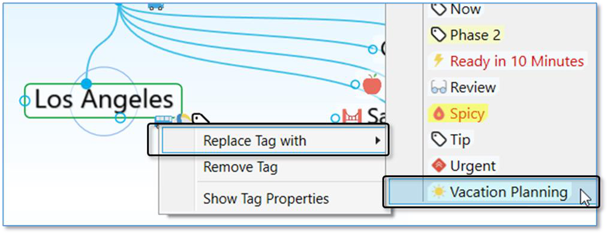

**Figure 163. Replacing a Tag**

**Nested Tags**

Tags can be organized under each other so they are easier to organize, navigate and apply.

- Link two existing tags with a parent/child relationship to sub-categorize

- You may also open a tag’s properties to assign it as a sub category of

another tag

- Nesting can include multiple tags and multiple layers

**Figure 164. Nested Tags**

**Changing the Properties of a Link**

Links between thoughts are normally unnamed. You can name a link by giving it a “label.” Just like thoughts, links can have Types, notes, and Attachments. You can control the way they appear in order to clarify relationships or just to create a more pleasing view of your brain, based on your personal preferences. You can also manipulate links in order to add or change relationships between your thoughts.

Just as each thought has its own **Thought Properties** dialog box, each link has its own **Link Properties** dialog box.

**To open the Link Properties dialog box, use any of these methods:**

- Double-click the link, or

- Click the link once to select it, then a second time to open the box, or

- **Alt**-click the link (whether or not the link is connected to the active thought), or

- Right-click the link, then click **Properties** on the context menu, or

- Click the link to select it, click the **Link** menu in the menu bar, then click the **Properties** command

**Figure 165. Link Properties Dialog Box**

**To add a label to a link:**

1. Open the **Link Properties** dialog box for the link, then type a label name in the **Label** field.

**Figure 166. Adding a Label to a Link**

2. Press the **Enter** key, or click outside of the **Link Properties** dialog box to close it. The label will appear on the link and will be enlarged when the mouse points at the link.

**To change the color of a link:**

1. Open the **Link Properties** dialog box for the link, then click the color box. 2. Click the color of your choice in the color palette, click outside of the palette to close it, then press the **Enter** key, or click outside of the **Link Properties** dialog box to close it.

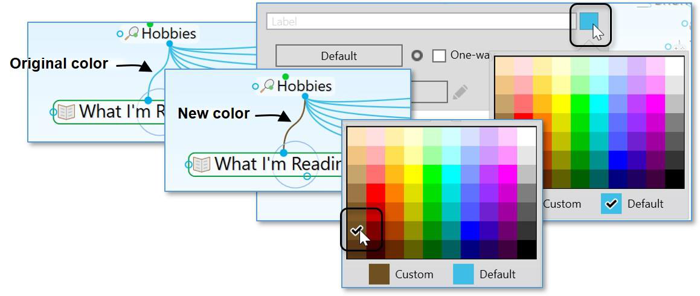

**Figure 167. Changing the Color of a Link**

the

**Brain Theme**

box (please see the Customizing a Theme’s Colors section on page 44 for details).

This changes the color for the individual link. You can set link colors globally in

**To change the width of a link:**

- Open the **Link Properties** dialog box for the link, click the **Default** button, click the width of your choice, then click outside of the **Link Properties** dialog box to close it.

**Figure 168. Changing the Width of a Link**

**Tip:**

You might want to widen links to illustrate the strength of particular relationships between thoughts.

**Link Types**

Link types are used to assign commonly-used relationships between thoughts that share a label, color, and width so they can be easily recognized. Link properties and types will be retained even if the two linked thoughts change their relationship but remain linked (for example, if a child thought becomes a jump thought of the original thought).

In addition to setting their color, you can add labels to link types and you can change the width of the link to call special attention to relationships.

1. Open the **Link Properties** dialog box for the link, then click the **Type** button.

This button will display “Untyped” if there is currently no Type assigned to the

link and it will display the type name if there is already a Type assigned.

2. If there’s an existing Type in the list that you want to use, click on it to select it. Otherwise, click on **New Type**, then type the name for the new link in the field that will be displayed.

**Figure 169. Creating a New Link Type**

2. Press the **Enter** key to close the **Link Properties** dialog box.

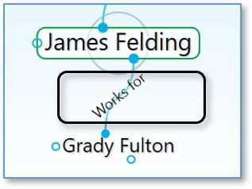

**Figure 170. Appearance of a Link Type in the Plex**

Type won’t be displayed in the plex in this case, it can still be used to find all thoughts connected to links of that Type.

If a Link has both a Type and a label, the *label* will show in the plex. While the

**Tip:**

Point the mouse at a Link Type or label to magnify it in the plex.

**Deleting Link Types**

1. Open the **Link Properties** dialog box for the link that has the Type you want to delete, then click the **Edit** button to open the **Type Properties** box.

2. Click the menu button then click the **Delete** command.

**Figure 171. Deleting a Link Type**

To see how to find thoughts that share one or more of the same link Type, please see the Producing Reports section beginning on page 218.

**Showing Link Direction**

By default, links do not show a directional arrow. You can add directional arrows that will appear on the link that points to or from the source thought.

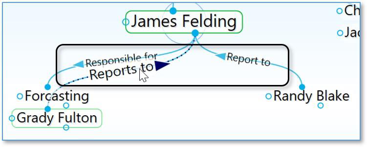

**Figure 172. Directed Links**

- A directed link shows an arrow in the middle of the link. If the link has a label or a Type, the arrow will be next to the text. The arrow is magnified when the mouse hovers on it. Directional arrows can provide visual cues that are

particularly useful when there’s a link label. For example, for the link label

“Inspired” (shown below), the link’s directional arrow shows that “Hank

Williams” was a source of inspiration for Elvis. This is also very useful when you want to represent flows between items like financial relationships.

**Figure 173. Hank Williams Inspired Elvis**

**To set link direction:**

1. Open the **Link Properties** dialog box for the link to which you want to add direction. Then:

- Click the icon to the left of the **One-way** check box to switch between non-directed, directed, and directed in the reverse.

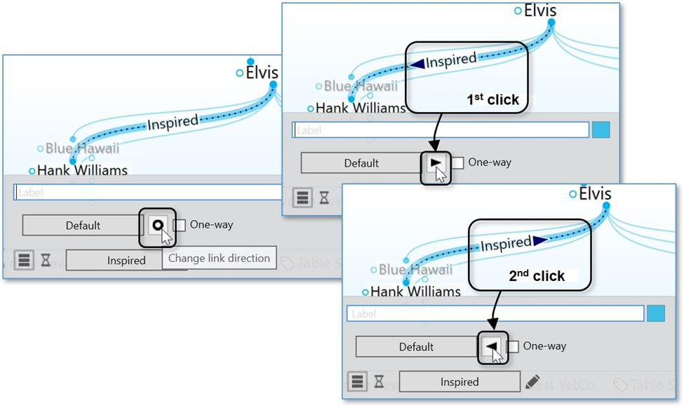

**Figure 174. Setting the Direction of a Link**

**Using One-Way Links**

- One-way links appear when the source of the link is active and the source thought is already visible.

- One-way links are indicated by an arrow with a rectangle at its base.

**Figure 175. One-Way Link**

One-way links are useful where *thought A* is relevant when *thought B* is active, but *thought B* is not relevant when *thought A* is active.

For example, you may want to see what company a person worked for when the person is the active thought. However, for a large company with thousands of employees, you may not want to see all of the employees when that company is the active thought. Creating a “works for” link type and making it one-way is a good way to do this.

**To make a Link one-way:**

1. Open the **Link Properties** dialog box for the link to which you want to add direction. Then:

- Select the **One-way** check box to make the selected link one-way. Note that one-way links cannot be non-directed.

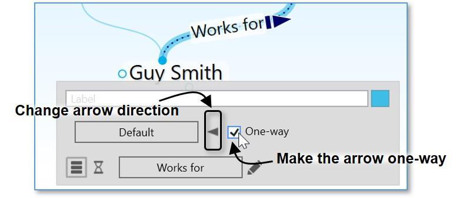

**Figure 176. Selecting Link Direction**

**To set Link direction for link Types:**

You can also set link direction for link types. The direction of a link type is inherited by instances of the type and can be overridden by the instance.

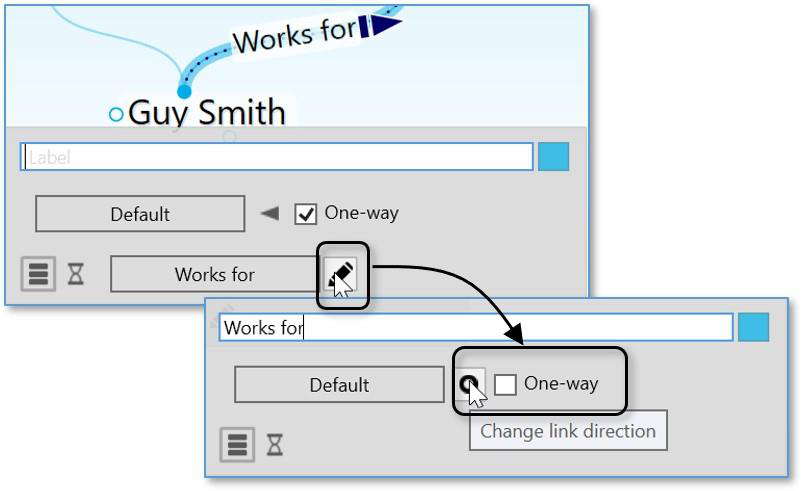

**Figure 177. Selecting a Link Type Direction**
