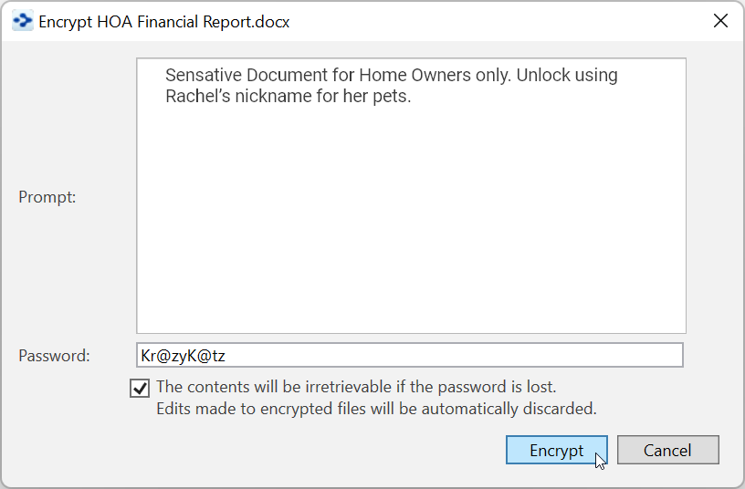

## **Encrypting Individual File Attachments**

You can encrypt individual file attachments within your brain using the **Encrypt** command on an attachment’s context menu.

AES 256 bit encryption ensures that without the password, it is impossible to recover the file contents from the encrypted file—even with administrator access to the machine where the file is stored on a local computer or remote cloud server.

Encrypted files cannot be searched and can only be decrypted via Windows and macOS versions of TheBrain. These files are completely inaccessible even to your hosting provider whether that be a private TeamBrain Enterprise Server or TheBrain Technologies Cloud Server.

**To encrypt a file:**

1. Right-click the attachment, then click **Encrypt** in the context menu.

**Figure 315. After Clicking on the Attachment’s Context Menu**

2. Type in the prompt you want the user to see when they attempt to open the file, type a password, click the check box confirming that the file cannot be opened if the password is lost, then click the **Encrypt** button.

**Figure 316. Example Encryption Details**

3. Whenever someone attempts to open the file, they’ll see the prompt you entered. They will have to enter the correct password, then click the **Decrypt** button. After that the file can be opened by clicking on it.

**Figure 317. Decrypting and Opening the File**

To modify an encrypted file, you will first need to permanently decrypt the file. The easiest way to do this is to open the document and **Save As** a new document. Make and save the new modification and return to TheBrain to encrypt the new file.
