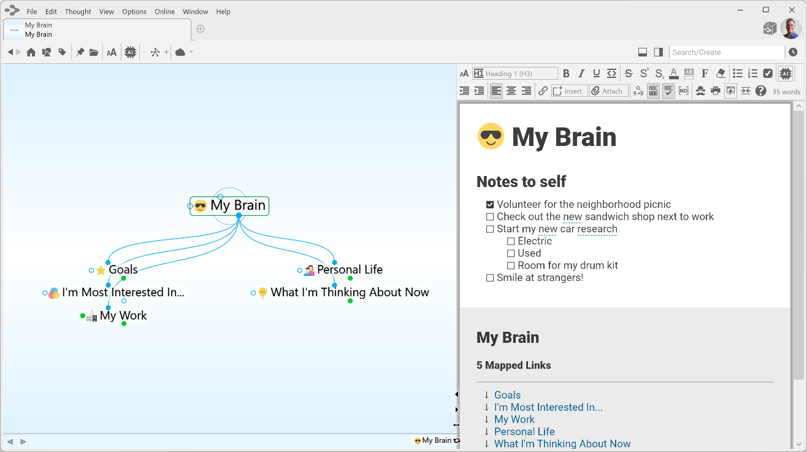
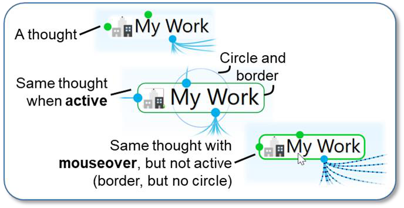
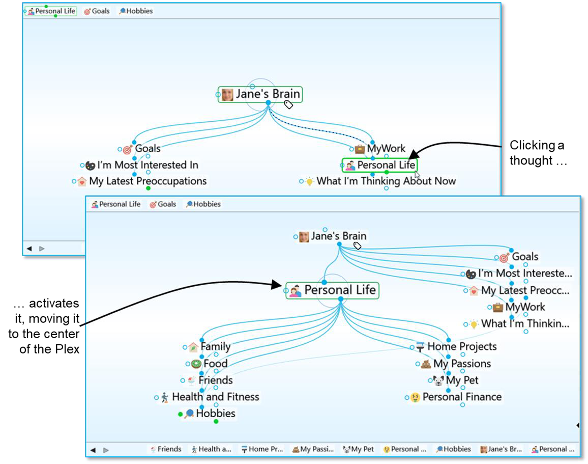
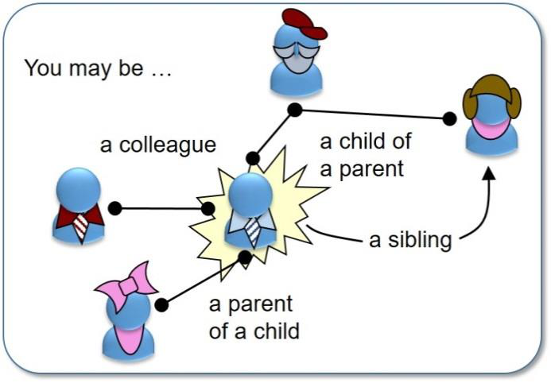
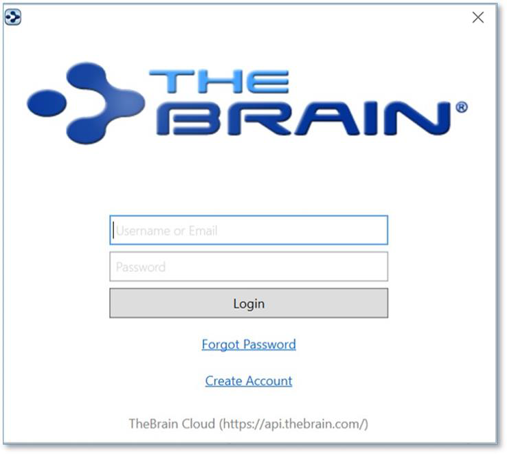
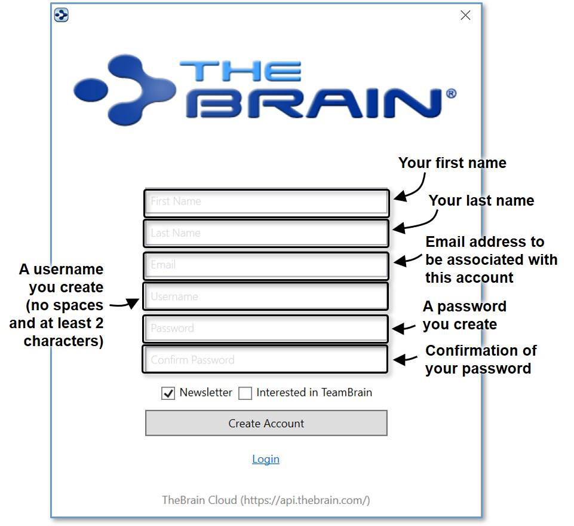
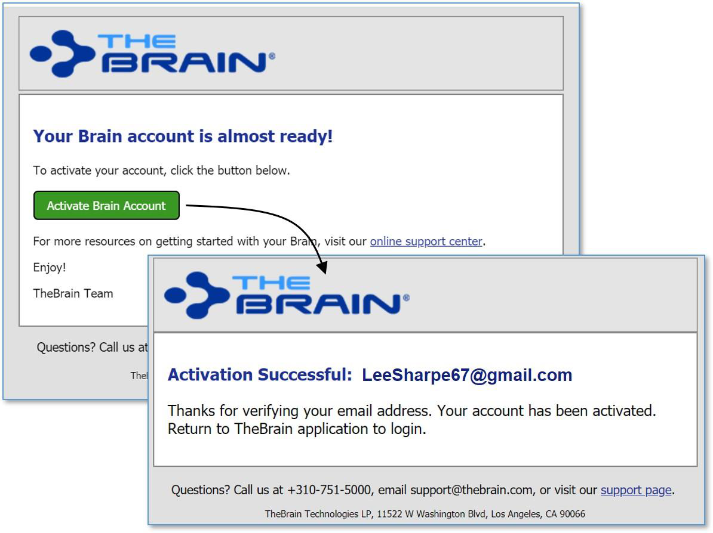
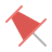

**Introduction**

Welcome to TheBrain™, your ultimate digital memory and no limits mind mapping software. Intelligence comes from the mind’s ability to think associatively—that is, to leap from thought to thought, building webs of greater and greater complexity, until new ideas are built. Associations are our inspirations. TheBrain allows you to organize your information in the same way, without limiting you to a pre-

determined file structure. In fact, with your digital brain there are no limits. You can create a small project-focused brain or grow your brain to hundreds of thousands of thoughts!

Now you don't have to force any idea or project into a single folder. TheBrain organizes information as **thoughts**. Unlike folder directories and search lists, a “thought” in your brain can have many connections and contexts. Moreover, TheBrain displays your thoughts by concept or project, linked according to how you think. Now you can get the big picture and discover information that might otherwise be overlooked.

Thoughts contain relevant notes, web pages, and files. Brains can be synced for easy access from your desktop to TheBrain Cloud or your mobile devices.

**Figure 1. TheBrain Interface**

## **Thoughts are Information**

TheBrain thoughts can represent just about any type of information, including concepts, people, documents, spreadsheets, images, videos, shortcuts, and web pages. By letting you create links and associations between thoughts, TheBrain expands to become a visual interface that reflects the way you think.

Using simple click-and-drag techniques, you’ll be able to create and navigate through networks of thoughts in a conceptual space unique to your work habits. When you begin using TheBrain, you will find that your computer becomes easier to use—faster, more enjoyable, and less frustrating—helping you use your time more efficiently.

## **TheBrain’s Dynamic Graphical Interface**

TheBrain lets you create a simple, dynamic graphical map in which to input and navigate all your information. Your brain starts with a single thought, to which several other thoughts can be visually linked. These thoughts have their own links to other thoughts and, possibly, to each other. TheBrain’s flexible structure allows any thought to be linked to any other thought, so you are never more than a few steps away from the information you are seeking. It’s simple to make connections between thoughts so that they reflect the connections you make in your mind.

## **Cross Platform Accessibility**

Brain data is accessible from virtually any device with rich full-featured clients on Windows and macOS plus mobile clients for iOS and Android. Additionally, you 
can access your brain via a web browser by logging in at [www.thebrain.com](https://www.thebrain.com). TheBrain’s sync service keeps all your data backed up and synchronized over
the cloud for seamless access.

This user guide is focused on the Windows and macOS software. Please visit [www.thebrain.com](https://www.thebrain.com) for information about the mobile clients.

## **About this Guide**

The following icons are used throughout this guide to flag categories of information:

[//]: # (![]&#40;../thebrain14-user-guide-images/image3.png&#41;  This icon is used to identify notes.)

<IconLabel icon="/thebrain14-user-guide-images/image3.png">
	This icon is used to identify notes.
</IconLabel>

[//]: # (![]&#40;../thebrain14-user-guide-images/image4.png&#41; This icon is used to flag tips and suggestions.)

<IconLabel icon="/thebrain14-user-guide-images/image4.png">
	This icon is used to flag tips and suggestions.
</IconLabel>

TheBrain is offered in two editions—Free and Pro. Icons are used throughout the guide to flag features that are specific to the Pro edition. Features that are available in **both** editions are not designated with a special icon.

[//]: # (![]&#40;../thebrain14-user-guide-images/image5.png&#41; This icon is used to indicate that the feature is available in the Pro edition only.)

<IconLabel icon="/thebrain14-user-guide-images/image5.png">
	This icon is used to indicate that the feature is available in the Pro edition only.
</IconLabel>

Because TheBrain works on Windows and macOS, OS-specific features are flagged with icons throughout the guide. Features that are available for **both** Operating Systems are not designated with a special icon.

<IconLabel icon="/thebrain14-user-guide-images/image6.png">
	This icon is used to indicate that the information applies only to computers running macOS.
</IconLabel>

<IconLabel icon="/thebrain14-user-guide-images/image7.png">
	This icon is used to indicate that the information applies only to computers running Windows.
</IconLabel>

In addition:

**Labels** Names of buttons, menus, commands, keys, and icons appear in **this font** throughout the guide in order to stand out.

## **Note to macOS Users**

**Right-clicking:** Most features in TheBrain can be accessed with just a single

click of your primary mouse button. However, there are several context-sensitive shortcuts available in context menus which appear when right-clicking. On a Macintosh, many systems do not have a right mouse button. For trackpad users, click or tap with two fingers. Alternatively, hold down the

**Control**

key while you click. Note that many mice can be set up to interpret clicks on each side of the main button differently so that

**Control**

- clicking is not necessary. To enable this, alter the Mouse settings in the System Preferences area of your Mac. Select “Secondary Button” for the right side of the mouse.

**Ctrl** key: Some features are accessed by clicking while holding down the **Ctrl** key on Windows. For macOS, use the **Command** key.

TheBrain supports Native Apple Silicon.

## **Brain Terminologies**

**Brain**

A collection of associated thoughts, each of which can have content. You can create multiple brains.

Here is a list of working definitions for the basic terms used throughout TheBrain.

**Thought** The topics that you link together in your brain are called thoughts and are the basic unit of a brain. A thought can represent anything you want it to. It can include an icon, notes, and one or more attachments (such as files and web sites) or it can have no content at all and simply act as a subject heading or organizer. Minimally, a thought has a name.

**Plex** The visible, graphical portion of your brain that displays your thoughts.

**Content Area** The portion of TheBrain window that displays content that can be associated with the active thought or link. Types of content include notes, attachments (such as worksheets, presentations, documents, videos, and images), links, URLs, and events. The content area also displays and provides quick access to related thoughts.

Clicking any thought or link in the plex displays its associated content in the content area.

**Figure 2. TheBrain Plex and Content Area**

**Active** The active thought appears in the center of the plex and is **Thought** the current focus. Any items attached to the thought, like notes, files, links, and events appear in the content area.

**Figure 3. The Different Ways a Thought Can Appear**

As shown below, when you click a thought, it moves to the center of the plex and

it becomes the active thought.

**Figure 4. Activating a Thought**

**Thought**

**Relationships**

A thought is said to be a “parent thought,” “child thought,” “sibling thought,” or “jump thought” based on its relationship to other thoughts with which it is linked.

In your own life, you may be someone’s parent, and

someone’s child, and someone’s sibling, and someone’s peer, advisor, or colleague. So, who are *you*? The answer to that question is relative—it depends on the circumstances

and what hat you’re wearing at the moment.

**Figure 5. Relationships are Relative to *You***

The same applies to thoughts. The relationships between thoughts are displayed automatically, based on which thought is active at the moment.

Whether a thought is a parent, child, or sibling depends on its

current relationship to the active thought.

**Figure 6. Thought Relationships are Relative to the Active Thought**

**Child** Child thoughts are subtopics of the active thought. They

**Thought** appear in the “child zone,” below the active thought. In the

picture above, the active thought “Hobbies” has seven child

thoughts.

**Parent** Parent thoughts represent superordinate topics of the active

**Thought** thought. They appear in the parent zone, above the active

thought.

**Sibling** Sibling thoughts share a parent with the active thought. They

**Thought** appear in the sibling zone, to the right of the active thought.

In the picture above, “Family,” “Food,” “Health and Fitness,”

“Home Projects,” “My Passion,” “My Pet,” and “Personal

Finance” are siblings of “Hobbies” because they are all

children of “Personal Life.” Sibling thoughts will not be

displayed if there are more than 50 parents to show in the

current plex.

**Jump** Jump thoughts are related to the active thought but are **Thought** neither child nor parent topics. They appear in the jump zone to the left of the active thought. Jump thoughts have an “equal weight” relationship with the thought to which they are related. For example, as shown above, “Hobbies” has the various hobbies “Art and Culture,” “Gardening,” “Music,” “Snorkeling and Diving,” “Sports,” “Technology,” and “What I’m Reading Now” linked as child thoughts since they are types of hobbies. “Budget” affects the amount of resources available to spend on the various hobbies and so it is closely related, but it is not a hobby itself. Therefore, it makes a perfect jump thought―related, but not part of the main thought grouping.

**Gate** Thoughts in the plex have three circular “gates,” each of which is used to link a specific type of relation: The parent gate is above a thought, the child gate is below it, and the jump gate is to the left or right of it. A gate is hollow when there are no links attached to it and solid when one or more links are attached. Solid gates in a contrasting color have links to thoughts that are not currently showing in the plex.

The color of gates is based on the current color scheme.

When you point at a gate, a highlighting circle appears around it.

**Link** A link is the line that connects two thoughts. When used as a verb, to “link” is the act of connecting thoughts to establish close relationships. Links can also show direction to help you visualize relationships.

**Figure 7. Thought Gates**

## **Installing TheBrain and Creating a Brain Account**

The first time you download and install TheBrain, you’ll be prompted to log in or create an account if you don’t already have one. The log-in window provides the ability to create a new account or log in to an existing account.

**Figure 8. TheBrain Log-in Window**

Here are the fields to complete if you’re creating a new account:

**Figure 9. Creating a New Account**

After you click the **Create Account** button, TheBrain will send an email to the address you specified.

Check for a message from no-reply@thebrain.com. Make sure to check your spam folder if you don’t receive the message promptly.

When you open the message, you will see a green **Activate Brain Account** link. After you click the link, you’ll see a notice confirming your success.

**Figure 10. Activating a New Account**

Now you can return to TheBrain and log in.

**Figure 11. Welcome to TheBrain**

Click “Create a Quick-Start Brain” and follow the directions on the screen to enter a personalized name for this brain. The Quick-Start brain is actually a dynamic resource for learning more about using your brains and you’ll find a wealth of useful information in it. Click any of the links to see what is displayed.

You can always create a new Quick-Start brain by selecting the

**Create a Quick-Start Brain**

command on TheBrain

**Help**

menu.

## **Opening Older Brains**

When you’re looking at old and new brain files, note that brains created in

TheBrain 7 or 8 have filename extensions of **.brain**. Brains created in some earlier versions have a **.brn** filename extension.

To open a **.brn** file that you created in a version **older** than TheBrain 8, first

open it using TheBrain 8 and then import the resulting brain in TheBrain 13, as described in the steps below.

Any older Brain must be opened in TheBrain version 8.0.2.2 before it can be

imported into TheBrain 1till be downloaded and installed. Please contact for a v8.0.2.2 download link.

To open a brain that you created in TheBrain 8:

1. Open TheBrain.

2. Click the **File** menu, then click the **Import** command.

All dialog boxes can also be navigated via the

**Tab**

and

**Arrow**

keys.

**Figure 12. Import Box for Opening an Older Brain**

3. Click the **Select File** button, navigate to the brain of your choice, then click the **Open** button when the file is selected. You will see a running progress report.

4. When TheBrain has finished converting, you will see a “Conversion complete” message as shown below. Click the **Import** button.

**Figure 13. Import Conversion Progress**

5. When TheBrain has finished importing, you will see the following dialog box. Click the **Open** button to open the brain you just imported in a new tab of TheBrain window.

**Figure 14. Open the Imported Brain in a New Tab**

## **Suggestions for Transitioning to Your New Brain**

Here are some tips for establishing a happy relationship with your brain:

You may want to attend one of TheBrain’s free online seminars on getting started―TheBrain 101. To learn more about TheBrain 101, go to

Avoid “converting” to a Brain-only environment all at once. Make the transition on a file-by-file basis so that every piece of information your brain contains will be useful.

Build your brain as you go—associating thoughts as they occur naturally.

Avoid the temptation to move large folders into your brain. TheBrain can handle this, but your brain will be cluttered with thoughts you may not need.

Remember that your first brain doesn’t need to be your *only* brain or your *last* brain. Experiment! Create a brain just for fun, to try out the possibilities—give yourself room to stretch and explore. Your brain is waiting!

Questions? Contact TheBrain Support Team right from within TheBrain app by choosing

**Contact Us**

from the

**Help**

menu in TheBrain toolbar.
