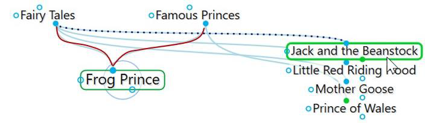
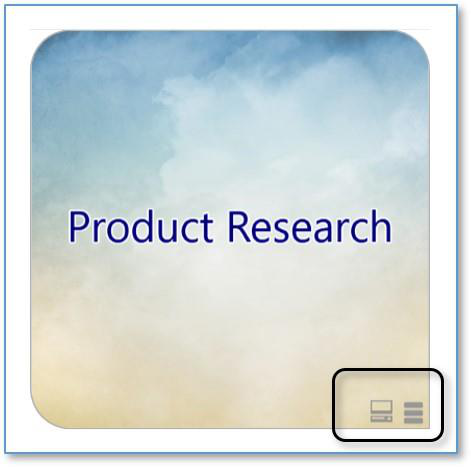
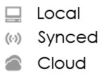
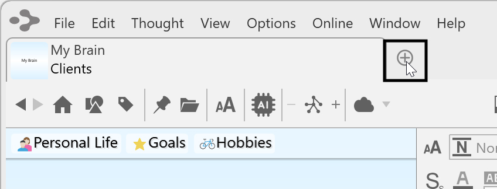
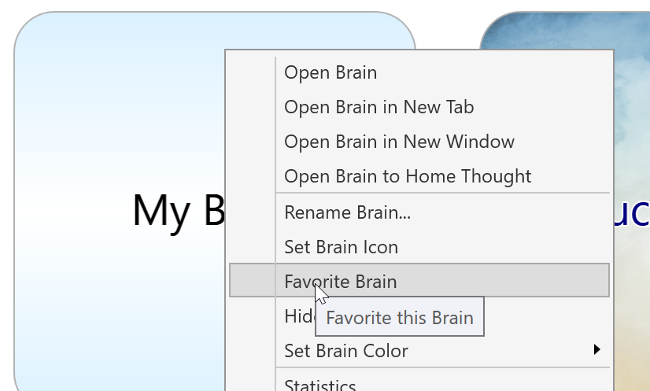
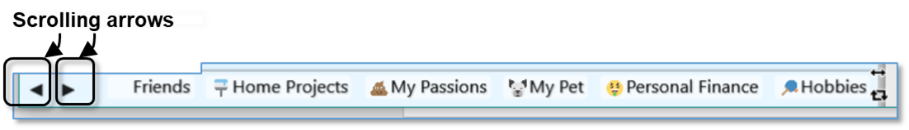
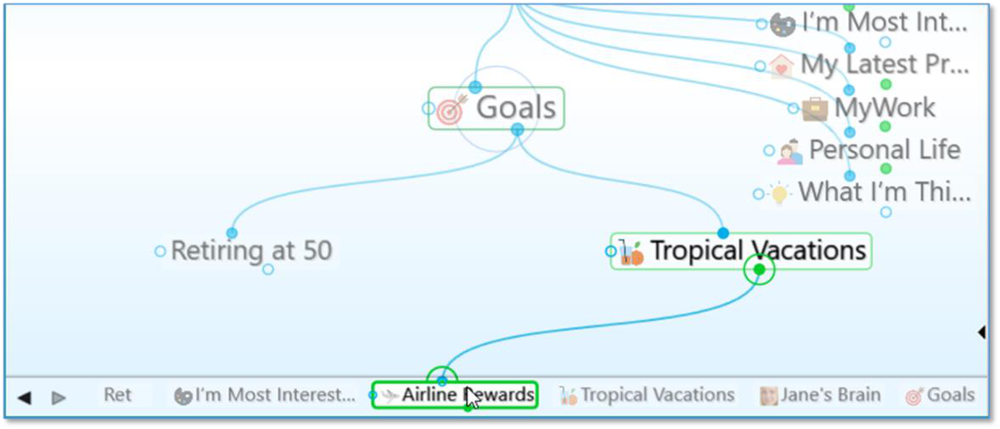
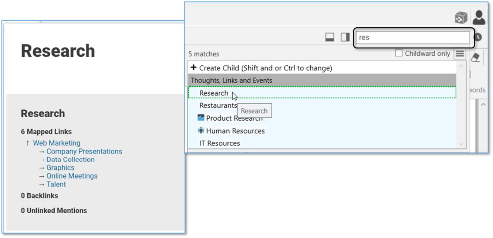

## **Navigating Your Brain**

All thoughts can be connected—directly or indirectly—even thoughts that may seem to have nothing to do with each other can be related through a chain of links.

Let’s look at an example, say, the Queen of England and asparagus. You have a thought called Queen of England. One of its child thoughts is Prince of Wales, which has a parent thought—Famous Princes—that is also linked to the story of the Frog Prince.

The story has another parent thought called Fairy Tales. A sibling of Frog Prince is Jack and the Beanstalk.

Jack and the Beanstalk has child thoughts called Giant and Jack. Giant has another parent thought called Famous Giants.

Famous Giants has a child thought called Jolly Green Giant. Jolly Green Giant has child thoughts named after canned vegetable products, one of which is Asparagus. Thus, the Queen of England is connected to asparagus!

Depending on the relationship you create between them, thoughts may be closely or distantly related. Thoughts are considered to be closely related when

they are linked directly or are siblings. In the default view of the plex, only close thoughts of the active thought are always displayed in the plex. Thoughts that are one additional step (generation) away from the active thought can be displayed by expanding the view. See Advanced Navigation and Alternative Views on page 147 for information about the different view options.

**Opening a Brain**

When you log into TheBrain, and no brain is open, all local, synced or online brains will be displayed as thumbnails in the **Brains** tab, as shown below. This is assuming that you have already created one or more brains. Clicking on a brain thumbnail opens that brain. Or, hold down the **Ctrl** key as you click to open a brain in a new tab, leaving the Brains tab open.

**Figure 20. Example of Four Available Brains on the Brains Tab**

By default, brains are listed according to how recently they have been accessed. You can also see the list of brains sorted alphabetically using the **Brains** tab toolbar, shown below. All brains that are locally available are shown first, followed by brains that are available online.

**Figure 21. The Brains Tab Toolbar**

The status of whether each brain is available locally, online, or both is also displayed. Each brain in the **Brains** tab will have an icon appearing in the lower-right corner of the thumbnail. Right-click on a brain or click on the status icon to display a menu of options for that brain, as shown below. The appearance of the icon(s) help you identify whether the brain is Local, Synced (local and online) or Cloud (Online only).

**Figure 22. Icons Indicating Local, Synced, or Cloud**

**Figure 23. Status Indicator Icons**

**Opening a Brain that Doesn’t Appear as a Tab**

If you have a brain from an older version or from a backup, it will not appear in the Brains tab until you import it. Click the **File** menu, then the **Import** command.

Choose the type of file you want to import, then click the **Select File** button, navigate to the file of your choice, then click the **Open** button when the file is selected. Click the **Import** button after TheBrain has finished converting the brain.

**Managing Brains Using the Tabs**

The tabbed interface of the plex lets you switch instantly between brains or even

keep the same brain open in multiple **Brain** tabs or windows.

To re-open the **Brains** tab to display the Brain thumbnails, click the **+** icon to the right of the last tab.

**Figure 24. Click the + Icon to Open the Brains Tab**

There is no limit to the number of brains you can open at once. Each time you

open a brain it will appear in a separate tab. Switch from brain to brain instantaneously by clicking its tab. All tabs and their states are automatically saved and restored when you quit and restart.

Tabs can be manipulated in several ways:

- **Float tabs** into their own dedicated window by dragging a tab out of TheBrain application window. This creates a new Brain application window with just a

single tab.

- **Merge tabs** into one window by dragging and dropping. Click the tab of one Brain window and drag the tab to another open brain, hovering over the tab

area. Then release the mouse button.

- **Open the same brain in multiple tabs** to view and edit multiple areas at a time. This lets you view different areas of your brain at the same time, and, if you like, use a different layout in each tab. Note that tabs are simply views into the same brain data and changes made in one tab affect all other tabs of that brain.

- **Duplicate tabs**. Right-click on a brain tab to duplicate it, showing the same

content in a new Brain tab.

**Brain Tab Properties**

Right click on any brain tab for the option to Set Tab Color. Chose from nine different colors. This tab will then be highlighted for as long as it remains open. Closing the tab will reset the tab properties.

To permanently set a tab color for a specific brain, right click on a brain thumbnail in the brains list and select Set Brain Color. The color selected will appear in the

color indicator on the brain’s thumbnail and the brain tab will be highlighted when this brain is open. If the brain tab is open, but not currently the selected tab, the color highlight will be visible, but minimized.

**Figure 25. Selecting a Brain Color**

Brain tabs can display either the brain name and the active thought name, or just the active thought name in a more compact tab. This setting can be found in **Preferences** on the **Look & Feel tab**.

**Figure 26. Brain Tabs displaying selected colors, brain name and active thought name**

**Windows Menu**

From **Windows** menu in the menu bar you’ll have the option to move between brain tabs, move tabs to new windows or select a specific brain tab to be activated.

Additionally, if you have adjusted the layout of a brain with the Smart Splitter, you can select the option to **Reset Window** which will bring the plex/content area back to their default views.

**Managing Brains Using the Context Menu**

You can right-click any brain in the **Brains** tab to display the available options.

**Figure 27. The Context Menu in the Brains Tab**

**Tip:**

Press Ctrl/Cmd + click to open a brain in a new tab from the brains list page.

**Favorite Brains**

If you have more than one brain and would like to keep commonly accessed

brains at the top of your brain list, you can set a brain to be a favorite.

**Figure 28. Favorite Brains at the top of your Brain List**

There is no limit to the number of favorite brains. To set a favorite brain, right

click on a brain in the brains list. Select **Favorite Brain**.

**Figure 29. Setting a Favorite Brain**

**Opening Content Associated with a Thought**

As you navigate through your brain, the content associated with the active thought is displayed in the content area. Notes associated with the thought are displayed automatically. There are several ways to open an attached file or web page:

- Click on the link for the attachment in the content area.

- Click on the attachment icon to the left of the thought’s name in the plex.

- Right-click on the thought, click **Open Attachment** on the context menu, then click the attachment of your choice.

**Showing Thought Content on Hover**

By default, the content for the active thought displays in the content area. If you prefer, you can display content for any thought your mouse pointer hovers over by changing the setting. To do so, click the **Options** menu (**TheBrain** menu on macOS), click **Preferences**, click the **Behavior** tab, then select the “Update displayed content on mouse hover or keyboard highlight” check box. Close the **Preferences** window when you’re finished.

**Previewing Thought Content**

Certain types of file attachments are automatically previewed inside of TheBrain. These include web pages, images, text, markdown files, JSON, .html files and PDFs. Simply click on an attachment’s tab and its preview will be shown. In the example below, Tropical Getaways is the active thought and there are two attachments in the content area—an image and a PDF.

You can view multi-page PDFs, web pages, and images as a slide show within

the content area.

- Click the link for an attachment to open a preview of it in the content area.

- Click the **Next** or **Previous** arrow in the top-right corner of the attachment to

move back and forth between attachments (or back to the notes in the

content area).

- Click the **Close** button (**X**) to end the preview and return to the notes.

- Click the **Open** button to open the file outside of TheBrain.

**Figure 30. Content Area for the Active Thought**

The PDF preview features:

- Supported rendering for each OS

- Support for very large, multi-page PDFs

- Thumbnails of each page, zoom, rotation, search, and printing

- All PDF commands can be mapped to a custom keyboard shortcut

**Editing Additional Notes**

Adding additional attachments to a thought, such as .md and .txt files will enable you to also edit these attachments the same as you would a brain note.

**Pins**

Pins are shortcuts to thoughts to which you want quick access. They appear at the top of the plex, just below TheBrain toolbar. No matter where you are in your brain, the pins remain visible.

**Figure 31. Pins**

**To create a pin:**

- Use the **Toggle Pin** button in the main toolbar to create a pin for the Active Thought or right-click the thought for which you want to create a pin, then click **Create Pin** on the context menu

**Figure 32. Toggle Pin Button**

**To remove a pin:**

- Use the **Toggle Pin** button in the main toolbar to remove the pin for the Active Thought or right-click the pin or on a thought that has a pin, then click **Remove Pin** on the context menu

Removing a pin does not remove or delete the associated thought; it deletes only the reference to it at the top of the plex.

**To use a pin to link thoughts:**

- Drag from one of the thought gates to the pin, or

- Move your mouse pointer over a pinned thought and gates will appear; drag from one of these gates to the thought you want to link

**Activating Recent Thoughts: The Past Thought List**

TheBrain keeps a running breadcrumb trail of your thoughts based on activation and displays it in the Past Thought List. You can think of the Past Thought List as the visual representation of the phrase, “train of thought”—a scrollable list of thoughts in the order you activated them. The Past Thought List is displayed at the bottom of the plex window.

Clicking on any thought in the Past Thought List activates that thought. Also, when a new thought is created it appears in the Past Thought List immediately.

**Figure 33. Past Thought List**

The left and right arrows to the left of the Past Thought List enable scrolling to see items that don’t fit on the display.

The most recently activated thought (the currently active thought) appears at the right end of the list.

**To use a thought in the Past Thought List to link thoughts:**

- Drag from one of the thought gates to one of the thoughts in the Past Thought List, or

- Move your mouse pointer over a thought in the Past Thought List and gates will appear; drag from one of these gates to the thought you want to link

In the example below, Tropical Vacations is going to become a parent of Airline

Rewards; the mouse is being dragged from the child gate of Tropical Vacations

to Airline Rewards in the Past Thought List.

**Figure 34. Creating a Link using the Past Thought List**

**Using the Back and Forward Buttons:**

- In addition to the Past Thought List, you can also use the **Back** and **Forward**

buttons, located near the top of the Window, to quickly retrace your steps;

these buttons work just like they do in a web browser

**Figure 35. The Back and Forward Buttons**

- Click the **Back** button to go back to the last active thought

- Once you have clicked the **Back** button, the **Forward** button can be used to

re-activate the thought you came from

**Back and Forward Mouse Buttons:**

The back and forward buttons available on some mice (typically on the left side of the mouse near where you place your thumb) may be used to navigate backward and forward in your brain. These mouse buttons perform the same navigation as the

**Back**

and

**Forward**

buttons in the Brain toolbar, shown above.

**Searching a Brain**

TheBrain includes powerful search capabilities. Indexing is performed by the application itself and is not dependent on your OS search settings. Re-indexing your brain is typically not necessary; however, your brain can be re-indexed by clicking on **File** in the toolbar. Under the **Utilities** option, select **Rebuild Brain Index**.

**Instant Activation**

TheBrain includes powerful search capabilities. The Search box is in the top-right area of the application.

**Figure 36. The Search Box**

The term “instant activation” refers to TheBrain’s ability to quickly find whatever

you’re searching for and activate the related thought. You can easily scan the search results as you type in the Search box. There's no need to click in the Search box, your cursor is always there by default, unless you are actively typing

in the content area or another field.

A content area preview will automatically appear for each choice you highlight.

To activate one of these results, click it with your mouse or use the **up-arrow**, **down-arrow**, **page up**, and **page down** keys on the keyboard then press the

**Enter** key.

**Figure 37. Instant Activate Finds Matches Based on Thought**

**Names, Labels, Notes, and Attachments**

Accents are ignored when matching thought names. Also, when two or more

matches with the same name are found, the names of their parent or jump

thoughts are also displayed so you can differentiate them.

You can search for thoughts by typing the first letter(s) of separate words and the

letters can be in any sequence; for example, to find the “Family and Friends”

thought you could type “fa fr,” or “fr fa,” or “fa and fri.”

**Figure 38. Use First Letters of Separate Words for Instant Activate**

Attachments and note search matches are identified with a yellow piece of paper icon for notes and a paper clip icon for Attachments.

**Figure 39. Search Results**

When you do a search, the results are sorted with results that match thought names first, then notes, then attachments. Within the thought name matches, they are ranked in groups:

- **Exact Matches**—where the entire name of the thought matches the entire query

- **Starting Matches**—where the entire query occurs at the start of the thought name

- **Continuous Matches**—where the entire query occurs anywhere in the thought name

- **Matches**—where every term in the query occurs somewhere in the thought name

Within each group, thoughts that have been activated in the last 30 days will be shown first, ordered with the most recently activated first. Thoughts that have not been activated within 30 days are sorted alphabetically.

**Cross-Brain Search**

Search results will be displayed first by results in the currently open brain,

however, you’ll also see results of your search query in Thoughts and Links from other Brains and Notes, Attachments and Events from other Brains. To keep the search process efficient, search results will be displayed progressively - first from your current, open brain and then from other brains.

**Figure 40. Search Results from other Brains**

Clicking on any of these results will launch the specified brain/thought in a new tab. These search results are only for brains that you have access to on the current machine where you are searching.

**Searching within Attachments**

Your searches automatically include matches based on the contents of

attachments. If the text you’re searching for exists within documents including PDFs, Word, Excel, PowerPoint and many other file formats, the documents containing the text will be found.

**Using the Search Box to Search the Web**

Say you’re searching for something and come up with no hits. For example,

you’re on a neighborhood committee and you’ve volunteered to look into an issue with squirrels. You type “squirrels” in the Search box. No results? Press the **F4** key to search the web.

**Figure 41. Search-Engine Choices**

- Click the drop-down arrow if you want to select a different search engine,

then click the **Search** button to begin searching the web based on what

you’ve typed.

- When you find a site you like, you can add it to any thought in the usual way.

The **Web Search** box will close automatically after you click the **Search**

button.

**To modify, add, or reset search-engines:**

- Click the **Edit** button in the **Web Search** box.

**Figure 42. Editing Search-Engine URLs**

**To customize the search-engine choices:**

- Click and edit any URL string to customize it, or

- Click the **Add New** button to enter a name that isn’t already in the list, or

- Click the **Reset** button to return to TheBrain’s default choices

Click the **OK** button to save your customizations or click the **Cancel** button to

close the box without making changes. The original **Web Search** box will still be

open, still showing the text you were searching for.

**Additional Search Functionality**

Search has several additional capabilities that are automatically enabled.

- You can find and execute commands from the Search box. To begin, type a

forward slash (/) in the Search box. An alphabetical list will appear. The list

will be fine-tuned to match what you type. This option can also be accessed

from the **Search Commands and Preferences** option under the **Help** menu.

**Figure 43. Executing a Command from the Search Box**

- External attachments are included in search results

- Search using acronyms (ex. find "New York Stock Exchange" by typing "nyse")

- Search for thoughts starting with punctuation. You may use this as a shortcut to provide fast access to thoughts that you always start with a certain type of punctuation. For example, you could use this for people (@Mike, @Sally, @Debbie, etc.) or projects (#Ridgeline, #Palmdale, #Westly, etc.)

**Figure 44. Search Results for Both Internal and External Attachments** - Below the search box is an option for searching Childward only. Selecting this option will limit the search results to 3 generations below the current active thought.
