# TheBrain14-User-Guide-v01

Companion for using Version 14 of TheBrain for Windows and macOS.

Posted March 2024

©2024. TheBrain Technologies LP. All Rights Reserved.

TheBrain, PersonalBrain, Brain, Thought, Thoughts, and Work the Way You Think are trademarks or registered trademarks of

TheBrain Technologies LP. Other trademarks or service marks appearing herein are the property of their respective owners.

## **Introduction**

Welcome to TheBrain™, your ultimate digital memory and no limits mind mapping software. Intelligence comes from the mind’s ability to think associatively—that is, to leap from thought to thought, building webs of greater and greater complexity, until new ideas are built. Associations are our inspirations. TheBrain allows you to organize your information in the same way, without limiting you to a pre-

determined file structure. In fact, with your digital brain there are no limits. You can create a small project-focused brain or grow your brain to hundreds of thousands of thoughts!

Now you don't have to force any idea or project into a single folder. TheBrain organizes information as **thoughts**. Unlike folder directories and search lists, a “thought” in your brain can have many connections and contexts. Moreover, TheBrain displays your thoughts by concept or project, linked according to how you think. Now you can get the big picture and discover information that might otherwise be overlooked.

Thoughts contain relevant notes, web pages, and files. Brains can be synced for easy access from your desktop to TheBrain Cloud or your mobile devices.

**Figure 1. TheBrain Interface**

**Thoughts are Information**

TheBrain thoughts can represent just about any type of information, including concepts, people, documents, spreadsheets, images, videos, shortcuts, and web

pages. By letting you create links and associations between thoughts, TheBrain expands to become a visual interface that reflects the way you think.

Using simple click-and-drag techniques, you’ll be able to create and navigate through networks of thoughts in a conceptual space unique to your work habits. When you begin using TheBrain, you will find that your computer becomes easier to use—faster, more enjoyable, and less frustrating—helping you use your time more efficiently.

**TheBrain’s Dynamic Graphical Interface**

TheBrain lets you create a simple, dynamic graphical map in which to input and navigate all your information. Your brain starts with a single thought, to which several other thoughts can be visually linked. These thoughts have their own links to other thoughts and, possibly, to each other. TheBrain’s flexible structure allows any thought to be linked to any other thought, so you are never more than a few steps away from the information you are seeking. It’s simple to make connections between thoughts so that they reflect the connections you make in your mind.

**Cross Platform Accessibility**

Brain data is accessible from virtually any device with rich full-featured clients on Windows and macOS plus mobile clients for iOS and Andou can access your brain via a web browser by logging in at

TheBrain’s sync service keeps all your data backed up and synchronized over

the cloud for seamless access.

ocused on the Windows and macOS software. Please visit for information about the mobile clients.

**About this Guide**

The following icons are used throughout this guide to flag categories of information:

This icon is used to identify notes.

This icon is used to flag tips and suggestions.

TheBrain is offered in two editions—Free and Pro. Icons are used throughout the guide to flag features that are specific to the Pro edition. Features that are available in **both** editions are not designated with a special icon.

This icon is used to indicate that the feature is available in the Pro edition only.

Because TheBrain works on Windows and macOS, OS-specific features are flagged with icons throughout the guide. Features that are available for **both** Operating Systems are not designated with a special icon.

This icon is used to indicate that the information applies only to computers

running macOS.

This icon is used to indicate that the information applies only to computers

running Windows.

In addition:

**Labels**Names of buttons, menus, commands, keys, and icons appear in **this font** throughout the guide in order to stand out.

**Note to macOS Users**

**Right-clicking:** Most features in TheBrain can be accessed with just a single

click of your primary mouse button. However, there are several context-sensitive shortcuts available in context menus which appear when right-clicking. On a Macintosh, many systems do not have a right mouse button. For trackpad users, click or tap with two fingers. Alternatively, hold down the

**Control**

key while you click. Note that many mice can be set up to interpret clicks on each side of the main button differently so that

**Control**

- clicking is not necessary. To enable this, alter the Mouse settings in the System Preferences area of your Mac. Select “Secondary Button” for the right side of the mouse.

**Ctrl** key: Some features are accessed by clicking while holding down the **Ctrl** key on Windows. For macOS, use the **Command** key.

TheBrain supports Native Apple Silicon.

**Brain Terminologies**

**Brain**

A collection of associated thoughts, each of which can have content. You can create multiple brains.

Here is a list of working definitions for the basic terms used throughout TheBrain.

**Thought** The topics that you link together in your brain are called thoughts and are the basic unit of a brain. A thought can represent anything you want it to. It can include an icon, notes, and one or more attachments (such as files and web sites) or it can have no content at all and simply act as a subject heading or organizer. Minimally, a thought has a name.

**Plex** The visible, graphical portion of your brain that displays your thoughts.

**Content Area** The portion of TheBrain window that displays content that can be associated with the active thought or link. Types of content include notes, attachments (such as worksheets, presentations, documents, videos, and images), links, URLs, and events. The content area also displays and provides quick access to related thoughts.

Clicking any thought or link in the plex displays its associated content in the content area.

**Figure 2. TheBrain Plex and Content Area**

**Active** The active thought appears in the center of the plex and is **Thought** the current focus. Any items attached to the thought, like notes, files, links, and events appear in the content area.

**Figure 3. The Different Ways a Thought Can Appear**

As shown below, when you click a thought, it moves to the center of the plex and

it becomes the active thought.

**Figure 4. Activating a Thought**

**Thought**

**Relationships**

A thought is said to be a “parent thought,” “child thought,” “sibling thought,” or “jump thought” based on its relationship to other thoughts with which it is linked.

In your own life, you may be someone’s parent, and

someone’s child, and someone’s sibling, and someone’s peer, advisor, or colleague. So, who are *you*? The answer to that question is relative—it depends on the circumstances

and what hat you’re wearing at the moment.

**Figure 5. Relationships are Relative to *You***

The same applies to thoughts. The relationships between thoughts are displayed automatically, based on which thought is active at the moment.

Whether a thought is a parent, child, or sibling depends on its

current relationship to the active thought.

**Figure 6. Thought Relationships are Relative to the Active Thought**

**Child** Child thoughts are subtopics of the active thought. They

**Thought** appear in the “child zone,” below the active thought. In the

picture above, the active thought “Hobbies” has seven child

thoughts.

**Parent** Parent thoughts represent superordinate topics of the active

**Thought** thought. They appear in the parent zone, above the active

thought.

**Sibling** Sibling thoughts share a parent with the active thought. They

**Thought** appear in the sibling zone, to the right of the active thought.

In the picture above, “Family,” “Food,” “Health and Fitness,”

“Home Projects,” “My Passion,” “My Pet,” and “Personal

Finance” are siblings of “Hobbies” because they are all

children of “Personal Life.” Sibling thoughts will not be

displayed if there are more than 50 parents to show in the

current plex.

**Jump** Jump thoughts are related to the active thought but are **Thought** neither child nor parent topics. They appear in the jump zone to the left of the active thought. Jump thoughts have an “equal weight” relationship with the thought to which they are related. For example, as shown above, “Hobbies” has the various hobbies “Art and Culture,” “Gardening,” “Music,” “Snorkeling and Diving,” “Sports,” “Technology,” and “What I’m Reading Now” linked as child thoughts since they are types of hobbies. “Budget” affects the amount of resources available to spend on the various hobbies and so it is closely related, but it is not a hobby itself. Therefore, it makes a perfect jump thought―related, but not part of the main thought grouping.

**Gate** Thoughts in the plex have three circular “gates,” each of which is used to link a specific type of relation: The parent gate is above a thought, the child gate is below it, and the jump gate is to the left or right of it. A gate is hollow when there are no links attached to it and solid when one or more links are attached. Solid gates in a contrasting color have links to thoughts that are not currently showing in the plex.

The color of gates is based on the current color scheme.

When you point at a gate, a highlighting circle appears around it.

**Link** A link is the line that connects two thoughts. When used as a verb, to “link” is the act of connecting thoughts to establish close relationships. Links can also show direction to help you visualize relationships.

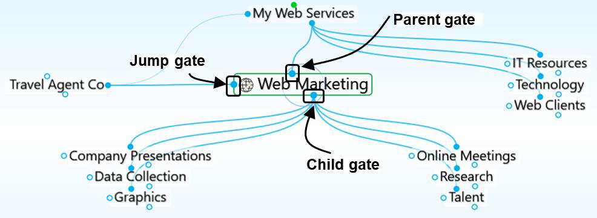

**Figure 7. Thought Gates**

**Installing TheBrain and Creating a Brain Account**

The first time you download and install TheBrain, you’ll be prompted to log in or create an account if you don’t already have one. The log-in window provides the ability to create a new account or log in to an existing account.

**Figure 8. TheBrain Log-in Window**

Here are the fields to complete if you’re creating a new account:

**Figure 9. Creating a New Account**

After you click the **Create Account** button, TheBrain will send an email to the address you specified.

Check for a message from no-reply@thebrain.com. Make sure to check your spam folder if you don’t receive the message promptly.

When you open the message, you will see a green **Activate Brain Account** link. After you click the link, you’ll see a notice confirming your success.

**Figure 10. Activating a New Account**

Now you can return to TheBrain and log in.

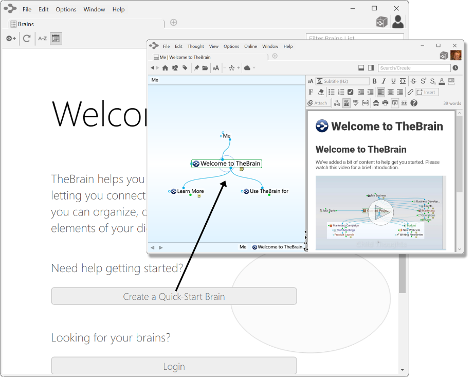

**Figure 11. Welcome to TheBrain**

Click “Create a Quick-Start Brain” and follow the directions on the screen to enter a personalized name for this brain. The Quick-Start brain is actually a dynamic resource for learning more about using your brains and you’ll find a wealth of useful information in it. Click any of the links to see what is displayed.

You can always create a new Quick-Start brain by selecting the

**Create a Quick-Start Brain**

command on TheBrain

**Help**

menu.

**Opening Older Brains**

When you’re looking at old and new brain files, note that brains created in

TheBrain 7 or 8 have filename extensions of **.brain**. Brains created in some earlier versions have a **.brn** filename extension.

To open a **.brn** file that you created in a version **older** than TheBrain 8, first

open it using TheBrain 8 and then import the resulting brain in TheBrain 13, as described in the steps below.

Any older Brain must be opened in TheBrain version 8.0.2.2 before it can be

imported into TheBrain 1till be downloaded and installed. Please contact for a v8.0.2.2 download link.

To open a brain that you created in TheBrain 8:

1. Open TheBrain.

2. Click the **File** menu, then click the **Import** command.

All dialog boxes can also be navigated via the

**Tab**

and

**Arrow**

keys.

**Figure 12. Import Box for Opening an Older Brain**

3. Click the **Select File** button, navigate to the brain of your choice, then click the **Open** button when the file is selected. You will see a running progress report.

4. When TheBrain has finished converting, you will see a “Conversion complete” message as shown below. Click the **Import** button.

**Figure 13. Import Conversion Progress**

5. When TheBrain has finished importing, you will see the following dialog box. Click the **Open** button to open the brain you just imported in a new tab of TheBrain window.

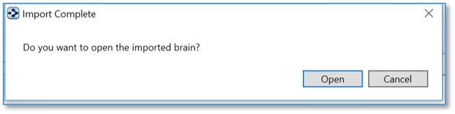

**Figure 14. Open the Imported Brain in a New Tab**

**Suggestions for Transitioning to Your New Brain**

Here are some tips for establishing a happy relationship with your brain:

You may want to attend one of TheBrain’s free online seminars on getting started―TheBrain 101. To learn more about TheBrain 101, go to

Avoid “converting” to a Brain-only environment all at once. Make the transition on a file-by-file basis so that every piece of information your brain contains will be useful.

Build your brain as you go—associating thoughts as they occur naturally.

Avoid the temptation to move large folders into your brain. TheBrain can handle this, but your brain will be cluttered with thoughts you may not need.

Remember that your first brain doesn’t need to be your *only* brain or your *last* brain. Experiment! Create a brain just for fun, to try out the possibilities—give yourself room to stretch and explore. Your brain is waiting!

Questions? Contact TheBrain Support Team right from within TheBrain app by choosing

**Contact Us**

from the

**Help**

menu in TheBrain toolbar.

## **Understanding Thought Relationships**

There are no rules governing the relationships between thoughts—whatever makes sense to *you* is the way your brain ought to be organized. The three primary relationship types―child, parent, and jump―can be used to express different types of relationships. Sibling is a relationship that is derived from child/parent relationships.

The examples in this section can help you understand the variety of relationships and how they are used. The core concepts behind each type of relationship are as follows:

▪ **Children**: Child thoughts are usually used to link more specific information or information that represents a sub-category.

▪ **Parents:** Thoughts linked as Parents are usually used to link more general information. Parents can also be thought of as higher-level categories to classify groups of information. They serve to indirectly connect their child thoughts as siblings.

▪ **Jumps:** Jump thoughts are usually used to link two pieces of information that are exclusively related, meaning that the two items are related to each other but neither represents a group that the other is a part of.

Let’s move on to an example to explore these relationship types. Imagine that you are the owner of a company and you are reviewing personnel files. Each employee has a file. You decide it makes sense to organize your employees by department. Your brain is called My Brain. From My Brain, you create a child thought called My Company (see Figure 15). My Brain is now My Company’s parent thought. You create four child thoughts from My Company—

Manufacturing, Sales, Service, and Billing. These departments are sibling thoughts of each other.

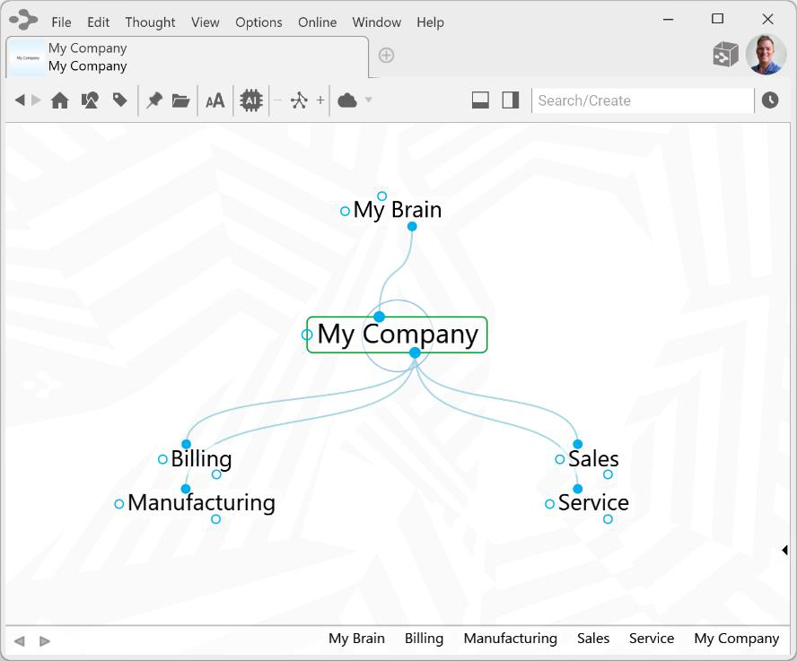

**Figure 15. Sample Brain**

Now you go to each department and create more child thoughts, one for each employee of the department. If an employee splits time between two

departments, you can make him a child thought of both departments—he’ll appear in both and you won’t have to duplicate his thought. In this example, Bob is a child thought of both Manufacturing and Sales (see Figure 16). This is one of the most powerful features of TheBrain—having one thought under more than one heading.

**Figure 16. Child Thought with Two Parents**

If you own more than one company, but have one accountant for all of them, you might want to create a thought called Accountant and link it as a jump thought to each company, as shown below.

**Figure 17. Jump Thoughts to the Active Thought**

Imagine that Joe’s company has just purchased one of your companies. Since Joe’s company now owns this company, Joe’s Company becomes a parent (see

below).

**Figure 18. New Parent Thought**

Because Joe wants to avoid a conflict of interest, the acquired company (My Other Company) no longer uses the same accountant. So its jump gate is hollow, while its sibling’s jump gate (My Company) maintains that link and is filled.

As you use TheBrain, you will develop a sense of the types of relationships you wish to make between thoughts. It is always easy to change relationships by adding and removing links (see Changing Relationships Using Drag and Drop on

page 108).

**Families of Thoughts**

It is tempting to view thought relationships as families, and indeed these different parts of your brain are types of families, with their ancestry visually spread before you, represented by subjects and categories. But unlike human families, a child thought can be a parent of one of its siblings and a thought can have more than two parents.

The complex relationships you can form in TheBrain are the source of its power. Let’s consider sibling thoughts that also share a parent/child relationship.

Let’s say you are studying philosophy. You might have a thought called

Philosophy. Individual philosophers such as Plato and Aristotle could be child thoughts of Philosophy. Each of these siblings, in turn, may have child thoughts.

Aristotle was a student of Plato, so you may want to make Aristotle not only a

child of Philosophy, but of Plato, so that when you’re working with Aristotle, Plato

is only a thought away.

**Figure 19. Example of Parent/Child Relationships**

Notice that when Philosophy and Plato are in Aristotle’s parent *zone*, their relationship (Philosophy is a parent thought of Plato) is shown by the line linking the child gate of Philosophy to the parent gate of Plato.

Clearly, TheBrain is a powerful method of organizing ideas and information. No hierarchical file structure can provide as much cross-referenced information at a glance. And our example is pretty basic—a fully developed brain can hold many more relationships and much more information.

## **Navigating Your Brain**

All thoughts can be connected—directly or indirectly—even thoughts that may seem to have nothing to do with each other can be related through a chain of links.

Let’s look at an example, say, the Queen of England and asparagus. You have a thought called Queen of England. One of its child thoughts is Prince of Wales, which has a parent thought—Famous Princes—that is also linked to the story of the Frog Prince.

The story has another parent thought called Fairy Tales. A sibling of Frog Prince is Jack and the Beanstalk.

Jack and the Beanstalk has child thoughts called Giant and Jack. Giant has another parent thought called Famous Giants.

Famous Giants has a child thought called Jolly Green Giant. Jolly Green Giant has child thoughts named after canned vegetable products, one of which is Asparagus. Thus, the Queen of England is connected to asparagus!

Depending on the relationship you create between them, thoughts may be closely or distantly related. Thoughts are considered to be closely related when

they are linked directly or are siblings. In the default view of the plex, only close thoughts of the active thought are always displayed in the plex. Thoughts that are one additional step (generation) away from the active thought can be displayed by expanding the view. See Advanced Navigation and Alternative Views on page 147 for information about the different view options.

**Opening a Brain**

When you log into TheBrain, and no brain is open, all local, synced or online brains will be displayed as thumbnails in the **Brains** tab, as shown below. This is assuming that you have already created one or more brains. Clicking on a brain thumbnail opens that brain. Or, hold down the **Ctrl** key as you click to open a brain in a new tab, leaving the Brains tab open.

**Figure 20. Example of Four Available Brains on the Brains Tab**

By default, brains are listed according to how recently they have been accessed. You can also see the list of brains sorted alphabetically using the **Brains** tab toolbar, shown below. All brains that are locally available are shown first, followed by brains that are available online.

**Figure 21. The Brains Tab Toolbar**

The status of whether each brain is available locally, online, or both is also displayed. Each brain in the **Brains** tab will have an icon appearing in the lower-right corner of the thumbnail. Right-click on a brain or click on the status icon to display a menu of options for that brain, as shown below. The appearance of the icon(s) help you identify whether the brain is Local, Synced (local and online) or Cloud (Online only).

**Figure 22. Icons Indicating Local, Synced, or Cloud**

**Figure 23. Status Indicator Icons**

**Opening a Brain that Doesn’t Appear as a Tab**

If you have a brain from an older version or from a backup, it will not appear in the Brains tab until you import it. Click the **File** menu, then the **Import** command.

Choose the type of file you want to import, then click the **Select File** button, navigate to the file of your choice, then click the **Open** button when the file is selected. Click the **Import** button after TheBrain has finished converting the brain.

**Managing Brains Using the Tabs**

The tabbed interface of the plex lets you switch instantly between brains or even

keep the same brain open in multiple **Brain** tabs or windows.

To re-open the **Brains** tab to display the Brain thumbnails, click the **+** icon to the right of the last tab.

**Figure 24. Click the + Icon to Open the Brains Tab**

There is no limit to the number of brains you can open at once. Each time you

open a brain it will appear in a separate tab. Switch from brain to brain instantaneously by clicking its tab. All tabs and their states are automatically saved and restored when you quit and restart.

Tabs can be manipulated in several ways:

▪ **Float tabs** into their own dedicated window by dragging a tab out of TheBrain application window. This creates a new Brain application window with just a

single tab.

▪ **Merge tabs** into one window by dragging and dropping. Click the tab of one Brain window and drag the tab to another open brain, hovering over the tab

area. Then release the mouse button.

▪ **Open the same brain in multiple tabs** to view and edit multiple areas at a time. This lets you view different areas of your brain at the same time, and, if you like, use a different layout in each tab. Note that tabs are simply views into the same brain data and changes made in one tab affect all other tabs of that brain.

▪ **Duplicate tabs**. Right-click on a brain tab to duplicate it, showing the same

content in a new Brain tab.

**Brain Tab Properties**

Right click on any brain tab for the option to Set Tab Color. Chose from nine different colors. This tab will then be highlighted for as long as it remains open. Closing the tab will reset the tab properties.

To permanently set a tab color for a specific brain, right click on a brain thumbnail in the brains list and select Set Brain Color. The color selected will appear in the

color indicator on the brain’s thumbnail and the brain tab will be highlighted when this brain is open. If the brain tab is open, but not currently the selected tab, the color highlight will be visible, but minimized.

**Figure 25. Selecting a Brain Color**

Brain tabs can display either the brain name and the active thought name, or just the active thought name in a more compact tab. This setting can be found in **Preferences** on the **Look & Feel tab**.

**Figure 26. Brain Tabs displaying selected colors, brain name and active thought name**

**Windows Menu**

From **Windows** menu in the menu bar you’ll have the option to move between brain tabs, move tabs to new windows or select a specific brain tab to be activated.

Additionally, if you have adjusted the layout of a brain with the Smart Splitter, you can select the option to **Reset Window** which will bring the plex/content area back to their default views.

**Managing Brains Using the Context Menu**

You can right-click any brain in the **Brains** tab to display the available options.

**Figure 27. The Context Menu in the Brains Tab**

**Tip:**

Press Ctrl/Cmd + click to open a brain in a new tab from the brains list page.

**Favorite Brains**

If you have more than one brain and would like to keep commonly accessed

brains at the top of your brain list, you can set a brain to be a favorite.

**Figure 28. Favorite Brains at the top of your Brain List**

There is no limit to the number of favorite brains. To set a favorite brain, right

click on a brain in the brains list. Select **Favorite Brain**.

**Figure 29. Setting a Favorite Brain**

**Opening Content Associated with a Thought**

As you navigate through your brain, the content associated with the active thought is displayed in the content area. Notes associated with the thought are displayed automatically. There are several ways to open an attached file or web page:

▪ Click on the link for the attachment in the content area.

▪ Click on the attachment icon to the left of the thought’s name in the plex.

▪ Right-click on the thought, click **Open Attachment** on the context menu, then click the attachment of your choice.

**Showing Thought Content on Hover**

By default, the content for the active thought displays in the content area. If you prefer, you can display content for any thought your mouse pointer hovers over by changing the setting. To do so, click the **Options** menu (**TheBrain** menu on macOS), click **Preferences**, click the **Behavior** tab, then select the “Update displayed content on mouse hover or keyboard highlight” check box. Close the **Preferences** window when you’re finished.

**Previewing Thought Content**

Certain types of file attachments are automatically previewed inside of TheBrain. These include web pages, images, text, markdown files, JSON, .html files and PDFs. Simply click on an attachment’s tab and its preview will be shown. In the example below, Tropical Getaways is the active thought and there are two attachments in the content area—an image and a PDF.

You can view multi-page PDFs, web pages, and images as a slide show within

the content area.

▪ Click the link for an attachment to open a preview of it in the content area.

▪ Click the **Next** or **Previous** arrow in the top-right corner of the attachment to

move back and forth between attachments (or back to the notes in the

content area).

▪ Click the **Close** button (**X**) to end the preview and return to the notes.

▪ Click the **Open** button to open the file outside of TheBrain.

**Figure 30. Content Area for the Active Thought**

The PDF preview features:

▪ Supported rendering for each OS

▪ Support for very large, multi-page PDFs

▪ Thumbnails of each page, zoom, rotation, search, and printing

▪ All PDF commands can be mapped to a custom keyboard shortcut

**Editing Additional Notes**

Adding additional attachments to a thought, such as .md and .txt files will enable you to also edit these attachments the same as you would a brain note.

**Pins**

Pins are shortcuts to thoughts to which you want quick access. They appear at the top of the plex, just below TheBrain toolbar. No matter where you are in your brain, the pins remain visible.

**Figure 31. Pins**

**To create a pin:**

▪ Use the **Toggle Pin** button in the main toolbar to create a pin for the Active Thought or right-click the thought for which you want to create a pin, then click **Create Pin** on the context menu

**Figure 32. Toggle Pin Button**

**To remove a pin:**

▪ Use the **Toggle Pin** button in the main toolbar to remove the pin for the Active Thought or right-click the pin or on a thought that has a pin, then click **Remove Pin** on the context menu

Removing a pin does not remove or delete the associated thought; it deletes only the reference to it at the top of the plex.

**To use a pin to link thoughts:**

▪ Drag from one of the thought gates to the pin, or

▪ Move your mouse pointer over a pinned thought and gates will appear; drag from one of these gates to the thought you want to link

**Activating Recent Thoughts: The Past Thought List**

TheBrain keeps a running breadcrumb trail of your thoughts based on activation and displays it in the Past Thought List. You can think of the Past Thought List as the visual representation of the phrase, “train of thought”—a scrollable list of thoughts in the order you activated them. The Past Thought List is displayed at the bottom of the plex window.

Clicking on any thought in the Past Thought List activates that thought. Also, when a new thought is created it appears in the Past Thought List immediately.

**Figure 33. Past Thought List**

The left and right arrows to the left of the Past Thought List enable scrolling to see items that don’t fit on the display.

The most recently activated thought (the currently active thought) appears at the right end of the list.

**To use a thought in the Past Thought List to link thoughts:**

▪ Drag from one of the thought gates to one of the thoughts in the Past Thought List, or

▪ Move your mouse pointer over a thought in the Past Thought List and gates will appear; drag from one of these gates to the thought you want to link

In the example below, Tropical Vacations is going to become a parent of Airline

Rewards; the mouse is being dragged from the child gate of Tropical Vacations

to Airline Rewards in the Past Thought List.

**Figure 34. Creating a Link using the Past Thought List**

**Using the Back and Forward Buttons:**

▪ In addition to the Past Thought List, you can also use the **Back** and **Forward**

buttons, located near the top of the Window, to quickly retrace your steps;

these buttons work just like they do in a web browser

**Figure 35. The Back and Forward Buttons**

▪ Click the **Back** button to go back to the last active thought

▪ Once you have clicked the **Back** button, the **Forward** button can be used to

re-activate the thought you came from

**Back and Forward Mouse Buttons:**

The back and forward buttons available on some mice (typically on the left side of the mouse near where you place your thumb) may be used to navigate backward and forward in your brain. These mouse buttons perform the same navigation as the

**Back**

and

**Forward**

buttons in the Brain toolbar, shown above.

**Searching a Brain**

TheBrain includes powerful search capabilities. Indexing is performed by the application itself and is not dependent on your OS search settings. Re-indexing your brain is typically not necessary; however, your brain can be re-indexed by clicking on **File** in the toolbar. Under the **Utilities** option, select **Rebuild Brain Index**.

**Instant Activation**

TheBrain includes powerful search capabilities. The Search box is in the top-right area of the application.

**Figure 36. The Search Box**

The term “instant activation” refers to TheBrain’s ability to quickly find whatever

you’re searching for and activate the related thought. You can easily scan the search results as you type in the Search box. There's no need to click in the Search box, your cursor is always there by default, unless you are actively typing

in the content area or another field.

A content area preview will automatically appear for each choice you highlight.

To activate one of these results, click it with your mouse or use the **up-arrow**, **down-arrow**, **page up**, and **page down** keys on the keyboard then press the

**Enter** key.

**Figure 37. Instant Activate Finds Matches Based on Thought**

**Names, Labels, Notes, and Attachments**

Accents are ignored when matching thought names. Also, when two or more

matches with the same name are found, the names of their parent or jump

thoughts are also displayed so you can differentiate them.

You can search for thoughts by typing the first letter(s) of separate words and the

letters can be in any sequence; for example, to find the “Family and Friends”

thought you could type “fa fr,” or “fr fa,” or “fa and fri.”

**Figure 38. Use First Letters of Separate Words for Instant Activate**

Attachments and note search matches are identified with a yellow piece of paper icon for notes and a paper clip icon for Attachments.

**Figure 39. Search Results**

When you do a search, the results are sorted with results that match thought names first, then notes, then attachments. Within the thought name matches, they are ranked in groups:

▪ **Exact Matches**—where the entire name of the thought matches the entire query

▪ **Starting Matches**—where the entire query occurs at the start of the thought name

▪ **Continuous Matches**—where the entire query occurs anywhere in the thought name

▪ **Matches**—where every term in the query occurs somewhere in the thought name

Within each group, thoughts that have been activated in the last 30 days will be shown first, ordered with the most recently activated first. Thoughts that have not been activated within 30 days are sorted alphabetically.

**Cross-Brain Search**

Search results will be displayed first by results in the currently open brain,

however, you’ll also see results of your search query in Thoughts and Links from other Brains and Notes, Attachments and Events from other Brains. To keep the search process efficient, search results will be displayed progressively - first from your current, open brain and then from other brains.

**Figure 40. Search Results from other Brains**

Clicking on any of these results will launch the specified brain/thought in a new tab. These search results are only for brains that you have access to on the current machine where you are searching.

**Searching within Attachments**

Your searches automatically include matches based on the contents of

attachments. If the text you’re searching for exists within documents including PDFs, Word, Excel, PowerPoint and many other file formats, the documents containing the text will be found.

**Using the Search Box to Search the Web**

Say you’re searching for something and come up with no hits. For example,

you’re on a neighborhood committee and you’ve volunteered to look into an issue with squirrels. You type “squirrels” in the Search box. No results? Press the **F4** key to search the web.

**Figure 41. Search-Engine Choices**

▪ Click the drop-down arrow if you want to select a different search engine,

then click the **Search** button to begin searching the web based on what

you’ve typed.

▪ When you find a site you like, you can add it to any thought in the usual way.

The **Web Search** box will close automatically after you click the **Search**

button.

**To modify, add, or reset search-engines:**

▪ Click the **Edit** button in the **Web Search** box.

**Figure 42. Editing Search-Engine URLs**

**To customize the search-engine choices:**

▪ Click and edit any URL string to customize it, or

▪ Click the **Add New** button to enter a name that isn’t already in the list, or

▪ Click the **Reset** button to return to TheBrain’s default choices

Click the **OK** button to save your customizations or click the **Cancel** button to

close the box without making changes. The original **Web Search** box will still be

open, still showing the text you were searching for.

**Additional Search Functionality**

Search has several additional capabilities that are automatically enabled.

▪ You can find and execute commands from the Search box. To begin, type a

forward slash (/) in the Search box. An alphabetical list will appear. The list

will be fine-tuned to match what you type. This option can also be accessed

from the **Search Commands and Preferences** option under the **Help** menu.

**Figure 43. Executing a Command from the Search Box**

▪ External attachments are included in search results

▪ Search using acronyms (ex. find "New York Stock Exchange" by typing "nyse")

▪ Search for thoughts starting with punctuation. You may use this as a shortcut to provide fast access to thoughts that you always start with a certain type of punctuation. For example, you could use this for people (@Mike, @Sally, @Debbie, etc.) or projects (#Ridgeline, #Palmdale, #Westly, etc.)

**Figure 44. Search Results for Both Internal and External Attachments** ▪ Below the search box is an option for searching Childward only. Selecting this option will limit the search results to 3 generations below the current active thought.

## **Customizing Your Brain’s Environment**

You may choose to use your brain just as it’s offered “out of the box” or you may choose to change some of the environmental settings to suit your personal preferences.

**TheBrain’s Default Settings**

Without making any changes, here’s what your brain looks like:

▪ The area where your thoughts appear (the plex) will be the color and design of one of TheBrain’s “Themes.” The initial theme is randomly selected and you can change it at any time.

▪ The left half of TheBrain window will display your thoughts and the right half of the window will display the “Content Area” which holds notes and any other items you will attach to your thoughts—files, web pages, Events, etc.

▪ Your thoughts will be displayed in “Normal” view, meaning that you will see only the direct parents, children, jumps, and siblings of the active thought.

**Figure 45. TheBrain Window with Default Settings**

**Using Smart-Splitter to Arrange TheBrain Window**

The smart-splitter controls let you manage where the plex and content area display relative to each other in the Brain window.

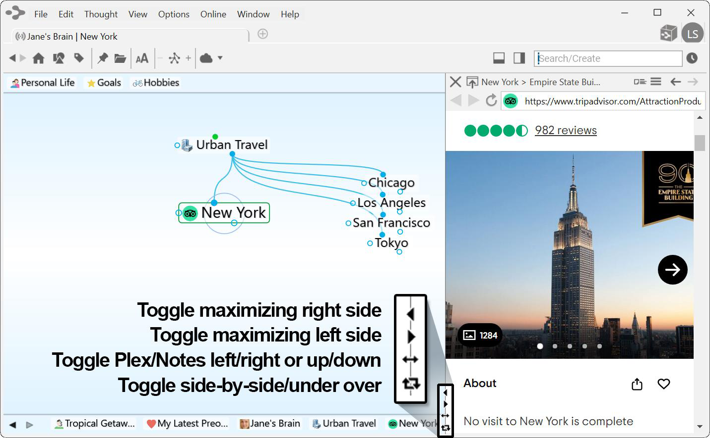

**Figure 46. Smart-Splitter**

▪ Click the individual left- and right-arrows (or up- and down-arrows if the window is in “over-and-under” mode) to maximize the area the arrow is pointing towards (either the plex or the content area).

▪ Click the double-headed arrow icon to toggle the plex to the right or left side of the content area.

▪ Click on the two-arrow icon that forms a box to toggle between seeing the plex and content area "side-by-side" or “over-and-under.”

▪ You can also point at the border between areas and click and drag when the double-headed arrow appears to move the border.

**Moving Thoughts in the Plex**

When the default settings are in use and the plex is in “Normal” view, you can move the thoughts in the plex up or down, vertically, by dragging (up or down) in any blank area of the plex background.

**Figure 47. Dragging the Plex Vertically**

**Resizing Thoughts in the Plex**

The plex is the heart and soul of TheBrain. You can change the size of thoughts in the plex by using TheBrain toolbar or your keyboard and mouse.

**To change the size of thoughts using the toolbar:**

▪ Click the **AA** button to activate the slider, then click and slide the bar up or down to grow or shrink the size of your thoughts.

**Figure 48. Resizing Thought Size with the Slider**

**To change the size of thoughts using the keyboard, mouse, or trackpad:**

▪ Hold **Cmd** (macOS)/**Ctrl**(Windows) on your keyboard and scroll up or down

on your mouse wheel or trackpad while your mouse pointer is in the plex.

**Figure 49. Resizing with the Mouse or Trackpad**

▪ Hold **Cmd** (macOS)/**Ctrl** (Windows) on your keyboard and press **-** to make

thoughts smaller or **+** to make thoughts larger.

**Figure 50. Resizing with the Keyboard**

▪ Pinch to zoom on a macOS Trackpad.

**Figure 51. Resizing on a Trackpad**

**Customizing a Brain’s Appearance**

**Selecting a Theme**

The Themes feature lets you choose from many built-in designs to customize the look of your brain, including the appearance of the plex and notes in the content area. You can change many of the default colors and the style of notes

associated with the Theme, then save the look of your brain as a new Theme. This lets you quickly switch from one saved Theme to another.

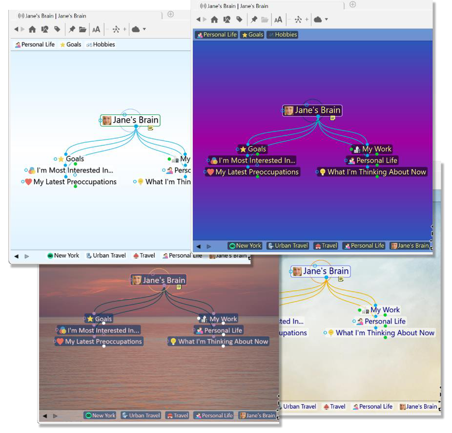

**Figure 52. Sample Themes**

**To select a Theme:**

1. Either click the **Options** menu in TheBrain toolbar (**TheBrain** menu on macOS) or right-click any blank space in the plex.

2. Click the **Brain Theme** command.

**Figure 53. Accessing the Brain Theme Dialog Box**

In the **Brain Theme** box, you’ll see a scrollable list of available themes in the left panel and **Colors** and **Options** tabs in the right panel. Click on any Theme to see how it looks in the plex.

**Figure 54. The Brain Theme Dialog Box**

**Customizing a Theme’s Colors**

Have the

**Brain Theme**

box open when you want to customize a Theme (right- click a blank area of the plex, then click the

**Brain Theme**

command).

The default colors for virtually all items in the plex vary based on the selected Theme. The current color for each item is shown in the circle to the right of the item’s description. Scroll through the list in the **Colors** tab to get an idea of all of the items that can be changed.

**To change the colors in the selected Theme:**

1. Click the item whose color you want to change to display your choices.

2. Click the color of your choice, click outside of the box of colors to close it, then click Close (**X**) (or press **Esc**) to close the **Brain Theme** box.

**Figure 55. New Selected Color for Links**

Note that while you can change the color of the shadow for thought text using the theme’s **Color** tab settings, you can toggle whether or not text shadows

are displayed using the

**Look & Feel**

tab of the

**Preferences**

window (as explained in the Look & Feel Preferences section on page 62). By default, text shadows are displayed.

When you are happy with your color selections, click the **Close** button (**X**) in the **Brain Theme** box.

**Defining and Selecting Additional Colors**

You can add customized colors if you don’t see the exact shade you want.

1. In the color selection box, click the color that’s closest to what you want, then click the box next to “Custom,” then click the **Define Custom Colors** button.

**Figure 56. Define a Custom Color**

2. The **Color** window will expand to provide a slider to fine-tune the shade.

You can also select a different color and fine-tune it or type in specific RGB

or HSL numbers. Click the **Add to Custom Colors** button when you’re

happy with the sample color, then click the **OK** button.

**Figure 57. Adding a Custom Color**

**Selecting a Custom Image for the Plex**

If you want to use an image of your own instead of using one in the Themes list

of the **Brain Theme** box, it’s very easy to do so.

**To select your own background image:**

1. Click the **Options** tab in the **Brain Theme** box, then click the **Wallpaper** check box.

**Figure 58. Options Tab in the Brain Theme Dialog Box**

2. In the **Select image file as the wallpaper** window, navigate to the location of your image file, click on it, and then click the **Open** button. Supported wallpaper file formats include .jpg, .gif, and .png.

3. Click the **Close** button (**X**) in the **Brain Theme** box to save your new image for the plex.

**To replace, remove, or copy a wallpaper image:**

▪ To replace the image, click the **Select** button next to the **Wallpaper**check box to navigate to a different image.

▪ To remove the image, click the **Wallpaper**check box to toggle off the check mark and remove the image from the plex.

▪ To copy a wallpaper image to your clipboard, click the **Copy Wallpaper** button

**Figure 59. Replacing or Removing Wallpaper**

**To dynamically select new Wallpaper from a web site:**

1. Go to a web site that offers Wallpaper files, right-click the design of your choice, then select **Copy** on the context menu.

2. Return to your brain, right-click in any blank area of the plex, then select **Paste Wallpaper** on the context menu.

**Figure 60. Context Menu on the Plex**

**Changing the Default Font in the Plex**

By default, the font for text that appears in the plex is Helvetica. You can change it to any font installed on your machine:

1. Click the **Options** tab in the **Brain Theme** box, then click the drop-down button for **Font**.

**Figure 61. Changing the Font for Plex Text**

2. Click the font of your choice. You will see the text in the plex update automatically.

**Changing the Content Area’s Default Attributes**

You can select custom colors for your notes’ text, links, page, edge, and

background. You can also change the font, size, weight (boldness), and other attributes for the heading and body text you include in the content area—either before or after you add it. Prebuilt Styles are also available, which you can use as-is, or modify. You’ll see instant previews of the changes you make, before you apply them. And, of course, you can change your changes anytime.

By default, the notes in the content area of your brains appear in a style called “Modern,” which is a sleek and clear combination of font, color, and size.

**To begin selecting different style attributes for notes:**

▪ Click the **Edit Notes Style** button on the **Options** tab in the **BrainTheme** box, or

▪ Click the **Notes Style** button in the content area toolbar

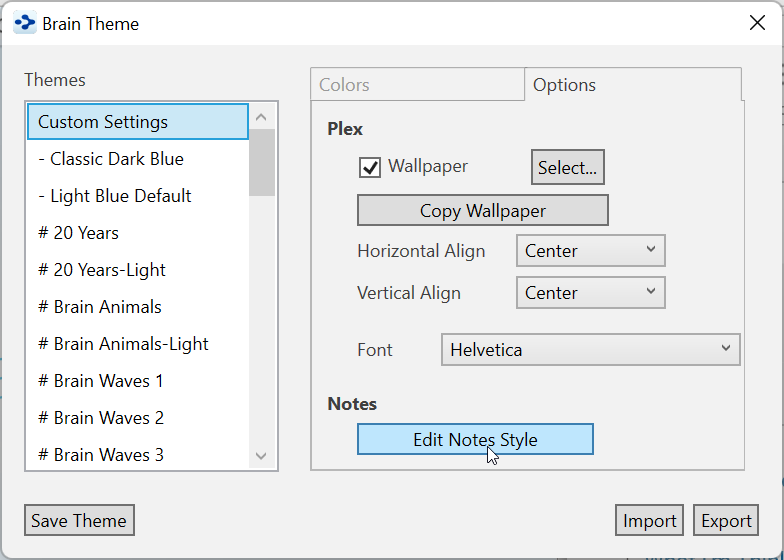

**Figure 62. Changing the Style of Notes**

You can also access the

**Edit Notes Style**

dialog box from the content area toolbar. See

*Choosing a Notes Style*

beginning on page 171.

**To change the appearance of headings:**

1. Click on an example heading for the level you want to change. For example, click on “Title Example Text” to change the top-level heading.

2. Select an attribute from the context menu. Selecting **Font**, **Weight**, **Color**, or **LetterSpacing** will take you to an additional set of choices.

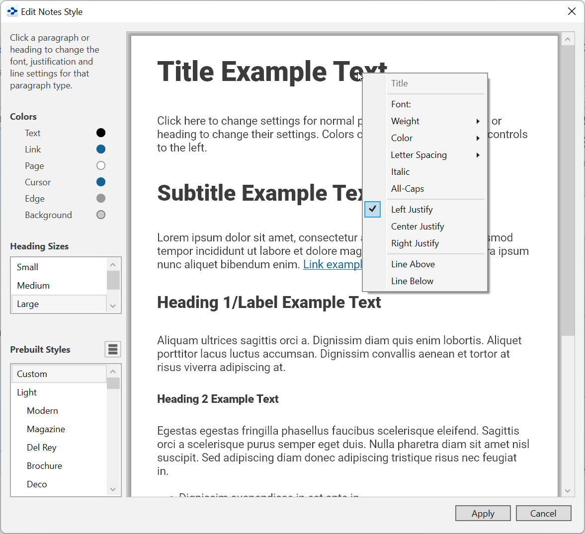

**Figure 63. Style Options for Content Area Text**

**Figure 64. Before and After Changing a Heading Color Style**

**To select a heading color that isn’t in the palette:**

▪ Click **Custom** at the bottom of the color palette, click **Define Custom Colors**, select a color you like, then click the **OK** button.

**Figure 65. Options for Fine-Tuning Heading Text Color**

**To change the size of headings:**

▪ Click **Small**, **Medium**, or **Large** in the **HeadingSizes** list. The sizes will adjust automatically, based on the level of each heading.

**Figure 66. Options for Changing Heading Size**

**To change the color of non-heading text and other Content Area parts:** 1. Click the round color sample in the left panel for the element you want to change.

2. When the palette opens, click the new color of your choice, or click **Custom** to select a different color. The example text will immediately reflect your choice. The palette stays open so that you can see what different colors look like when applied.

3. Click outside the palette to close it, when you’re ready.

**Figure 67. Selecting a New Color for Body Text in the Content Area To change the font or weight of non-heading text:**

1. Click within any non-heading body text, then choose either **Font** or **Weight** in the context menu.

2. To change the font, select a choice in the scrollable list that appears—you’ll find over 1,000 options. Each has a sample of how it will appear.

3. Press **Esc** or click outside of the list to close the box if you don’t want to make a selection.

**Figure 68. Changing the Font of Content Area Body Text**

4. To change the weight (the width/boldness of the characters), select a choice from the list that appears.

**Figure 69. Changing the Weight of Content Area Body Text**

**Viewing and Selecting Prebuilt Styles**

A handy way of seeing combinations of options for the content area is to visit the Prebuilt Styles—if you see one you like, apply it to your brain and see the results

instantly. The list of Prebuilt Styles is grouped into **Light**, **Dark**, and **Fun** sections.

As you click each Prebuilt Style, you’ll see the Example Text instantly reflect the look.

**Figure 70. Selecting a Prebuilt Style**

**Copying, Pasting, Importing, and Exporting Styles**

You can copy, paste, import, and export styles, making it easier to create new styles. Click the Actions button to display the Copy, Paste, Import, and Export options for Styles.

**Figure 71. Selecting a Prebuilt Style**

▪ **Copy Notes Style**—Click when you want to apply the current notes formatting in another brain.

▪ **Paste Notes Style** (available if a note style has been copied)—Click after you’ve opened the brain to receive the style.

▪ **Paste Colors Only** (available if a note style has been copied)—Click after you’ve opened the brain to receive the color choices in the copied style.

▪ **Export Notes Style**—Click **Save** after navigating to a location of your choice for saving the style file. The filename will look like this: Style-2021-08- 13.nstyle (except with the actual date you exported the file).

▪ **Import Notes Style** (available if a note style has been exported)—with the receiving brain open, choose this option, navigate to the location of the .nstyle file, click **Open** when the file is selected, then click the **Apply** button.

**Saving Changes**

When you are happy with your content area choices, click the **Apply** button, then close the **Brain Theme** box to return to your brain.

**Reverting to the Theme’s Default Settings**

selected in the Themes list.

As soon as you make any changes to a Theme, “Custom Settings” will be

To switch back to the original settings for any Theme, select the Theme name in the Themes list within the **Brain Theme** dialog box.

**Saving Themes**

1. Make sure the tab with the brain that has the Theme you want to save is active in the plex.

2. Unless the **Brain Theme** box is already open, either click the **Brain Theme** command on the **Options** menu or right-click a blank area of the plex, then click the **Brain Theme** command.

3. Click the **Save Theme** button, click **Save as New** (so you don’t overwrite the original Theme), then type a name for your new theme in the field.

**Figure 72. Save a Theme**

4. Click the **OK** button. Your new Theme will be inserted into the list of Themes, ready for use in your other brains.

**Figure 73. Newly Saved Theme in the Themes List**

Your saved Theme will also include customizations you have made in the

**Edit Notes Styles**

window.

**Renaming a Theme**

1. In the **Brain Theme** box, click the Theme you want to rename, then click the **Rename** button.

2. Type or revise the current name, then click the **OK** button (or press the **Enter** key).

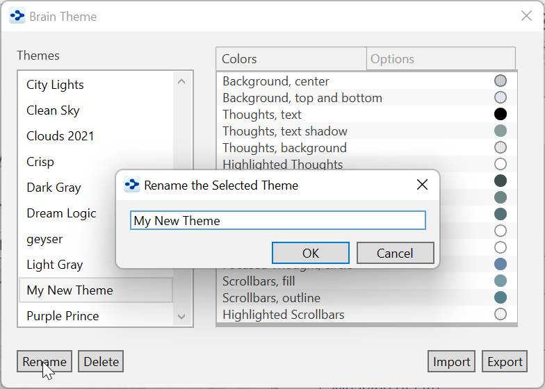

**Figure 74. Renaming a Theme**

3. Click the **Close** button (**X**) to close the **Brain Theme** box.

**Deleting a Theme**

1. In the **Brain Theme** box, click the Theme you want to delete, then click the **Delete** button.

Clicking on a Theme that you want to rename will activate this Theme in your

brain. You may want to save your current Theme first (if it has been customized) before renaming another, existing Theme.

**Figure 75. Deleting a Theme**

2. Click the **Delete** button to confirm that you’re sure you want to delete the

Theme.

3. Click the **Close** button (**X**) to close the **Brain Theme** box.

**Importing and Exporting Themes**

**Figure 76. Importing or Exporting a Theme**

**To import a Theme:**

▪ Click the **Import** button, navigate to the location of the .BrainTheme file you

want to import, select it, then click the **Open** button.

**To export a Theme:**

▪ Make sure the Theme you want to export is in the active brain tab.

▪ Click the **Export** button, navigate to the location where you want to save the

Theme, then click the **Save** button.

▪ Click **OK** in the confirmation box.

**Dark Mode**

The Dark Mode changes the windows, menus, icons and other user interface

elements to be predominantly dark grey. Dark Mode allows you to focus on your

work with subtle colors and fewer distractions.

- To switch to Dark Mode, click the **Options** menu, then click the

**Preferences** command (on macOS, the **Preferences** command is

located in the **TheBrain** menu). On the **Look and Feel** tab, select Dark

under the **User Interface** setting.

- After you give permission, TheBrain will restart and apply the change.

**Figure 77. TheBrain in Dark Mode**

▪ You may want to modify your Brain Theme to complement the darker

interface and tones.

▪ On macOS, the Dark Mode setting will follow your OS automatically.

**Setting Other Preferences**

TheBrain’s **Preferences** dialog box is where you’ll find many of the settings for

adjusting how your brain works, both mechanically and visually. Preference

settings affect how TheBrain works globally―no matter which brain is open when

you make your choices.

**To open thePreferencesdialog box:**

▪ Click the **Options** menu, then click the **Preferences** command (on macOS,

the **Preferences** command is located in the **TheBrain** menu)

**Figure 78. Accessing Preferences**

TheBrain **Preferences** are organized into these categories:

▪ Look & Feel

▪ Behavior

▪ Notes Editor

▪ System

▪ Keyboard

▪ Experimental

**Look & Feel Preferences**

**Figure 79. Look & Feel Preferences**

**User Interface**

**Preference** **Description**

**Compact Window Title Bar**

Moves the File, Edit, Thought, View, etc. menu items up into the frame of the app.

**Hide Brain Name in Tags**

When selected, Brain tabs will only display the current active thought.

**Theme** Switch between Light and Dark Mode.

**Plex**

**Preference** **Description**

**Default Layout:**

Select from Normal, Outline, Mind Map or Normal +1,

**Animation Speed**

Drag the slider right to reduce or left to

increase the speed with which a thought becomes active when you click it in the plex.

**Preference** **Description**

**Wander Delay**

Wandering is an option to step randomly through TheBrain, to let you see thought associations. Drag the slider to specify the amount of delay (in seconds) between

thought activations. The delay is shortest by default.

**Thoughts**

**Preference** **Description**

**Column Width** Controls the minimum size that will be used

for columns of thoughts relative to the current

text size.

**Spacing** Drag the slider to decrease or increase

space between thoughts. The wider the

spacing, the larger and more spaced out the

thoughts will be.

**Tags text** You can choose not to show, only show Tag

text on hover (mouseover), or always show.

**Tags icons** You can choose to never show, only show

Tag icons on hover (mouseover), or always

show.

**Show event indicators**

Event icons will appear in the bottom-right area of thoughts that include events. This preference is off by default.

**Show note indicators** Note icons will appear in the bottom-right

area of thoughts that include notes. When

this is selected, you can hover over the icons

for an instant view of the corresponding note.

This preference is off by default.

**Show attachment count** The number of attachments (if more than

**indicators** one) will be displayed on the thought icon.

**Show siblings in normal** This preference is on by default.

**view**

**Context sensitive thought** Context sensitive thought names are

**names** explained on page 84. This preference is on

by default.

**Show label for active thought**

This preference is off by default.

**Text shadows** This preference is on by default.

**Use ClearType to render text (slower)**

Applies a crisper display of thought names, but may require more system resources.

**Links**

**Preference** **Description**

**Curved Links** When selected, links will be curved lines and

when not selected, links will be straight lines.

This preference is on by default.

**Timeline**

**Preference** **Description**

**Always show thought or link name on events**

This preference is on by default.

**Calendar week starts on Monday**

When checked, Monday will be the first day of the week. Unchecked, Sunday will be the first day.

**Behavior Preferences**

**Figure 80. Behavior Preferences**

**Thoughts**

**Preference** **Description**

**On click active thought**

**Custom thought Context Menu**

**Automatically capitalize thoughts on creation**

**Activate last created**

**thought**

**Download Icons for**

**Attached Email Addresses from Gravatar**

By default, the thought’s properties will display when the active thought is clicked. The other option is to do nothing.

Click on Toggle Commands and uncheck options that you would like to have hidden.

The first letter of the name of the thought will be automatically capitalized. This preference is on by default.

A thought will become the active thought as soon as it’s created. This preference is off by

default.

This preference is on by default.

**Content**

**Preference** **Description**

**On drag and drop of files**

By default, files will be copied when dragged and dropped. The other options are that they will be either moved or linked.

**Update displayed content** This preference is off by default.

**on hover**

**Show details when** This preference is off by default.

**selecting attachment to**

**open**

**Show first attachment when notes is empty**

Preference is on by default.

**Show attachments as a list**

Attachments will show in the same area

instead of on separate tabs within the content area. This preference is off by default.

**Show attachment** Will display the file modification date/time

**modification date and time** when files are viewed as a list

**in list**

**Content Previews**

**Preference** **Description**

**On click attachment**

Select between ‘Preview when possible’ or ‘Always open in default application’.

**Preference** **Description**

**Show content previews when searching**

This preference is on by default.

**Automatically start**

**playback of media**

**attachments**

This preference is on by default.

**Show page thumbnails in** This preference is on by default.

**PDF preview**

**Embedded browser for web** Linked web pages will open in TheBrain’s

**links** built in browser.

**Preview attachments** Attachments being dragged and dropped into

**immediately upon being** TheBrain will launch in the content area

**attached** immediately when checked.

**Other**

**Preference** **Description**

**Sync brains on application** Closing TheBrain application will sync all

**exit** brains. To exit immediately when this feature

is on, simply close the sync status window.

**Maximize on double-click of plex background or**

**content tab background**

Double-clicking either the plex or content area background will maximize that part of the

brain and the other part will be hidden. This preference is off by default.

**Hide brain name in tabs** Removes the brain name from appearing in

the tabbed interface.

**Treat touches like mouse** The way the plex interprets touch events can

**input** be altered using the preference. More

**Show accounts on brains** Display all available accounts below brain

**list** thumbnails on the brains list tab.

**Notes Editor Preferences**

**Figure 81. Notes Editor Preferences**

**General**

**Preference** **Description**

**Layout** Simple (all notes on one long scrolling page)

or Multi-Column (notes in thinner columns,

multiple columns will be displayed where

space is available)

**Line Spacing** Set notes line spacing.

**Thought Icon**

Choose between Hide, Above, Below, and Inline⎯the default icon placement is inline.

**Emoji Size** Set emoji size to Small, Medium, or Large.

**Attachment Text Size**

Set attachment text size to Small, Medium, or Large.

**Custom Date/Time Format**

Use the default date/time layout or customize your own.

**Custom date/time format for notes**

Use the following format options to customize the appearance of your date/time

stamp in notes:

**Characters** **Result**

d The day of the month, from 1 through 31.

dd The day of the month, from 01 through 31.

ddd The abbreviated name of the day of the week.

dddd The full name of the day of the week.

h The hour, using a 12-hour clock from 1 to 12.

hh The hour, using a 12-hour clock from 01 to 12.

H The hour, using a 24-hour clock from 0 to 23.

HH The hour, using a 24-hour clock from 00 to 23.

K Time zone information.

mm The minute, from 00 through 59.

M The month, from 1 through 12.

MM The month, from 01 through 12.

MMM The abbreviated name of the month.

MMMM The full name of the month.

ss The second, from 00 through 59.

t The first character of the AM/PM designator.

tt The AM/PM designator.

yy The year, from 00 to 99.

yyyy The year as a four-digit number.

z Hours offset from UTC, with no leading zeros.

zz Hours offset from UTC, with a leading zero for a single-digit value.

zzz Hours and minutes offset from UTC.

: The time separator.

/ The date separator.

**Animation**

**Preference** **Description**

**Animate Cursor** Cursor will visibly animate when clicking to

different locations in notes.

**Blink Cursor** Cursor in notes will blink to indicate its

location.

**Highlight lines on hover** Hover over any line in the notes and it will be

highlighted.

**Header and Footer**

**Preference** **Description**

**Include Title**

This preference is on by default. Option to display the Thought Label in the content area when checked.

**Mapped Links** This preference is on by default.

**Backlinks** This preference is on by default.

**Unlinked Mentions** This preference is on by default.

**Hide Private**

**Backlinks/Unlinked**

**Mentions**

This preference is on by default.

**Options**

**Preference** **Description**

**Select adjacent text when inserting link**

This preference is on by default.

**Automatic smart quotes** This preference is on by default.

**Rename thought updates** This preference is on by default. **links**

**Check spelling as you type** This preference is on by default. Applies to spell checking while creating thought names as well.

**Recognize emails and phone numbers**

Properly formatted emails and phone numbers will be hyperlinked.

**Insert link when extracting child thoughts**

When selecting text in a note to become a new thought, a link to the new thought remains on the original note.

**Display**

**Preference** **Description**

**Underline normal links** Hyperlinked text will be underlined.

**Render underscore tags as italics**

Unchecked – text within underscores will be underlined. Checked – text within

underscores will be italicized.

**Show markdown** When checked, markdown tags will be visible

in the notes.

**User Interface**

**Preference** **Description**

**Use compact toolbars for notes**

Some content area buttons will be grouped into dropdown lists⎯all tools will be available via the **More Notes Editor Actions**button.

**Show link target in pop-up** When checked, hovering over a hyperlink in

a note will display the linked URL.

**Restore cursor and scroll** This preference is on by default.

**position**

**Mentioned Thought names** Select between Show all, Show except

common words and Never show

**Clicking links in notes**

Follows link or Moves cursor (places cursor in the text)

**Printing**

**Preference** **Description**

**Include title** Includes title when printing the note.

**Include label** Include any thought label when printing

**Include links and mentions** This preference is off by default.

**Include attachments** This preference is off by default.

**Prevent widows and** This preference is on by default.

**orphans**

**Prevent orphan headers** This preference is on by default.

**Clipboard**

**Preference** **Description**

**Replace pasted URL with** This preference is on by default.

**page title**

**Preference** **Description**

**Paste without formatting as default**

This preference is off by default.

**Exclude color information when pasting**

This preference is on by default.

**System Preferences**

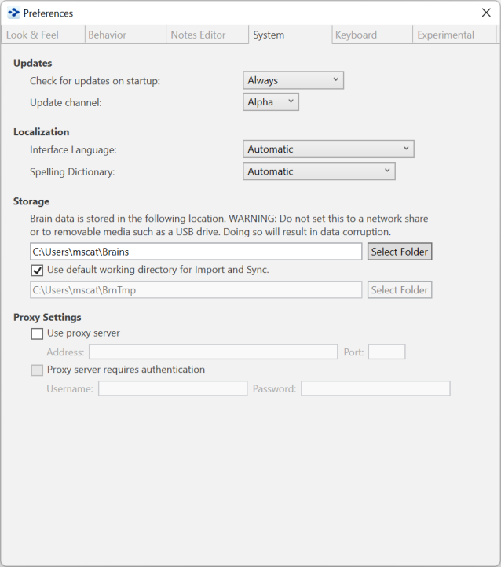

**Figure 82. System Preferences**

**Updates**

**Preference** **Description**

**Check for updates on startup**

Notification of updates on startup. Always, Only free updates or Never.

**Update Channel**

This preference affects which kind of updates you’ll see as available when you click the **Check for Update** command on TheBrain’s **Help** menu. The default is Stable and the other choices are Beta and Alpha.

**Localization**

**Preference** **Description**

**Interface Language** The default is Automatic; however, you may select from one of 78 different languages.

**Spelling Dictionary** The default is Automatic and there are many other languages to choose from in the drop- down list. After you select another language, you’ll be prompted to exit TheBrain and restart so that your change can take effect.

**Storage**

**Preference** **Description**

The location of your brain data. The default is **Storage**

to use the default working directory for Import and Sync.

**Proxy Settings**

**Preference** **Description**

**Use proxy server and proxy server requires**

**authentication**

If you are unable to synchronize your brain with TheBrain Cloud due to a proxy server or restricted ports on your network, the Proxy settings can be used to customize the

synchronization process. Check with your network administrator for the appropriate information for these fields. By default, the Use proxy server preference is off.

**Keyboard Preferences**

Most Brain commands can be accessed by keyboard commands, which you can customize based on your preferences. You can even export your settings to share them with others or to transfer them from one computer to another.

**Figure 83. Keyboard Preferences**

**Using the Keyboard Preferences Tab**

**To do this …** **Do this …**

**Find a command quickly**

Begin typing the command in the Search

commands field in the bottom-left corner of the **Keyboard** tab of the **Preferences** window.

As you type, the list will shorten to match what you’ve typed. When you see the command

you’re looking for, note its shortcut or click it to define a new shortcut.

**To do this …** **Do this …**

**Collapse the list to see only major headings**

**Restore the full list**

Click the **Collapse All** button.

You can also collapse an individual heading, for example “Application,” to collapse or

expand just that section.

Click the **Expand All** button.

**To do this …** **Do this …**

**Import shortcuts** Click the **Actions** menu button in the bottom- right corner of the **Keyboard** tab, then click the **Import Shortcuts** command.

**To do this …** **Do this …**

**Export shortcuts**

Click the **Actions** menu button in the bottom-right corner of the **Keyboard** tab, click the **Export Shortcuts** command, select a

location for the file, then click the **OK** button.

The file will be named

“KeyboardShortcuts.txt.”

**Restore default shortcuts** Click the **Actions** menu button in the bottom- right corner of the **Keyboard** tab, then click

the **Restore Defaults** command.

**To define a new shortcut:**

1. In the left column, expand a category of interest.

2. Click the command for which you want to create a shortcut. The row containing the command will be highlighted and an instruction will appear

under the **Preferences** tabs.

**Figure 84. Creating a New Shortcut**

3. With the command of your choice highlighted, press the function key or keyboard combination of your choice. For example, you might choose to assign the “Check for Update” command to **Ctrl**+**Shift**+**U**.

**Ctrl**

- 

**C**

) nor can you use letter or number keys by themselves. The

**Alt**

key can You can’t assign keys that are already used for common operations (such as

be used as a standalone modifier

Your new shortcut will display in the list. You can delete the shortcut by pressing the **Delete** key while the command is highlighted.

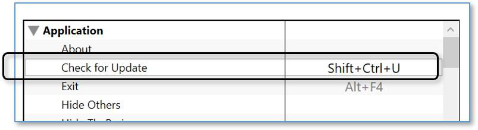

**Figure 85. The New Shortcut in the List**

If the keyboard shortcut you selected is already in use for another action, you will have the option to “steal” the shortcut for the current selection, or cancel the request and select a different keyboard combination.

**Figure 86. Replacing an Existing Shortcut**

**Default Shortcuts for Windows**

**Application Commands** **Shortcut**

Exit **Alt**+**F4**

Preferences **Ctrl**+,

**Edit Commands** **Shortcut**

Copy **Ctrl**+C

Copy as Text **Shift**+**Ctrl**+C

Cut **Ctrl**+X

Paste **Ctrl**+V

Paste without Formatting **Shift**+**Ctrl**+V

Redo **Ctrl**+Y

Select All **Ctrl**+A

Undo **Ctrl**+Z

**Navigation Commands** **Shortcut**

Activate Tag **Ctrl**+G

Activate Type **Ctrl**+E

Backward **Alt**+Left

Expand/Collapse Current Thought **Space**

Forward **Alt**+Right

Navigate Down **Down**

Navigate Enter **Enter**

Navigate Escape **Esc**

Navigate Left **Left**

Navigate Right **Right**

Navigate to Pin 1 **Ctrl**+1

**Navigation Commands** **Shortcut**

Navigate to Pin 2 **Ctrl**+2

Navigate to Pin 3 **Ctrl**+3

Navigate to Pin 4 **Ctrl**+4

Navigate to Pin 5 **Ctrl**+5

Navigate to Pin 6 **Ctrl**+6

Navigate to Pin 7 **Ctrl**+7

Navigate to Pin 8 **Ctrl**+8

Navigate Up **Up**

**Notes Commands** **Shortcut**

Bold **Ctrl**+B

Collapse All **Ctrl+[**

Collapse All Except Here **Shift + Ctrl+I**

Expand All **Ctrl+]**

Expand/Collapse Toggle **Ctrl+\**

Find & Replace **Ctrl**+F

Find Next **F3**

Find Previous **Shift+F3**

Insert Date/Time **Ctrl**+D

Insert/Edit Thought or Web Link **Ctrl+K**

Italic **Ctrl**+I

Open in Browser **Alt**+**Ctrl**+O

Pop up Table of Contents **Ctrl+T**

Print **Ctrl**+P

Replace Next **Ctrl+F3**

Replace Previous **Shift+Ctrl+F3**

Take Action **Ctrl+L**

Underline **Ctrl+U**

**Options Commands** **Shortcut**

Web Search **F4**

**Thought Commands** **Shortcut**

Create Child **F6**

**Thought Commands** **Shortcut**

Create Jump **F8**

Create Parent **F7**

Forget **Ctrl**+**Del**

Open Folder **Shift**+**Ctrl**+F

Show Thought Properties **Ctrl**+**Enter**

**Thought Icon Commands** **Shortcut**

Select Stock Icon **Alt**+**Ctrl**+I

**View Commands** **Shortcut**

Collapse All **Ctrl**+9

Expand All **Ctrl**+0

Mind Map **Shift**+**Ctrl**+3

Normal **Shift**+**Ctrl**+1

Outline **Shift**+**Ctrl**+2

Zoom In **Ctrl**+=

Zoom Out **Ctrl**+-

**Window Commands** **Shortcut**

Close Tab **Ctrl**+W

Close Window **Alt+F4**

Keyboard Focus to Notes **Ctrl**+N

Keyboard Focus to Search **Ctrl**+S

New Tab **Ctrl**+T

New Window **Shift**+**Ctrl**+N

Next Brain Tab **Ctrl**+**Tab**

Previous Brain Tab **Shift**+**Ctrl**+**Tab**

Rotate Splitter **Shift**+**Ctrl**+D

Splitter Left or Up **Shift**+**Ctrl**+A

Splitter Right or Down **Shift**+**Ctrl**+S

**Default Shortcuts for macOS**

Create Child **Alt**+**Command**+Down

Create Parent

Create Jump

**Alt**+**Command**+Up

**Alt**+**Command**+Left

Rename **Alt**+**Enter**

Focus on Plex **Cmd**+S

Focus on notes **Cmd**+N

Search Web **Cmd**+E

**Experimental Preferences**

**Figure 87. Experimental Preferences**

The features and settings on the **Experimental** tab will change from time to time

and may be removed in future versions of TheBrain.

**AI Settings**

Select from a drop down menu of current/popular AI models that TheBrain will

use for AI generation features. You may also select to use your own custom

OpenAI API Key. For help with using a custom OpenAI API key, visit

**https://www.thebrain.com/docs/openai-api-key-help**.

**Creating Thoughts**

**Creating a Single Thought**

There are many ways to create a thought, but most start with the same step—choosing the thought with which the new thought will have a relationship. You will use the chosen thought as a starting place when creating the new thought.

Generally speaking, you’ll create child thoughts more often than parents or jumps. There are certainly exceptions, but usually, using a “top-down” approach is helpful if you are just getting started: Create children (and jumps, as

appropriate) and let parents happen naturally.

Once you have activated the thought that will have a relationship with your new thought, use any of these techniques to begin creating a new thought:

▪ Drag from the thought’s parent, child, or jump gate

**Figure 88. Gates to Drag for Creating Thoughts**

▪ Or click the **Thought** menu, then click the **Create Child**, **Create Parent**, or **Create Jump** command

▪ Or, right-click the thought, then click the **Create Child**, **Create Parent**, or **Create Jump** command

▪ Or use a keyboard shortcut:

On Windows, press the **F6** key (for a child thought), **F7** (for a parent

thought), or

**F8**

(for a jump thought)

On macOS, press the **Option+Cmd+Down Arrow** (for a child

thought),

**Option+Cmd+Up Arrow**

(for a parent thought), or

**Option+Cmd+Left Arrow**

(for a jump thought)

No matter which of the above methods you use to begin creating your new thought, the next thing you’ll see is the **Thought Creation** dialog box with the cursor blinking in the field for typing in the name of your new thought.

**Figure 89. Thought Creation Dialog Box** 1. Type the name of your new thought in the field provided.

2. Press the **Enter** key or click in a blank area of the plex to save your new thought (or press the **Esc** key to cancel the process and close the box).

**Automatic initial-capitalization:** If you type a thought name using all

lowercase letters, the first letters of words will be capitalized for you

automatically. TheBrain uses “smart rules” to determine which words should be lowercase (such as “a,” “and,” and “of”). For example, if you’ve typed “visit the

of Liberty.” This feature is active, by default, but you can turn it off in the

**Behavior**

tab of the

**Preferences**

dialog box.

statue of liberty” the thought name will automatically become “Visit the Statue

If spellcheck is turned on in the content area toolbar, thought names will also be spellchecked in the **Thought Creation** dialog box as well as in the **Thought Properties** dialog box.

**Displaying Thought Properties and Details**

▪ To expand the thought creation box to include the **Type** and **Tags** buttons

(explained in the Thought Types and Tags section beginning on page 123),

click the down-arrow in the bottom-right corner

▪ To display a thought’s details (create/modify dates and ID) after the thought is

created, click the down-arrow in the bottom-right corner

▪ To hide the thought’s details, click the up-arrow in the bottom-right corner

**Figure 90. Showing and Hiding Thought Properties and Details**

**Creating Multiple Thoughts at Once**

TheBrain offers a timesaver (affectionately known as the “semi-colon trick”) for

creating more than one thought at a time.

▪ Type a **semicolon** (;) to separate multiple thought names in the **Thought**

**Creation** dialog box

▪ This feature can also be used while creating new **Thought Types** and

**Thought Tags**

**Figure 91. Creating Multiple Thoughts**

**Creating Context-Sensitive Thought Names Using Commas**

It’s always good to be specific with your thought names. TheBrain has some time savers to help you if you have repetitive information that needs to be added to your brain. For example, say you have thoughts for each of your clients, each of whom has a billing department. You’d like a child thought named “Billing Info” for each of your client thoughts. However, you may not want to have identical thought names because when you see these thoughts later you won’t be able to tell them apart without looking at their parents.

To remedy this potential dilemma, when you type the name of the new thought, start or end the name with a comma. The parent thought name will be added automatically. When this thought is displayed, its name will vary depending on the context in which it’s viewed. If the client thought is active, the client’s name will be hidden and it will appear as just “Billing Info.” But when you activate this thought, the full name along with the client’s name will appear.

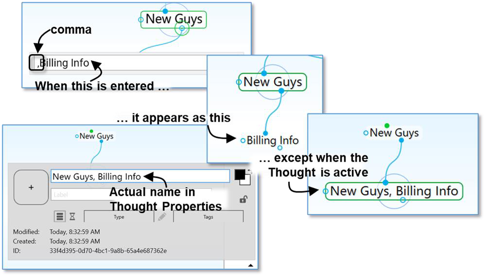

**Figure 92. Sub-Category Thoughts**

The thought will display its full name when it is active or when hovering over it with the cursor. When its parent thought is active, you’ll see only the portion of the name that does not repeat the parent’s name. Ensuring that each of your thoughts has a unique name will help you find and identify them more easily.

**Tip:**

The part of the thought’s name that is hidden is context sensitive. Say for example that you wanted to have a single place to see the billing information for all your clients. You might create a thought called “Billing Info” and then link to the billing information thoughts for each of your clients, such as “New Guys, Billing Info.” If you do this, when Billing Info is active “New Guys, Billing Info” will appear as just “New Guys,” whereas when New Guys is active, that same thought will appear as Billing Info. Try it―you’ll see how this can be very useful.

When thoughts are displayed in alphabetical order, the current view of the context sensitive name will determine its position.

**Using Parentheses to Assist with Thought Sorting**

Adding parentheses around the first part of thought name will skip that part for sorting purposes (unless there is a tie) when thoughts are grouped

alphabetically.

▪ To enable this feature, a thought name must have both an open parenthesis as the first character and a close parenthesis later in the thought name. Whitespace will be trimmed, and there must be some thought name left after that. (Later parenthesis will be ignored.)

▪ Note that this is mutually exclusive to Hidden Ordering Prefixes starting with a dot. You can only have one or the other.

Example: if your thoughts are grouped alphabetically, the following group of thoughts named:

**(The) Beatles**

**Belle & Sebastian**

**(The) Bee Gees**

**(The) Beach Boys**

would display as:

**The Beach Boys**

**The Beatles**

**The Bee Gees**

**Belle & Sebastian**

**Creating Thoughts with Artificial Intelligence**

Thoughts can automatically be created on any topic via TheBrain’s AI integration. From any thought in your brain, click on the AI button in the tool bar above the plex.

**Figure 93. AI Thought Generation**

The active thought will automatically be selected as the Topic Name. You will have the option of generating a thought structure (multiple generations of thoughts below the active thought) or generate child thoughts (one generation below the active thought)

Additional settings will allow you to:

- **Set Context Thought** – Select a parent thought above the active thought to be referenced as context for your new content. This is helpful for

general thought names. For example, a thought named “Directors” can be given greater context by selecting a parent thought named “Silent Film”

- **Use Children for Context** – If the thought already has some children, check this box to give AI an indication of the type of content you are hoping to see.
- **Creativity** – Select from 0% - 100% creative. Not seeing the results

you’re looking for? Try bumping up the creativity level and let AI start thinking “outside the box.”

- **Mode – Categories vs. List** – Your results will either be categories that your query can be placed in vs. lists of specific types of your query. For example:

o**Fruit Category**: Citrus, Melons, Benefits, Impact on Agriculture…

o**Fruit List**: Banana, Kiwi, Lime, Strawberry…

- **Language** – Regardless of your default language settings, your AI query results can be generated in one of 78 different languages.

While AI is generating your new content, you will not be able to move to a different thought or brain tab. When complete, the new content will be displayed in the plex and new thoughts will appear with a glowing boarder. You can review your new content before selecting one of the three options in the banner above the plex to either Accept changes, Redo (opens the AI pop up window with the most recent settings) or Discard.

**Creating Orphan Thoughts**

When you create a thought in your brain, you usually first decide what

relationship it will have with an existing thought, but sometimes you just want to create a thought unrelated to an existing thought.

To create a thought independently of other thoughts, type into the Search box. If no search result is returned, hit enter and the new thought will be created as an Orphan. This works well especially when you are looking for something and discover you haven’t yet put it into your brain.

**Tip:**

You can also create an orphan thought by pressing

**F9**

on Windows or

**Opt**

+

**Cmd**

+

**Right Arrow**

on macOS.

**Figure 94. Default Windows Keyboard Shortcut for Create Orphan**

**Create Thoughts from Search, Notes or Events**

You can create a new thought instantly from the Search box or within Notes or Events. Say you’d like a “Monthly Meetings” thought to be a child of “My Work,” but you’re not sure whether you already have a thought with that name. You can begin by searching, and if it doesn’t already exist, no need to retype the name.

**To create a new thought using search:**

1. Activate the thought that should be the parent, child, or jump thought of the new thought.

2. Click in the Search box at the top-right corner of the window, then type the name of the thought you’re looking for, or want to create if it’s not found.

3. If the thought doesn’t already exist and you want to create it:

- Press the **Enter** key to create it as a child of the active thought, or
- Hold down the **Shift** key as you press the **Enter** key to create it as a parent of the active thought, or
- Hold down the **Ctrl** key as you press the **Enter** key to create it as a jump thought of the active thought, or
- Hold down the **Ctrl** key as you press the **Shift** key, then click on **Create** **Orphan** to create it as an orphan thought

Your new thought will be the active thought.

**Figure 95. Creating a Thought from the Search Box**

**To create a new thought when searching finds an existing thought:** 1. Press the **up-arrow** key. This highlights the default option—Create Child.

Note that pressing the **Enter** key before pressing the **up-arrow** key activates the existing thought.

**Figure 96. Creating a Thought from the Search Box when the Thought is Found**

2. Use any of the same key combinations for creating a new thought from the Search box when a thought isn’t found.

**To create a new thought from within a note:**

1. Select the text within the note for which you want to create a child, parent, or jump thought.

2. Right-click the selected text, then click the **Insert Thought or Web Link** command. Optionally, you can revise the text in the new box that appears, if you want a different name for the new thought.

3. Select a relationship for the new thought:

- Press the **Enter** key to create it as a child of the active thought, or
- Hold down the **Shift** key as you press the **Enter** key to create it as a parent of the active thought, or
- Hold down the **Ctrl** key as you press the **Enter** key to create it as a jump thought of the active thought

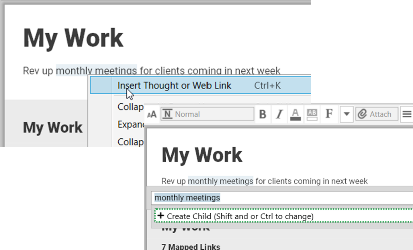

**Figure 97. Creating a Thought from a Note**

**To create a new thought from within an Event:**

1. Open an existing Event or click and drag from the start to finish times in the timeline to create a new Event.

2. Type a name for the new thought where you see “No thought or link” at the top of the Event box. A new orphan thought will be created with that name.

**Figure 98. Creating a Thought from an Event**

**Changing the Order of thoughts in the Plex**

You can use TheBrain’s hidden ordering system to change the default

alphabetical ordering of thoughts in the plex to any order you prefer. To do this, type a period and a number as the first characters of any thought name. These characters will not be displayed in the plex. For example, try creating the following group of child thoughts in one area:

▪ .01 Zebra

▪ .02 Walrus

▪ .03 Aardvark

The thoughts will appear in the order of Zebra, Walrus, Aardvark (without the periods or numbers), rather than alphabetically. You can always delete or revise the numbers in the **Thought Properties** dialog box.

**Figure 99. Changing Thought Order**

**Copying Thoughts Within and Between Brains**

Thoughts, including all of their notes, properties, events, and attachments, can be copied and pasted between brains or duplicated within a brain. When thoughts are copied, associated thought types and link types are automatically copied as well.

**To copy a thought within the same brain:**

1. Right-click the thought to be copied and then click the **Copy “*name of***  ***thought”*** command on the context menu.

2. Activate the thought that will be the parent of the newly copied thought.

3. Right-click within any blank area of the plex and click **Paste Thought(s)** on the context menu.

4. The copied thought will automatically be linked as a child of the active thought and it will also retain all of its original relationships.

**Figure 100. Copied Thought with Two Parents**

**To create a duplicate of a thought:**

If you just want to make a duplicate of a single thought without retaining any of its links, you can use the **Duplicate Thought** command.

1. Right-click the thought to be duplicated and then click the **Duplicate** **Thought** command on the context menu.

2. The duplicated thought will appear as a child of the original, as shown in the figure below.

**Figure 101. Duplicating a Thought**

**To copy a thought to another brain:**

1. Right-click the thought to be copied and then click the **Copy “*thought name”*** command on the context menu (or activate the thought, click the **Edit** menu, and then click the **Copy** command).

2. Open the brain into which you want to copy the thought.

3. Right-click on the background of the plex and then click the **Paste Thought** command on the context menu (or click the **Edit** menu and then click the **Paste Thought** command).

4. The thought will be pasted into the brain and linked as a child of the active thought. It will include any attachments, thought types, notes, or other attributes it had in the original brain.

If you have selected multiple thoughts, they can all be copied at once using the

same technique. Right-click anyplace within the Selection panel to open the context menu. See Selecting Multiple Thoughts beginning on page 97 for complete instructions about selecting multiple thoughts.

**Paste Thought Colors:**

1. Right-click on any thought with modified colors (text or background) and select **Copy “*thought name”***

2. Right click on another thought (in the same brain or a different brain) and select **Paste Thought Colors**. This thought will then have the same text and background colors as the thought that was originally copied. This

feature can also be used when working with multiple thoughts in the **Selection Box**.

**Merging Thoughts**

You can automatically merge multiple thoughts that refer to the same thing. You can combine the links, attachments, and notes so that the resulting thought has all of the information from those multiple thoughts.

**To merge thoughts:**

1. **Ctrl+click** on two or more thoughts that you want to merge into a single thought. The thought names will automatically appear in the Selection panel.

2. Right-click in the Selection panel, then click **Merge (*n*) Thoughts**.

**Figure 102. Merging Three Selected Thoughts into One**

When you activate the new thought, you’ll see all content that was in each of the standalone thoughts. The name of the new thought becomes a combination of the formerly separate thoughts, in alphabetical order.

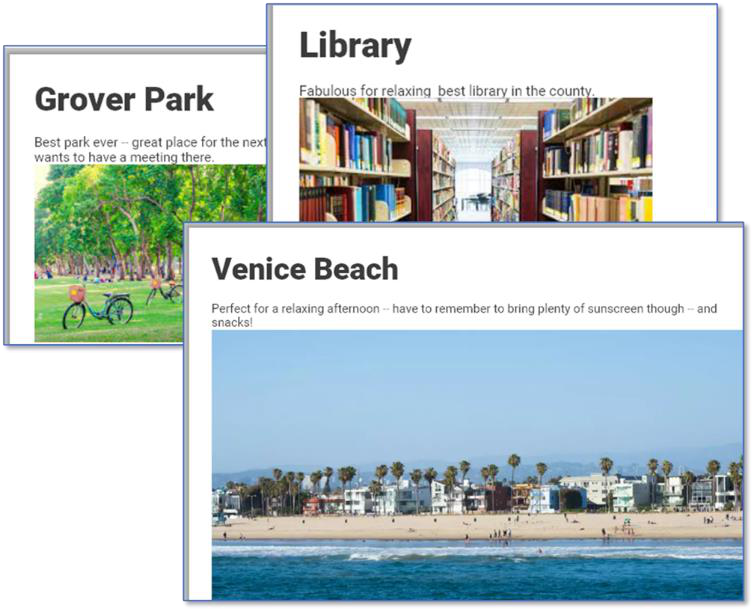

**Figure 103. Original Content Area of Three Thoughts before Merging**

**Figure 104. After Merging**

**Undoing and Redoing Actions**

Changing your mind about your actions is easy. You can undo up to 100 actions

during your current session. Actions that have been undone can also be re-

executed using the **Redo** command.

**Figure 105. Undo and Redo Commands**

**To undo an action:**

1. Click the **Edit** menu and then click the **Undo** command. The list on the secondary menu displays your most recent action first.

2. To undo your most recent action, click the first item in the secondary menu. To undo multiple actions, select the oldest action to be undone from the list. All actions above that action will also be undone.

**To redo an action you have undone:**

1. Click the **Edit** menu and then click the **Redo** command. If there are multiple items that can be redone, a secondary menu will be displayed.

2. Click the action of your choice. As in the list of actions that can be undone, the list is in most-recent-action-first order. All actions above the item you click will also be undone.

The Undo and Redo lists are cleared when you sync your brain (including an auto sync) and when your brain is closed.

**Editing Thoughts and Links**

**Renaming Thoughts**

You can easily rename any thought in its **Thought Properties** dialog box. When you rename a thought, any references to it from other notes are automatically updated with the new name.

▪ Click the thought to make it active, then click it again. You may also click the **Show Thought Properties** command in the **Thought** menu or **Alt**-click a

non-active thought. In the **Thought Properties** dialog box, make any edits you want, then press the **Enter** key or click in the plex.

**Figure 106. Renaming a Thought**

**Selecting Multiple Thoughts**

You can select multiple thoughts in three ways:

- Hold down the **Ctrl** key (**Cmd** on macOS) as you click each thought you want to select, or

▪ Hold down the **Ctrl** key (**Cmd** on macOS) as you drag to form a box around the thoughts, or

▪ Hold down the **Ctrl** key (**Cmd** on macOS) as you click a gate to select all the thoughts connected to that gate

**Figure 107. Selecting Multiple Thoughts by Ctrl-Dragging (Cmd-dragging on macOS)**

Selected thoughts are then added to TheBrain’s Selection panel for making mass edits on large groups of thoughts at one time.

After the multiple thoughts are selected, you can apply actions—link, unlink, forget, set thought type, and other actions you would apply to an individual thought—to the selected thoughts en masse. When multiple thoughts are selected, they are listed in a Selection panel on the left side of the plex and they are highlighted in the plex itself.

**Figure 108. Selection Panel and Selected Thoughts**

**To de-select individual thoughts:**

▪ Hold down the **Ctrl** key (**Cmd** on macOS) as you click a thought (either in the plex or in the Selection panel) to de-select just that thought.

**To close the Selection panel and de-select all thoughts:**

▪ Click the **Close** button (**X**) in the top-right corner of the Selection panel. The button will turn red as you point to it and after the panel is closed the thoughts will no longer be selected in the plex.

**Figure 109. Closing the Selection Panel**

**To perform actions on selected thoughts:**

▪ Right-click in an empty area of the Selection panel and select the action of your choice on the context menu. The entries in this menu are also displayed in the **Edit** menu.

**Figure 110. Selection Panel Context Menu**

**Other Selection Uses**

Once you have created a selection, you can also use it for other things besides what you see in the menu. For example, you can limit searches to selected thoughts. In the example below, only “Debbie Miller” is found because it is the only thought name beginning with “D” that is currently selected.

**Figure 111. Limiting Searches to Selected Thoughts**

**Forgetting and Deleting Thoughts**

When you no longer need a thought, it can be forgotten or deleted. A forgotten thought may be remembered and restored later, or deleted. A deleted thought is gone forever. This is similar to the Recycle Bin/Trash feature on your desktop which stores your deleted files until you choose to remove them permanently.

**To forget a thought:**

▪ Right-click the thought to be forgotten, then click **Forget *Thought Name*** in the context menu, or

▪ Click the active thought to be forgotten, click the menu button in the **Thought** **Properties** dialog box, then, click the **Forget *Thought Name*** command.

**Figure 112. Forgetting a Thought in its Thought Properties Dialog Box**

Once a thought has been forgotten it will disappear from the display. If you want to access it again later temporarily, you can do so by turning on the display of forgotten thoughts. You can also permanently delete forgotten thoughts or you can remember them.

**To access forgotten thoughts:**

1. Click the **Options** menu, then click the **ShowForgotten Thoughts** command. Any forgotten thoughts will appear grayed out in the plex.

**Figure 113. Forgotten Thoughts in the Plex**

2. Notice the “Showing Forgotten Thoughts” message above the pins. This reminds you why some thoughts are grayed. You can use forgotten thoughts just like normal thoughts as long as they are displayed. Click the **View Report** button to work directly with the forgotten thoughts.

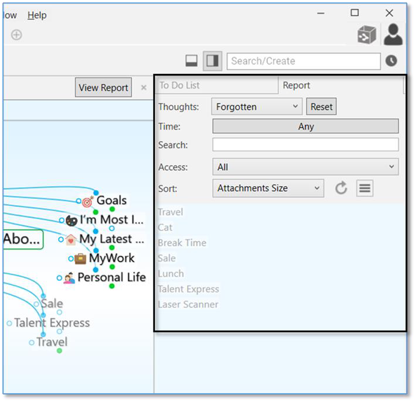

**Figure 114. Forgotten Thoughts in the Report Tab**

3. You can click on a thought in the **Reports** tab to activate it.

**To delete all forgotten thoughts using the Reports tab:**

▪ Click the **Reports** tab menu button, then select **Forgotten** from the Thoughts drop down menu. You can then click on the context menu button and select **Delete Forgotten Thoughts.** Alternatively, you can use the **Ctrl** key (**Cmd** on macOS) to select multiple individual forgotten thoughts and then delete only those.

**Figure 115. Using the Report Tab to Delete All Forgotten Thoughts**

▪ You can click the **Refresh** button on the **Reports** tab to update the list.

Closing the **Forgotten Thoughts** dialog box hides the forgotten thoughts. You can also reinstate forgotten thoughts by clicking the **Remember All** command

in the

**Reports**

tab menu. You can also reinstate an individual forgotten thought by right-clicking in the plex, then clicking the Remember

*thought name*

command on the context menu.

It is generally recommended to forget thoughts when you don’t need them so that you can easily retrieve them if you change your mind. If you are sure you will *never* need a thought again and you do not want to be able to remember it in the future, you can delete it immediately without forgetting it first.

**To delete a thought instantly:**

1. Hold down the **Shift** key (for Windows)/Alt key (for Mac) as you right-click the thought to be deleted. The context menu will be displayed, showing the **Delete *thought name*** command in place of the **Forget *thought name*** command.

**Figure 116. Shift-Right-Click Context Menu for a Thought**

2. Click the **Delete*thought name*** command. The thought will be permanently deleted. See Selecting Multiple Thoughts on page 97 for forgetting or

deleting multiple thoughts at once.

When a file attachment is deleted, the file is placed into an internal trash folder

in case the delete needs to be undone. When undo is cleared, the trash is emptied. The files are then moved to the OS trash/recycle bin so you have further opportunity to recover the file if needed.

**Tip:**

If you delete something by accident you can still recover it if you use the

**Undo**

command immediately.

**Unlinking Thoughts**

**To unlink thoughts:**

▪ Right-click the link, then click the **Unlink** command on the context menu

**Tip:**

If you are moving a thought from one place to another by linking and unlinking it, it is generally easier to do the unlinking after you have done the linking. This avoids making the thought into an “orphan,” a thought with no relatives.

If you have difficulty telling which link you are pointing at with the mouse, just look at the highlighted thoughts. When the mouse pointer is over a link, it is highlighted along with the two thoughts it connects. This makes it easy to tell which thoughts will be unlinked if you click on the link.

In addition to being able to unlink thoughts one link at a time, you can also select multiple thoughts to unlink several of them at once. To do so:

▪ Select the thoughts you want to unlink by holding down the **Ctrl** key (**Cmd** on macOS) and clicking on each one, or **Ctrl** drag (**Cmd** drag on macOS) a box around thoughts in the same area

▪ Activate the thought from which you wish to unlink the selected thoughts

▪ Right-click in the Selection panel and select the **Unlink Selection** command

**Linking Thoughts**

As noted previously, links are *power*. Not only do links allow for associations that group thoughts conceptually, they allow information to be stored in and

accessible from numerous places.

A single thought may have relationships with multiple thoughts. For example, you may want a thought named “Aunt Mary” to be a child of your “Mentors”

thought and also a child of your “Family” thought. If your Aunt Mary is also helping you plan your next vacation, her thought may also be a child or jump thought to your “Vacation” thought. The possibilities are endless.

There are several ways to link to existing thoughts, as described in the following sections.

**Link to a Thought Visible in the Plex**

When the thoughts you want to link are both visible in the plex, you can simply drag from the desired gate of one thought in the plex to another thought in the plex. Note that the thought you drag from or to does not have to be the active thought.

In the Normal view, the display of thoughts is limited to close relations. You may find it useful to expand the view when linking thoughts, because you can see more thoughts at once.

**Link by Dragging to a Pin**

You can Link to a thought that is not visible in the plex if it has a pin. Simply drag from the appropriate gate to the pin. When you want to link a thought to many other thoughts, create a pin of the thought so you can quickly link to it. A pin’s gates appear when you point at the pin with the mouse.

**Figure 117. Link by Dragging to a Pin**

The relationship you establish by linking a thought to a pin is between the thoughts; if you delete the pin, the Link between the thoughts is still intact.

**Link by Dragging to the Past Thoughts’ List**

You can link a thought in the plex to a thought in the Past Thought List. Like pins, gates for a thought in the Past Thought List appear when you point at the past thought with the mouse.

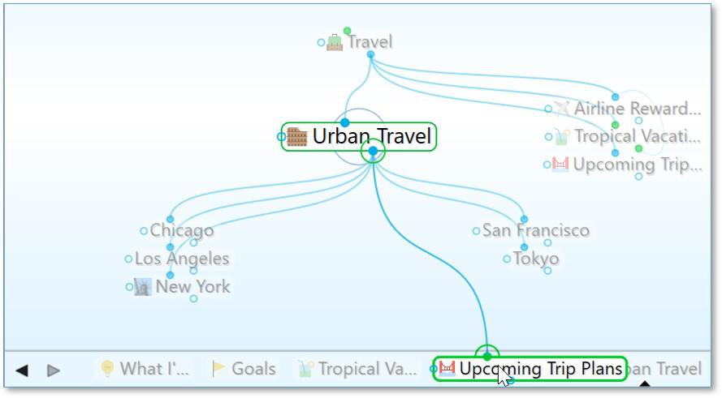

**Figure 118. Link by Dragging to a Thought in the Past Thoughts’ List**

**Link by Selecting a Thought in the Existing Thoughts List**

You can also link by using the **Thought Creation** dialog box:

1. Make the thought you want to link from the active thought, then start creating a thought by dragging or using the **Thought** menu. The **Thought Creation** dialog box appears.

2. Type the first few letters of the name of the thought you want to link to. Double-click on the thought you want to link when you see it in the **Existing Thought List** that appears below (or click it once, then click in the thought name field and press the **Enter** key).

**Figure 119. Create a Link by Starting to Create a Child Thought**

**Link by Using the Selection Panel**

Thoughts in the Selection panel can be linked to the active thought using the Selection menu:

1. Select the thought or thoughts you want to link using **Ctrl**-click (**Cmd** on macOS) or by holding down the **Ctrl** key (**Cmd** on macOS) as you drag a box around the thoughts if they’re next to each other.

2. Activate the thought in the plex to which you want to link.

3. Right-click the Selection panel, then click the link command of your choice in the context menu.

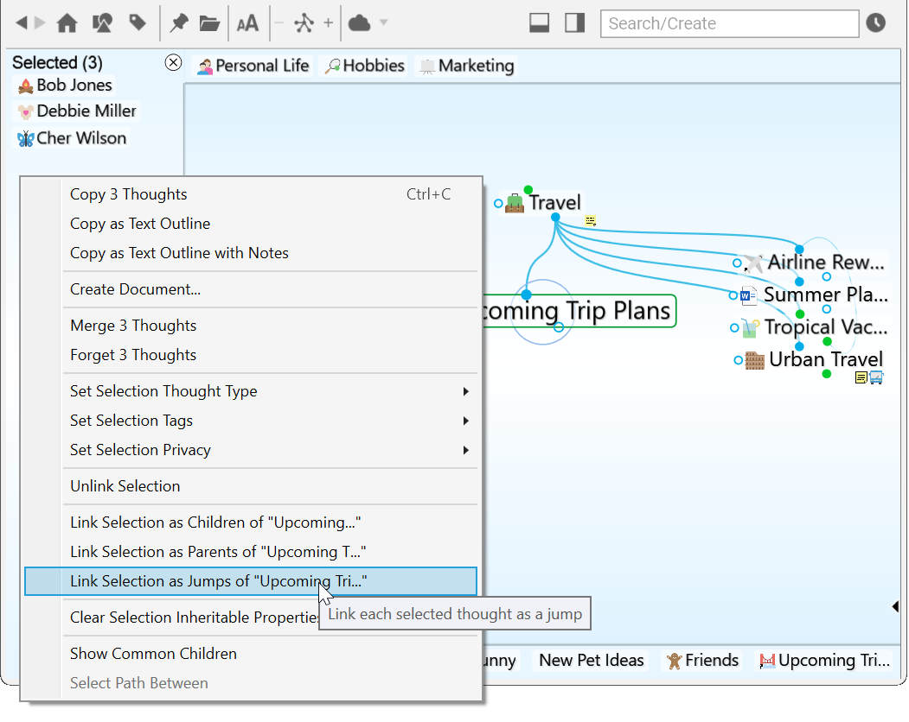

**Figure 120. Linking Using the Selection Panel**

**Cancel Creation of a Link**

Press the **Esc** key while dragging a link to abort the process. (The mouse button should still be held down while you press **Esc**.)

**Changing Relationships Using Drag and Drop**

Say that you decide that your “Product Promotions” thought shouldn’t really be a child of your “Customer Service” thought. Instead, it should be the child of “Business Development.” You can quickly change relationships between thoughts in a single step: Hold down the **Shift** key while linking a thought to a new parent. All of the current parents will be unlinked automatically. Note that even if a thought has more than one parent, all of the former parents will be unlinked.

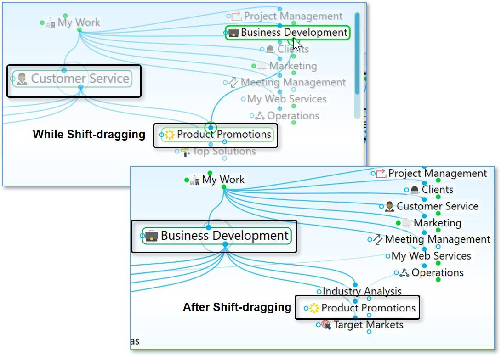

**Figure 121. Shift-Dragging to Change Relationships**

**Customizing Thought and Link Properties**

You can change the colors of thoughts and links globally using the **Brain**

**Theme**

dialog box (see the Customizing a Brain’s Appearance section on page

42). This section explains how to view and manage the properties of individual

and selected thoughts and links. Changed settings override the global defaults.

**Changing the Properties of a Thought**

**To open the Thought Properties dialog box, use any of these methods:**

▪ Click the active thought, or

▪ Click the thought once to select it, then a second time to open the box, or

▪ **Alt**-click the thought (whether or not the thought is active), or

▪ Right-click the thought, then click **Show Thought Properties** on the context

menu, or

▪ Click the thought to select it, click the **Thought** menu in the menu bar, then

click the **Show Thought Properties** command

**Figure 122. Thought Properties Dialog Box**

Press the **Enter** key or click anywhere outside of the dialog box to close it and

save any changes.

You can use the **Thought Properties** dialog box to:

▪ Rename a thought

▪ Add or edit a thought Label

▪ Add or change a thought Type

▪ Add or change a thought Tag

▪ Mark the thought as Private or Public

▪ Customize the thought text or background color (just this thought; global

changes are done in the **Themes** window)

▪ Add or change the thought's icon

▪ Review the thought's creation/modification history and ID. The ID is not

normally needed but may be useful when troubleshooting.

▪ And, using the **Thought Properties** Actions Menu button (three horizontal

lines):

o Forget the thought

o Create a Pin

o Set as the Home thought

**Changing the Colors of a Thought**

While thought colors are set globally in the **Brain Theme** box, you can override

these settings for individual thoughts. To begin, activate the thought, then click

on it or **Alt-**click on any inactive thought.

Note that the individual changes you may make to thoughts, such as their color

and background, override the settings in the **Brain Theme** box.

**To change the text color of a thought:**

▪ In the Thought Properties box, click the upper color square, click the color of

your choice, then click outside of the box of colors.

**Figure 123. Text Color in the Thought Properties Dialog Box**

**To change the background color of a thought:**

▪ Click the lower color square, click the color of your choice, then click outside of the box of colors.

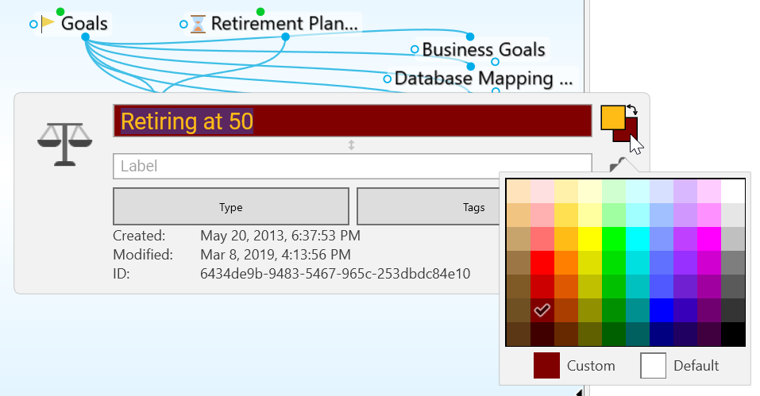

**Figure 124. Background Color in the Thought Properties Dialog Box**

**To swap a thought’s text color with its background color:**

▪ Click the double-headed arrow next to the two color sample squares in the top-right area of the **Thought Properties** dialog box.

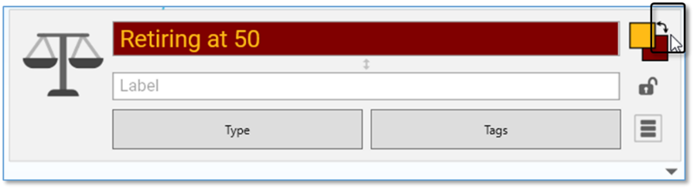

**Figure 125. Swapping Text and Background Colors**

You can use the same techniques to fine-tune new colors for thought text and

background as you can use to define colors globally in the

**Brain Theme**

box. Please see the Defining and Selecting Additional Colors section on page 45 for details.

**Adding a Label to a Thought**

Labels are hints that appear below thoughts when you point the mouse at the thought.

**Figure 126. A Thought Label**

**To add a label during thought creation:**

1. While typing a new thought name, add a pipe symbol (|) and anything after will become the thought’s label.

**Figure 127. Adding a Pipe Symbol During Thought Naming**

**To add a label to an existing thought:**

1. Activate the thought, then click on it or **Alt-**click on any inactive thought.

2. Type the text for the label in the **Label** field, then press the **Enter** key. When you point at the thought, the label text will appear in a box below the thought.

**Figure 128. Label Field in Thought Properties Dialog Box**

**Swapping a Thought’s Name with its Label**

You can swap a thought’s name with its label by clicking the **Switch** button (double sided arrow) in the **ThoughtProperties** dialog box. This can be very useful when the default label and name are assigned based on a URL and the automatic naming isn’t optimal for your purposes.

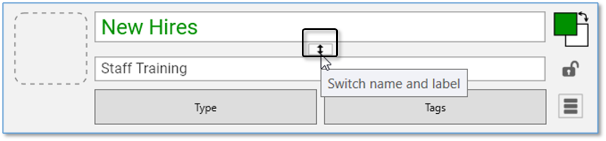

**Figure 129. Swapping Label and Thought Names**

**Adding an Image to a Thought**

In any thought, you can attach an icon from TheBrain’s built-in selection, an image from a file of your own, an image from notes or attachments in the active thought, or a screen capture. These pictures provide a visual boost to your brain. When you point to the icon next to the thought, the picture zooms to a larger size automatically.

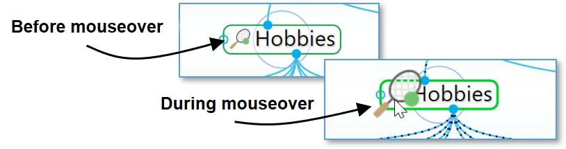

**Figure 130. A Thought Icon**

**To insert an icon from TheBrain’s built-in icon library:**

1. Click the thought icon box in the upper left of the **Thought Properties** box, then click the **Select Stock Icon** command.

**Figure 131. Select an Icon from the Built-in Library**

2. With the Browse radio button selected, click any of the categories in the left panel. (See the TheBrain Icons section on page 236 for more about icon choices.) Click an icon of your choice to add it to the thought. The **Thought Properties** dialog box will close automatically when an icon is selected.

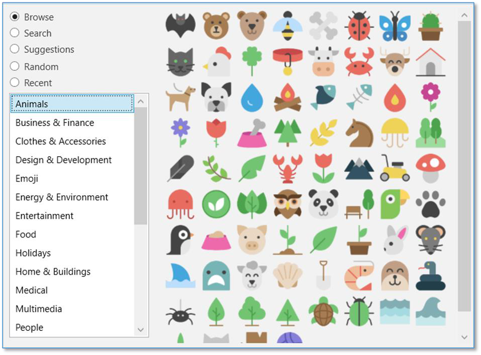

**Figure 132. Icon Choices**

**To insert an image from a file as a thought icon:**

1. Click the thought icon box, then click the **Choose File** command.

**Figure 133. Choose a File to Use as an Icon**

2. Navigate to the file of your choice, then click the **Open** button. Supported file formats for images include .jpg, .png, and .gif.

**To create a thought icon from an image in the Content Area:** ▪ Click the image to select it, right-click it, then click the **Copy to Icon** command in the context menu.

**Figure 134. Copy to Icon Command in the Image’s Context Menu**

**To create a thought icon from one of its attachments:**

▪ Right-click the attachment, then click the **Copy to Icon** command in the context menu.

**Figure 135. Copy to Icon Command in the Attachment’s Context Menu**

The new icon will appear to the left of the thought name at the top of the content area and on the active thought in the plex.

**Figure 136. Thought with its New Icon**

**To insert a screen capture of an image as a thought icon:**

1. Make sure the screen item you want to capture is visible, then activate the thought and click on it or **Alt**-click on any inactive thought.

2. Click the thought icon box, then click the **Capture Image** command.

**Figure 137. Capture Something on the Screen to Use as an Icon**

3. Your brain will be hidden temporarily and red cross hairs will appear on the screen. Drag a rectangle around the area to be captured by dragging the mouse in a diagonal line from one corner of the rectangle to the opposite corner, then releasing the mouse button.

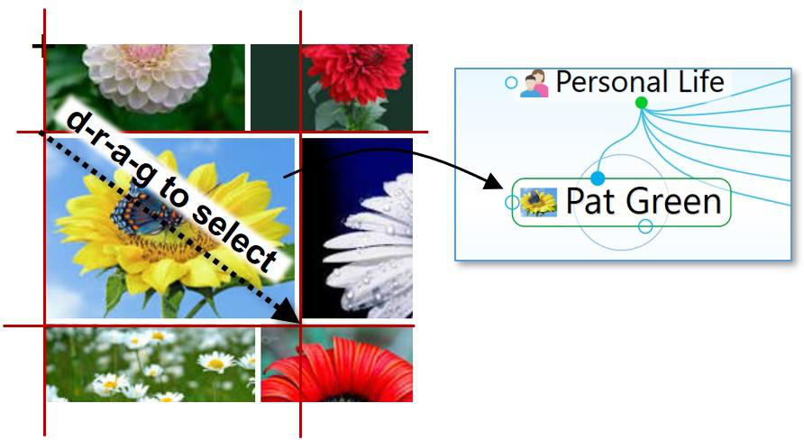

**Figure 138. Using the Crosshair to Capture an Image**

4. When you release the mouse, the image will be in the Icon area of the **Thought Properties** dialog box.

**Tip:**

To capture from the Brain window itself, press the

**Tab**

key to toggle its visibility. You will see the crosshairs and you can drag to select the area of your choice.

While the captured item will become a picture, the source can be anything―a company logo, a photo, or part of an Excel worksheet or PDF file.

**To paste an image you copy from somewhere else:**

1. Copy the image using standard techniques. For example, you may right- click an image on a web page, then click the **Copy Image** command.

2. After the image is copied, from the **Thought Properties** dialog box, click the thought icon box or right-click on a thought in the plex and select the **Paste Icon** command.

**Figure 139. Capture Something You’ve Copied to Use as an Icon**

**To copy an image from the thought to someplace else:**

Images you capture can be copied and pasted as attachments, pasted into notes or the plex, or used as icons.

1. Click the thought icon box, then click the **Copy Icon** command.

**Figure 140. Copy the Icon to Use Elsewhere**

2. The icon you copied can be pasted elsewhere, such as in a thought’s content area or elsewhere on your computer.

Favicons being displayed as the thought icon can be copied as well.

To change a thought’s icon, repeat the steps above. The icon will be replaced.

**To delete a thought’s icon:**

▪ Click the thought icon box, then click the **Delete Icon** command.

**Figure 141. Removing a Thought Icon**

**Displaying Inherited Properties**

All inherited properties, such as from a thought type’s icon, label or colors, are displayed in the properties dialog.

Thought types or tags are also clearly indicated.

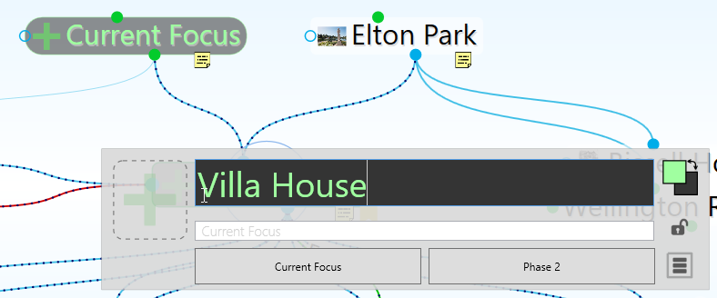

**Figure 142. Properties Dialog Improvements**

**Making Thoughts Private**

Thoughts may be marked “Private.” Private thoughts will appear with a small lock icon shown below and to the right of the thought. The lock appears whether the Private thought is active or not. If you make your brain publicly viewable on the web, private thoughts remain hidden from view by read only visitors. To mark a thought as “Private,” click the lock icon in the **Thought Properties** dialog box.

**Figure 143. A Private Thought**

**Using Thought URLs**

Each thought in TheBrain is available via a unique URL. A thought URL can be used to create links to thoughts from external third-party applications or from other brains. Thought URLs can also be used within TheBrain as another way to connect thoughts via links within notes or as attachments to thoughts.

Thought URLs can be added as hyperlinks in many third-party applications so that when the link is activated, TheBrain will go to the referenced thought.

**To copy a thought URL:**

▪ Right-click the thought (or click the **Edit** menu), then click the **Copy Local** **Thought URL** command.

**Figure 144. Copying a Thought URL**

**To paste a copied thought URL so it will be another thought’s attachment:**

1. Activate the thought to which it should be copied (which may be in the original brain or any active brain), then right-click the thought (or click the **Edit** menu).

2. Click **Add Attachment** and select the **Paste Web Link** command. The URL will be added to the thought as an attachment.

**Figure 145. Pasting a Thought URL**

**To paste a thought URL after it has been copied so that it becomes a hyperlink in a note:**

1. In the note, select the text that will be the link using one of the two methods below:

▪ If the text happens to be the name of a thought you want to link to, it will have a dotted underline—click within the underlined text

▪ If the text isn’t the name of a thought, just drag through it to select it

2. Click the **Insert Thought or Web Link** command in the content area toolbar (or right-click and select it from the context menu).

3. Select the thought in the drop-down list, then click outside of the list to close it and create the link.

When you click the link, the thought will open and you can click its attachment(s) to view them in the content area.

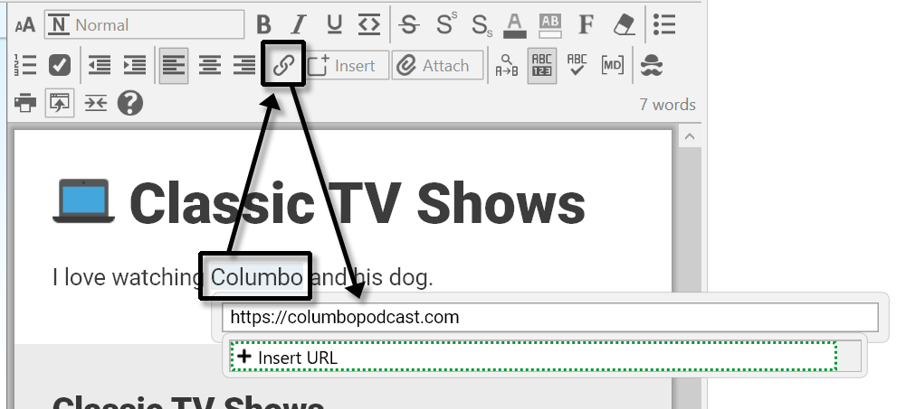

**Figure 146. Inserting a Hyperlink in a Note**

**Thought Types and Tags**

If you have several thoughts with which you want to share common attributes, such as color and an icon, you may want to create a thought type so that these attributes can be easily applied to many thoughts. This is one use of thought types.

For example, you may want to create a “person” type for all thoughts that

represent people in your brain. This type might have a label— “Person”—and a specific color and icon so that all people in your brain stand out and can be easily recognized.

Type thoughts can be edited by activating them and using the **Thought**

**Properties**

dialog box, just as you would for any other thought. You can assign attributes, such as icons, notes, and attachments, to type thoughts.

**Figure 147. Three “Person” Type Thoughts**

Once a type has been applied to a set of thoughts, it can also be used to create reports of all thoughts of that type.

When a type has been assigned to a thought, that thought is said to be an “instance” of the type. For example, if you have a thought named “Jane” of the “Person” type, the Jane thought is said to be an instance of the Person type.

**Creating a Thought Type**

Thought Types can be created from the **Activate Type** button in the main toolbar.

1. Type the new Thought Type name or type multiple new Thought Types separated with a semicolon

2. Select New Type

**Figure 148. Creating a New Thought Type**

To create a thought type from within the plex:

1. Activate the thought you want to be the first instance of the new type, then click the thought to open its **Thought Properties** dialog box.

2. Click the **Type** button, then click the **New Type** command. Alternatively, you can right-click the thought, click the **Set Type** command, then click the **New Type** command.

3. Enter the name of the type you want to create, then press the **Enter** key. Click outside of the **Thought Properties** dialog box to close it.

4. If you used the context menu to create the new type, the type will appear as a thought in the plex. Type thoughts are special and have an oval border when active and inactive to distinguish them from other thoughts.

**Figure 149. An Active Type Thought (“Person”)**

**To do this ...** **Do this ...**

Locate and

Activate a Type

thought

Delete the active

Type thought

Enter the Type’s name in the Search box as you would to search for any other kind of thought, then click the

matching result in the drop-down list.

OR

Activate any thought associated with that type, and click on the Parent thought Type if it is visible.

OR

Click the **Activate Type** button in the menu bar, then click the type of your choice or begin typing the name of the type to locate it quickly if the list is long.

Click the active Type thought to open its **Thought**

**Properties** dialog box, click the menu button, then click the **Delete *thought name*** command.

Note that unlike normal thoughts, types cannot be forgotten and remembered. Deleting a type removes it from your brain permanently.

**To do this ...** **Do this ...**

Set a thought’s

Type

Set a thought’s

Type during

thought creation

Remove a Type

from a thought

Create new

thoughts linked

to the active

Type thought

Create a Super

Type

Reuse a Type in

another brain

Use any of these methods:

▪ Open the thought’s **Thought Properties** dialog box,

click the **Type** button, then click the type of your

choice, or

▪ Right-click the active thought, click the **Set Type**

command, then click the type of your choice, or

▪ Click the **Thought** menu when the thought is active,

click the **Set Type** command, then click the type of

your choice

▪ Link the thought as a child of the type

Click the **Set Type** button in the **Thought Creation** dialog

box, then click the type of your choice.

Use any of these methods:

▪ Open the thought’s **Thought Properties** dialog box,

click the **Type** button, then click the **Untyped** button,

or

▪ Click on the checked Type to unselect it, or

▪ Right-click the active thought, click the **Set Type**

command, then click the **Untyped** button, or

▪ Click the **Thought** menu when the thought is active,

click the **Set Type** command, then click the **Untyped**

button

▪ Unlink the Thought as a child of the type

Drag down from the Type thought’s child gate and

continue creating the thought as usual.

Drag up from the parent gate of a Type thought, then

continue creating as usual or link to another existing Type

thought.

Copy and paste type thoughts from one brain to another

the same way you copy and paste other thoughts.

**Tip:**

To arrange your display by thought types, right-click on the plex background, click

**Arrange Thoughts by**

, then click

**Type**

.

Attributes that are assigned to a thought type are inherited by all instances of the Type but will be overridden if there are attributes assigned directly to the thought itself. For example, if you have a thought named “Jane” of the type

“Person,” you can assign an icon of a smiley face to the Person type and it will

appear next the Jane thought and all other instances of the Person type. But, if you then assign a picture of Jane as the icon for that thought, the picture will appear on that thought (only) instead of the smiley face. Likewise, a label assigned to a specific thought would override the label of any thought type assigned to that thought.

**Super Types**

TheBrain supports multiple levels of types for advanced modeling. Just like a thought can have a type, each type may in turn have a super type. To set a super type, open a thought type that should have the super type, then click the **Type** button. The new type will be a parent (or super) type of the active type. The attributes assigned to a super type are inherited by its sub types and instances.

Super types can be used when there is a category of thoughts which is a subset of a larger category. For example, the thought type “Person” could be the super type of the type “Executive.”

To see how to find groups of thoughts that share one or more of the same Type, please see the Producing Reports section beginning on page 218.

**Dynamic Wallpaper**

Another advantage of using thought types in your brain is being able to utilize dynamic wallpaper. This enables you to change the wallpaper of the plex, based on the type of the current active thought.

To set up a dynamic wallpaper:

1. Navigate to a thought type.

2. Right click and select Set Dynamic Wallpaper

3. Navigate through your machine to locate the desired wallpaper image and click Open.

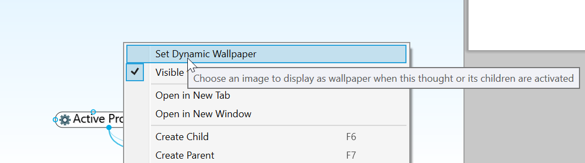

**Figure 150. Setting Up Dynamic Wallpaper on a Thought Type**

**Figure 151. Navigating to a Thought with a Dynamic Wallpaper assigned to its Type**

Navigating to any thought that is associated with a Thought Type containing Dynamic Wallpaper will fade the current background and transition to the Thought Type Wallpaper.

**Using Thought Tags**

If there are multiple attributes you would like to add to your thoughts, you can create thought *Tags*. Tags are useful for flagging thoughts that you want to be able to reference as a group, without them having to share a common parent. For example, you may want to create a “To do” Tag so you can get a list of all of these thoughts very quickly.

Tag thoughts can be edited by activating them and using the **Thought**

**Properties**

dialog box, just as you would for any other thought. You can assign attributes, such as icons, colored text and colored backgrounds to Tag thoughts.

Thoughts can have one or many Tags at the same time. Tag thoughts are global for a brain and displaying Tag text and icons can be toggled on and off in the **Look & Feel** tab of the **Preferences** window.

**Figure 152. A Thought with a Tag**

**To create a thought Tag:**

1. Activate the thought to which you want to attach a Tag, then click the thought to open its **Thought Properties** dialog box.

2. Click the **Tags** button, then start typing a name for your new Tag.

Alternatively, you can right-click the thought, click the **Set Tags** command, then click the **New Tag** command and start typing a name for your new Tag. You can also create multiple Tags at the same time by typing a semi-colon between each Tag name, just as you can do to create multiple regular thoughts at the same time.

3. Press the **Enter** key. Click outside of the Tags list to close it, then click outside of the **Thought Properties** dialog box to close it. The new Tag will be attached to the active thought.

**Figure 153. Creating a New Tag**

Alternatively, you can right-click the thought or click the **Thought** menu, click

the

**Set Tags**

command, then click the

**New Tag**

command and start typing a name for your new Tag. Press the

**Enter**

key when you’ve finished.

You can also assign one or more Tags to a thought (regular or Type thoughts) while you’re creating the thought by clicking the

**Tags**

button in the

**Thought Properties**

or

**Thought Creation**

dialog box.

**Assigning and Removing Tags**

You can assign and remove Tags using the same general technique as for creating them. The only difference is that instead of typing a new name, you select (to attach) or deselect (to remove) the Tag name(s) in the list.

As shown below, currently assigned Tags are preceded with a check mark. Click an assigned Tag to remove it and click any Tag in the list to assign it to the active thought. This makes it easy to assign and remove multiple Tags at a time.

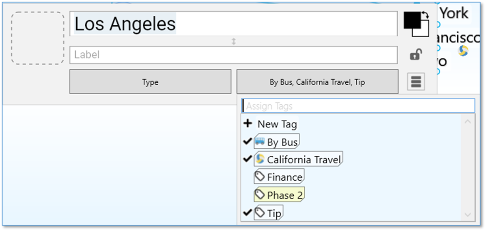

**Figure 154. Assigning and Removing Tags**

**Assigning Tags to Multiple Thoughts at One Time**

If you want to assign Tags to multiple thoughts at once, first select them, then right-click in the **Selection** panel. Click the **Set Selection Tags** command, then click the **New Tag** command or on any of the Tag names in the list.

**Deleting a Tag**

1. Click the **Tags** button on the toolbar, then click the Tag of your choice to activate it.

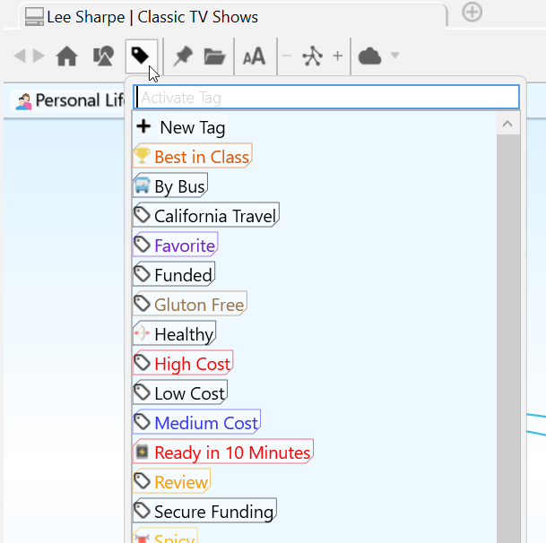

**Figure 155. Opening the Tags List**

2. Either right-click the thought or click the **Thought** menu, then click the **Delete “Thought name”** command. You can also open its **Thought Properties** dialog box, click the menu button, then click the **Delete**

**“Thought Name”** command.

**To delete multiple Tags at one time:**

1. Click the **Tags** button on the toolbar to display all Tag names in your brain.

2. **Ctrl**-click each Tag you want to delete. The Tag is added to the **Selection** tab to the left of the list.

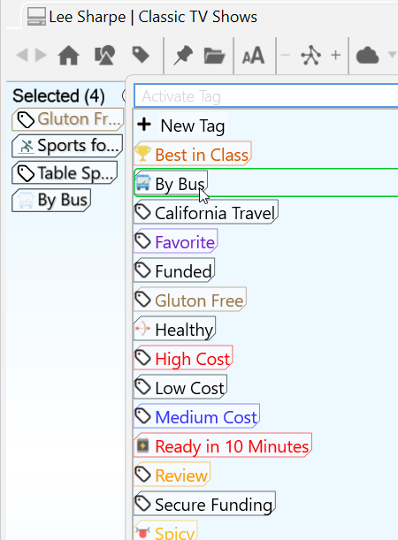

**Figure 156. Deleting Multiple Tags List**

3. When all the Tags you want to delete are selected, right-click in the Selection tab, then click the **Delete (#) Thoughts** command. (Remember that Tags are also thoughts themselves.)

Unlike normal thoughts, Tags cannot be forgotten and remembered. Deleting a Tag removes it from your entire brain permanently.

**Renaming and Adding Attributes to a Tag**

You can change the properties of Tags, just as you change the properties of regular thoughts—colors, icons, and attachments.

1. Click the **Tags** button on the toolbar, click the Tag of your choice, then click the Tag thought to open its **Thought Properties** dialog box. You can also click any tag that is visible in the plex to navigate to that tag thought.

2. You can make the same customizations as you can to any thought while you’re in the Tag’s **Thought Properties** dialog box. When you’re finished making revisions, press the **Enter** key.

Renaming a Tag changes the Tag throughout your entire brain.

**Displaying Thoughts Based on Their Tags**

You can show all thoughts with the same Tag by using Search:

▪ Begin typing the Tag name in the Search box, then click the Tag name when it appears. Tags may be indicated with any icon that has been assigned to them. When you click the Tag name in the Search hit list, all thoughts assigned to that Tag will be displayed in the plex.

**Tag Abbreviations**

Along with adding icons to Tags and customizing their names with color, you can also attach an “abbreviation” for the full Tag name. Abbreviated forms of the name can serve as hints for what the Tags represent while giving the plex a cleaner appearance.

In the **Look & Feel** tab of the **Preferences** window, you can change the Tags

text setting to “Show always” if you want the abbreviations to show. Hovering over a thought with Abbreviated Tags or Tag icons will then display the full Tag name.

**Figure 157. Tag Icons and Abbreviations**

**Figure 158. Pointing at a Thought Hides the Abbreviation and Shows the Full Name**

**To enter a Tag abbreviation:**

▪ In the Tag’s **Thought Properties** dialog box, type the abbreviation in the field below the Tag’s name, then press the **Enter** key.

**Figure 159. Creating a Tag Abbreviation**

**Additional Thought Type and Tag Features**

**Visible Thought Types and Tags**

Types and tags can be visible in the plex. Want to see a type or tag as a child thought? Just link any existing type or tag thought as a child, or as a jump. Optionally, types are visible as parent thoughts as well.

**Figure 160. Visible Parent Type and Child Tag**

Linkable types and tags eliminate the need to create two thoughts when you want to show all instances of a type or tag within the plex.

▪ Types are visually distinguished by rounded sides.

▪ Tags are visually distinguished by chamfered (diagonal) corners.

**Hiding Visible Thought Types**

Thought types being visible in the plex is optional.

▪ To prevent a thought type from being visible in the plex, right click on a

thought type and uncheck the option for **Visible when Parent of Active**

**Thought**

**Figure 161. Toggling the Visibility of a Thought Type**

- This setting can also be modified globally by clicking on **File**, selecting

**Utilities** and clicking on **Make All Types Visible/Hidden as Parents**

**Converting Thoughts to Type or Tag**

You easily change a normal thought into a type or tag at any time:

▪ Right-click on a thought and select **Convert to Type or Tag**

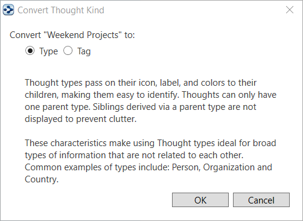

**Figure 162. Convert to Type or Tag**

▪ Tags and types can easily be changed into a normal thought

**Clickable Tags**

Tag icons that show on thoughts are clickable. Click any tag that is visible in the plex to navigate to that tag thought.

**Replacing a Tag**

You can easily move a thought through a project cycle or simply re-classify its tag attributes. To quickly replace a thought’s tag:

▪ Right-click on a tag to open its context menu.

▪ Select the option **Replace Tag with** and select another tag.

**Figure 163. Replacing a Tag**

**Nested Tags**

Tags can be organized under each other so they are easier to organize, navigate and apply.

▪ Link two existing tags with a parent/child relationship to sub-categorize

▪ You may also open a tag’s properties to assign it as a sub category of

another tag

▪ Nesting can include multiple tags and multiple layers

**Figure 164. Nested Tags**

**Changing the Properties of a Link**

Links between thoughts are normally unnamed. You can name a link by giving it a “label.” Just like thoughts, links can have Types, notes, and Attachments. You can control the way they appear in order to clarify relationships or just to create a more pleasing view of your brain, based on your personal preferences. You can also manipulate links in order to add or change relationships between your thoughts.

Just as each thought has its own **Thought Properties** dialog box, each link has its own **Link Properties** dialog box.

**To open the Link Properties dialog box, use any of these methods:**

▪ Double-click the link, or

▪ Click the link once to select it, then a second time to open the box, or

▪ **Alt**-click the link (whether or not the link is connected to the active thought), or

▪ Right-click the link, then click **Properties** on the context menu, or

▪ Click the link to select it, click the **Link** menu in the menu bar, then click the **Properties** command

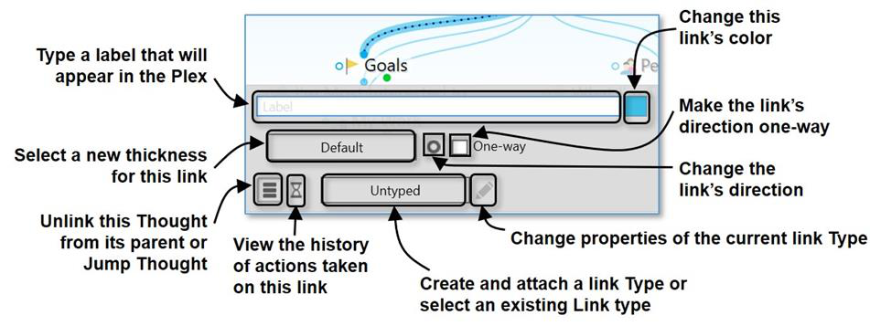

**Figure 165. Link Properties Dialog Box**

**To add a label to a link:**

1. Open the **Link Properties** dialog box for the link, then type a label name in the **Label** field.

**Figure 166. Adding a Label to a Link**

2. Press the **Enter** key, or click outside of the **Link Properties** dialog box to close it. The label will appear on the link and will be enlarged when the mouse points at the link.

**To change the color of a link:**

1. Open the **Link Properties** dialog box for the link, then click the color box. 2. Click the color of your choice in the color palette, click outside of the palette to close it, then press the **Enter** key, or click outside of the **Link Properties** dialog box to close it.

**Figure 167. Changing the Color of a Link**

the

**Brain Theme**

box (please see the Customizing a Theme’s Colors section on page 44 for details).

This changes the color for the individual link. You can set link colors globally in

**To change the width of a link:**

▪ Open the **Link Properties** dialog box for the link, click the **Default** button, click the width of your choice, then click outside of the **Link Properties** dialog box to close it.

**Figure 168. Changing the Width of a Link**

**Tip:**

You might want to widen links to illustrate the strength of particular relationships between thoughts.

**Link Types**

Link types are used to assign commonly-used relationships between thoughts that share a label, color, and width so they can be easily recognized. Link properties and types will be retained even if the two linked thoughts change their relationship but remain linked (for example, if a child thought becomes a jump thought of the original thought).

In addition to setting their color, you can add labels to link types and you can change the width of the link to call special attention to relationships.

1. Open the **Link Properties** dialog box for the link, then click the **Type** button.

This button will display “Untyped” if there is currently no Type assigned to the

link and it will display the type name if there is already a Type assigned.

2. If there’s an existing Type in the list that you want to use, click on it to select it. Otherwise, click on **New Type**, then type the name for the new link in the field that will be displayed.

**Figure 169. Creating a New Link Type**

2. Press the **Enter** key to close the **Link Properties** dialog box.

**Figure 170. Appearance of a Link Type in the Plex**

Type won’t be displayed in the plex in this case, it can still be used to find all thoughts connected to links of that Type.

If a Link has both a Type and a label, the *label* will show in the plex. While the

**Tip:**

Point the mouse at a Link Type or label to magnify it in the plex.

**Deleting Link Types**

1. Open the **Link Properties** dialog box for the link that has the Type you want to delete, then click the **Edit** button to open the **Type Properties** box.

2. Click the menu button then click the **Delete** command.

**Figure 171. Deleting a Link Type**

To see how to find thoughts that share one or more of the same link Type, please see the Producing Reports section beginning on page 218.

**Showing Link Direction**

By default, links do not show a directional arrow. You can add directional arrows that will appear on the link that points to or from the source thought.

**Figure 172. Directed Links**

▪ A directed link shows an arrow in the middle of the link. If the link has a label or a Type, the arrow will be next to the text. The arrow is magnified when the mouse hovers on it. Directional arrows can provide visual cues that are

particularly useful when there’s a link label. For example, for the link label

“Inspired” (shown below), the link’s directional arrow shows that “Hank

Williams” was a source of inspiration for Elvis. This is also very useful when you want to represent flows between items like financial relationships.

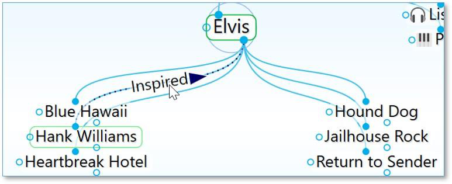

**Figure 173. Hank Williams Inspired Elvis**

**To set link direction:**

1. Open the **Link Properties** dialog box for the link to which you want to add direction. Then:

▪ Click the icon to the left of the **One-way** check box to switch between non-directed, directed, and directed in the reverse.

**Figure 174. Setting the Direction of a Link**

**Using One-Way Links**

▪ One-way links appear when the source of the link is active and the source thought is already visible.

▪ One-way links are indicated by an arrow with a rectangle at its base.

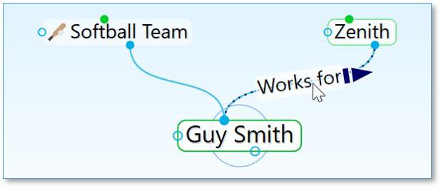

**Figure 175. One-Way Link**

One-way links are useful where *thought A* is relevant when *thought B* is active, but *thought B* is not relevant when *thought A* is active.

For example, you may want to see what company a person worked for when the person is the active thought. However, for a large company with thousands of employees, you may not want to see all of the employees when that company is the active thought. Creating a “works for” link type and making it one-way is a good way to do this.

**To make a Link one-way:**

1. Open the **Link Properties** dialog box for the link to which you want to add direction. Then:

▪ Select the **One-way** check box to make the selected link one-way. Note that one-way links cannot be non-directed.

**Figure 176. Selecting Link Direction**

**To set Link direction for link Types:**

You can also set link direction for link types. The direction of a link type is inherited by instances of the type and can be overridden by the instance.

**Figure 177. Selecting a Link Type Direction**

**Advanced Navigation and Alternative Views**

**Changing Your View of Thoughts**

There are three views for displaying your thoughts:

▪ **Normal view**: For focusing on the active thought and displaying information

pertaining to its parent thoughts above, child thoughts below, and jump

thoughts to the left.

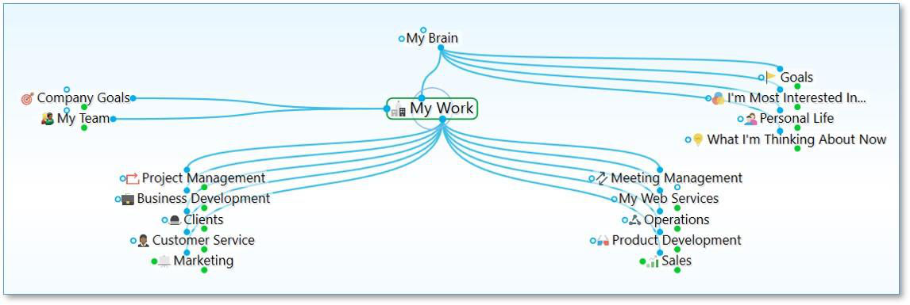

**Figure 178. A Brain in Normal View**

▪ **Outline view:** For a more expanded, primarily hierarchical view of your

thoughts.

**Figure 179. A Brain in Outline View**

▪ **Mind Map view:** For a horizontally expanding symmetrical layout.

**Figure 180. A Brain in Mind Map View and Expanded**

In addition to selecting a view, you can expand and collapse the display of thoughts in all views to show more or fewer generations.

TheBrain automatically remembers the last view you used and selects it by default. For example, if you select Outline view and then close TheBrain, the next time you open it, Outline view will be active.

**Three ways to change to a different view:**

▪ Click the **Layout** button in TheBrain toolbar, then click the view of your choice, or

Right-click in the plex, click the **Layout** command, then click the view of your ▪

choice, or

▪ Click the **View** menu in the menu bar, then click the view of your choice

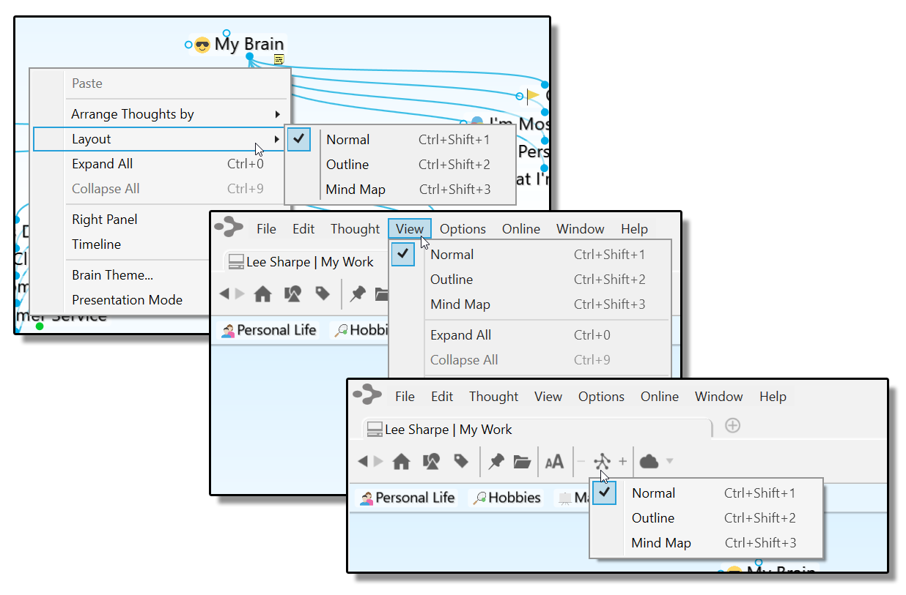

**Figure 181. Three Ways to Select a View**

**Tip:**

The check mark in the menu identifies the current view.

A rule of thumb for when you might use each view is to use Normal view when

you’re creating thoughts and navigating the plex, use Outline view when you

want to see a more traditional structure, and to use Mind Map view for viewing

and analyzing the “big picture.”

**Using Outline View**

**Figure 182. Plex in Outline View**

Providing a clean, organized way of looking at your thoughts, Outline view enables a fast, easily understood overview of the active area of your thought network. The level of detail can go as deep as you want while maintaining an ordered view.

When the plex is in Outline view, you can show or hide generations of children for individual thoughts. To see if a thought has child thoughts that aren’t currently showing, point the mouse at the thought.

▪ On mouseover, a plus sign (**+**) icon will appear above the top edge of the thought’s outline if there are child generations to display. Click the **+** icon to expand and show that thought’s children.

▪ On mouseover, a minus sign (**-**) icon will appear below the bottom edge of the thoughts’ outline if child thoughts can be collapsed or hidden. Click the **-** icon to hide that thought’s children.

**Figure 183. Showing/Hiding Additional Generations of Individual Thoughts**

**Using Mind Map View**

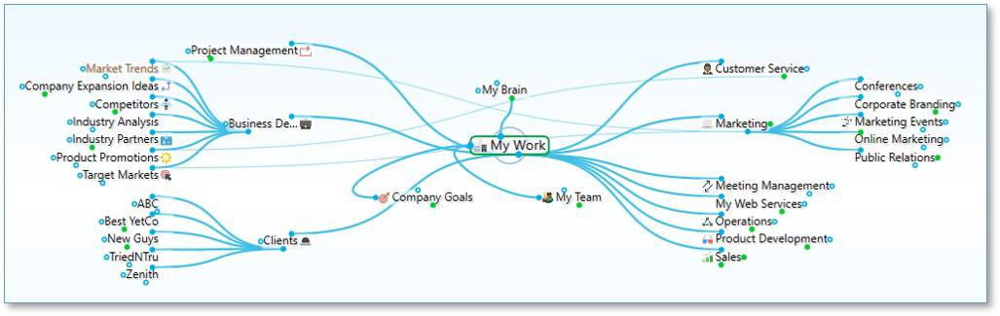

**Figure 184. Mind Map View**

The Mind Map view allows switching the focused thought without changing the layout for when you want to view and alter various pieces of content while keeping the view mostly static. Traditional mind map layouts can be created instantly from any thought.

To navigate to another thought in your plex while in Mind Map view, right-click the desired thought and select **Activate Thought**.

**Figure 185. Changing the Active Thought without Changing the Layout**

As with Outline view, when the plex is in Mind Map view, you can show or hide

generations of children for individual thoughts by pointing the mouse at a thought, then clicking the plus sign (+) or minus sign (-) icon to show or hide the thought’s children.

**Expanding and Collapsing Generations**

Besides expanding and collapsing individual thoughts in Outline view or Mind Map view, as explained in the previous section, you can also expand and collapse generations of all thoughts in all views.

**Figure 186. Expanding or Collapsing from the View Menu**

In Outline and Mind Map view, you can also use the buttons on the toolbar to expand or collapse all visible thoughts by one generation.

**Figure 187. Expanding or Collapsing by One Generation**

work the same way as the

**Expand All**

and

**Collapse All**

commands on the

**View** menu.

In Normal view, the **Expand** and **Collapse** by one generation on the toolbar

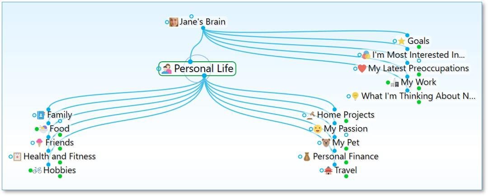

**Figure 188. Jane’s Brain in Normal View with All Collapsed**

**Figure 189. Jane’s Brain in Normal View after Expanding All**

**Tip:**

The vertical scroll bar on the right side of the plex indicates that there are

more sibling thoughts in that area which are not currently visible.

**Figure 190. 5 Generations of Thoughts**

**Presentation Mode**

Presentation Mode makes your brain full-screen, hiding the title bar, menu bar, toolbar and Brain tabs. On both Windows and macOS the taskbar and dock are also hidden. Presentation mode is an excellent viewing option when using your brain for effective and focused discussions.

▪ Enter Presentation Mode by selecting it from the View menu

▪ Keyboard shortcuts can be used for functionality that is hidden from the current view, such as switching amongst open Brain tabs without exiting Presentation Mode

▪ Just start typing to search and the controls appear and disappear as needed

**Figure 191. Before and after switching to Presentation Mode**

**The Content Area**

You can think of the parts of TheBrain’s content area as personal assistants who are ready to help when asked. You can give any of them the day, week, or year off if you choose not to use their services, but they’re all standing by, ready to assist you—-at the click of your mouse.

The content area keeps all of your thought-specific notes and attachments. Attachments can be files, web pages, pictures, and more.

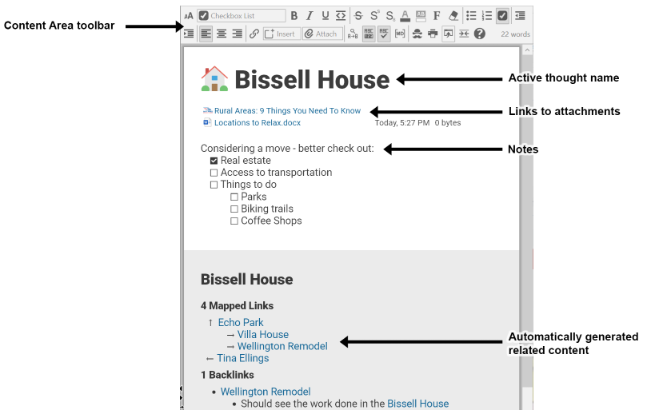

**Figure 192. TheBrain’s Content Area**

**Content Area Overview**

Here are some handy things to know about the content area:

▪ By default, the content area shows content attached to the active thought. If the active thought has no content, the content area shows only the thought’s name and related content (or placeholders for related content to come).

However, if you want to see the content for thoughts you point at with the

mouse, select the “Update displayed content on hover” option in the **Behavior** tab of the **Preferences** window. (Please see the Behavior Preferences section on page 64 for more information about setting global user interface preferences.)

▪ A red border highlights the content area when the content belongs to a moused-over thought.

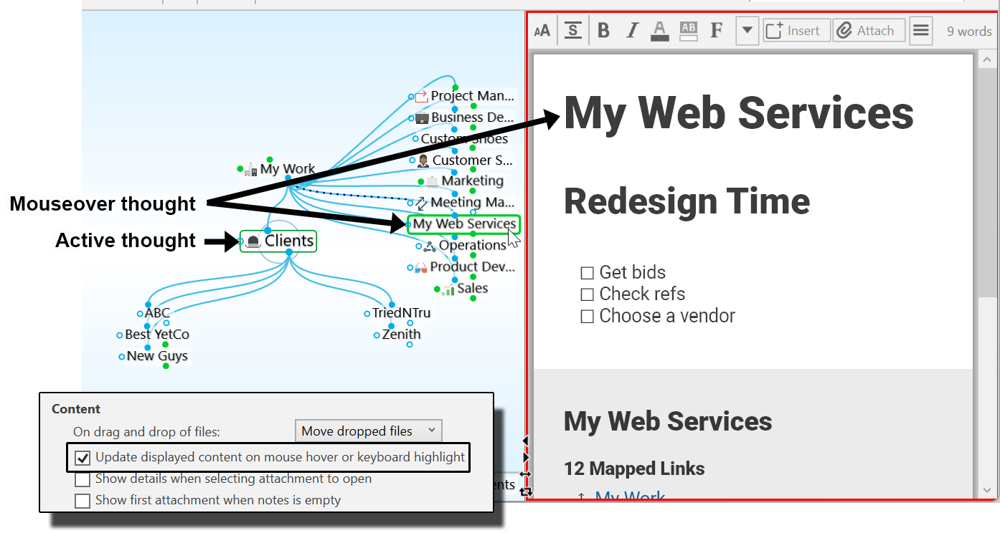

**Figure 193. Content of an Inactive Thought after Behavior Preference is Changed**

Preferences are global; whatever options are selected when one brain is active

will also be selected in your other brains. Of course, you can change your

preferences at any time.

▪ With one click, you can move the content area to any side of the plex—

above, below, left, or right. See the Using Smart-Splitter to Arrange TheBrain

Window section on page 38 for details. While you’re working on content you

might find it convenient to maximize the content area.

**Figure 194. Maximizing the Content Area**

▪ The size of the content area depends on the size of TheBrain window, but when the plex and the content area are side-by-side, you’re in control of how much of the available space each area occupies. Just point the mouse at the line between the two areas and when the double-headed arrow appears, drag left or right to change the proportions.

**Figure 195. Making the Content Area More Wide or Narrow**

**Tip:**

To work with the content area in a separate window, click the

**New Window**

command on the

**File**

menu. Then, maximize the plex in one window and the content area in the other. Changes you make in one window will be reflected in the other because you’re working with the same brain, however, the windows won’t be in synch. In other words, making a thought active in one window won’t make it active in the other.

**Note Viewing Options**

TheBrain formats its notes using markdown. Users have the option of either viewing the markdown syntaxes (formatting tags) while editing, or staying in a WYSIWYG editor and using the buttons in the content area toolbar for all formatting. The option to toggle on/off this setting can be found in **Preferences** under the **Notes Editor** tab. Look for the **Show Markdown** checkbox.

Additionally, you can switch this setting with a button in the content area toolbar with the Show Markdown button.

**Figure 196. The Show Markdown Button**

Even when Markdown is hidden, some keyboard shortcuts will still be operational such as shortcuts for bulleted lists, ordered lists, checklists, titles, subtitles, headings and block quotes.

**Creating and Formatting Notes**

Take a note, capture your ideas, or create your next literary masterpiece!

**Figure 197. A Note-Worthy Note**

**The Content Area Toolbar**

The content area toolbar is quite robust—don’t feel like you have to use every feature for every note. You’ll see many of the tools you’re familiar with from word

processing and email applications. And when you want your note to look “just so”

you’ll have an excellent array of options at your fingertips.

Depending on how wide you’ve made your content area, you may see the fully expanded toolbar or the compact version. Either way, you’ll have access to all tools via buttons providing access to the additional commands. By default, unless the content area is stretched wide, the compact version of the toolbar will be displayed.

**Tip:**

To show the expanded toolbar even if the content area isn’t very wide, deselect the “Use compact toolbars for Notes” check box in the

**Notes Editor**

tab of the

**Preferences**

window. (Please see the

**Behavior Preferences**

section on page 64 for more information about setting global user interface preferences.)

**Figure 198. Compact and Expanded Versions of the Content Area Toolbar**

Unlike earlier versions of TheBrain software, the content area toolbar is always on display when the content area is open, but does not have your cursor focus.

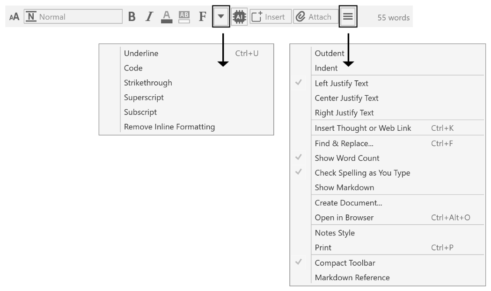

**Figure 199. The Compact Content Area toolbar**

Here are the buttons that show when the expanded content area toolbar is displayed. The annotations point out special buttons you may not see in other text editors.

**Figure 200. Buttons on the Expanded Content Area toolbar**

All Notes features are always available no matter which content area toolbar—compact or expanded—is displayed.

**Toolbar Buttons**

Content Area toolbar buttons (in order of appearance):

▪ **Text Size** – Use the text size slider to resize the notes

▪ **Paragraph Style** —choose from:

o Normal

o Title (H1)

o Subtitle (H2)

o Heading 1 (H3)

o Heading 2 (H4)

o Heading 3 (H5)

o Heading 4 (H6)

o Code

o Unordered List

o Ordered List

o Checkbox List

▪ Bold, Italic, Underline and Code

▪ Strikethrough, Superscript, Subscript, Foreground Color, Background Color, Font and Remove Formatting

▪ Unordered, Ordered and Checkbox Lists

▪ AI Writing Assistance – This button will always be visible, even when the Compact Toolbar is enabled.

▪ Outdent and Indent

▪ Left, Center and Right Justify Text

▪ Link

▪ **Insert:** Date/Time, Table, Special Character, Capture and Insert Image, Mathematical Expression, Horizontal Rule, Page Break and Table of Contents

▪ **Attach:** Link to File/Folder/URL, Add Markdown File, Paste, Add from Brainbox, Add File from Template, Create Event, Open Thought Folder, Capture Image to Attachment, Copy Path to Thought’s Folder, Template Help

▪ Find and Replace, Show Word Count, Spellcheck as You Type and Show/Hide Markdown

▪ Note Style, Print, and Export

▪ Compact Toolbar and Markdown Reference

**Markdown Editor**

Notes in TheBrain are created using a next-generation markdown editor. This improved version of markdown enables more capabilities than standard editors for a superior editing experience. As mentioned, the visibility of markdown tags can be turned on/off with the Show Markdown button in the content area toolbar.

▪ Unlike other markdown editors, TheBrain enables direct rendering of formatting, images, and more without requiring a "preview" window.

▪ With the Show Markdown setting turned on, you’ll have text-based, inline code formatting: Ability to type text that converts into formatting, such as:

o “[ ] “ (or “- “) to create a checkbox – “+ “ for a pre-checked checkbox

o ** for bold

o “* “ at the start of a line to create a bullet list

o Block quotes using “>“

Spaces are now ignored while typing between two markdown tags. For example, typing a full sentence in between “**” and “**” will keep the text bold. Earlier versions of the markdown editor would remove formatting each time a space was added.

Toolbar-based formatting: Not familiar with markdown? A toolbar that works just like you're used to that will also help you learn the text equivalents.

Use the question mark icon link in the content area toolbar to TheBrain

Markdown Reference Guide for more clarity on how you can utilize markdown by typing directly into the notes.

**Figure 201. Link to TheBrain’s Markdown Reference Guide**

**Markdown Variations**

TheBrain has updated the markdown tags for designating underlined text to be more in line with traditional markdown specifications. This new setting in **Preferences** on the **Notes Editor** tab defaults to off (unchecked). Existing note content from earlier versions of TheBrain will remain in the same formatting. For example, the following markdown tags will designate underlined text:

This word is still _underlined_.

Checking the option for **Render underscore tags as italics** will change the word to be italicized.

This word is now _*italicized*_.

The markdown formatting commands for underscoring now utilizes an underscore and bracket:

This word is _{underlined}_ in TheBrain 13.

**Figure 202. Render Underscore Tags as Italics**

**Viewing Multi-Column Notes**

By default, your notes will display as a single page. Long notes will utilize a scroll bar to navigate in a linear direction. This is called the Simple View. If desired, multi-column notes can be displayed. In **Preferences**, under the **Notes Editor** tab, the **Layout** setting can be toggled between **Simple** and **Multi-column**.

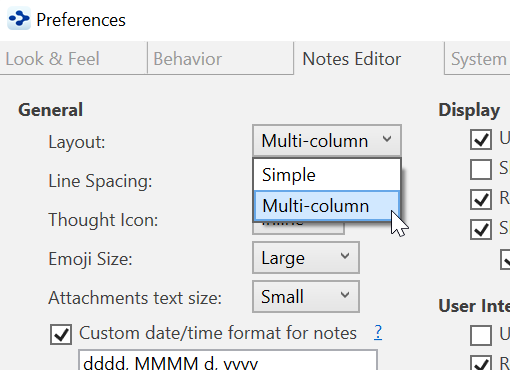

**Figure 203. Switching to Multi-Column Layout**

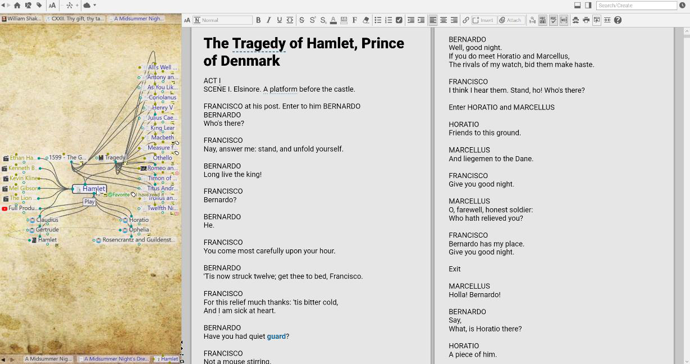

**Figure 204. A Multi-Column Note**

If you are still seeing just a single column in Multi-column Layout, try giving the

content area more screen real estate. Use the smart splitter to make the plex smaller. Multi-column notes are best suited for high resolution monitors.

**Entering Notes**

To enter a note, activate the thought to which the note pertains, then click in the open area of the content area and begin typing. The content area toolbar will remain displayed whenever the content area is visible.

Notes are saved automatically when another thought is activated and will be saved when closing a brain and prior to an unlikely crash in the application.

You can use all of the standard techniques you use in other text editors when you type, revise, and format TheBrain notes:

▪ Automatic word wrap controls line endings. Press the **Enter** key to begin a new paragraph.

▪ Either apply formatting as you go or select existing text before you apply formatting such as bold, italics, underlining, and color.

▪ Standard text selection techniques:

o Drag the mouse through text to select it, or

o Click at the beginning of the text, then hold down the **Shift** key as you click at the end of the text to select all text in between, or

o Double-click to select an entire word, triple-click to select an entire line

▪ To apply formatting to an entire paragraph, such as lists—bulleted, numbered, or check marked—just click anyplace within the paragraph. There’s no need to first select the entire paragraph.

▪ Standard keyboard shortcuts—such as **Ctrl**-C for **Copy**, **Ctrl**-V for **Paste**, and **Ctrl**-A for **Select All**—work as you would expect in notes. (On macOS, the standard **Command** key shortcuts also work.) You can copy and paste within notes and between TheBrain and other applications.

▪ To toggle a check box on or off, follow a link, or open an attachment in the content area, press the **Ctrl+L** keyboard shortcut.

Double space to create a period in notes on macOS.

One special feature for TheBrain notes is that if **no** text is selected and you

select a formatting command such as bold, highlighting, or change in typeface or font size, the formatting will apply to the entire word in which the cursor is currently blinking.

**Tip:**

You can press

**Ctrl**

- Z (or click the

**Edit**

menu, then click the

**Undo**

command) to immediately undo your most recent action in notes.

**Artificial Intelligence Writing Assistance**

Notes can be automatically generated for any thought in your brain with the help of AI. This can be done from scratch or in addition to an existing note.

Additionally, AI can be used to improve, modify, edit and summarize an existing note in a variety of different ways.

**Generating New Notes with AI**

To create a new note from scratch, navigate to your desired thought and click on the AI button in the content area toolbar. Select Generate Note.

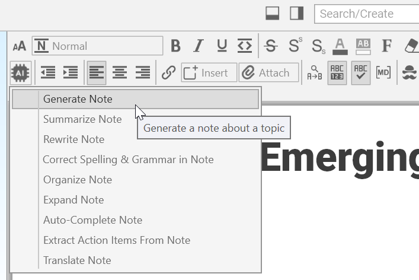

**Figure 205. Generate a Note with AI**

The active thought name will be automatically selected as the Topic Name, but this field can be modified for clarification if needed. You will also have the option to modify the following settings:

- **Set Context Thought** – Select a parent thought above the active thought to be referenced as context for your new content. This is helpful for

general thought names. For example, a thought named “Directors” can be given greater context by selecting a parent thought named “Silent Film”

- **Use Children for Context** – If the thought already has some children, check this box to give AI an indication of the type of content you are hoping to see.
- **Creativity** – Select from 0% - 100% creative. Not seeing the results

you’re looking for? Try bumping up the creativity level and let AI start thinking “outside the box.”

- **Word Count** – Specify between 50 – 1000 words for your new note with the Word Count Slider.

**Tip:**

Although the maximum word count is 1000, you can always add more text manually later, or use AI to expand on existing content.

- **Language** – Regardless of your default language settings, your AI query results can be generated in one of 78 different languages.

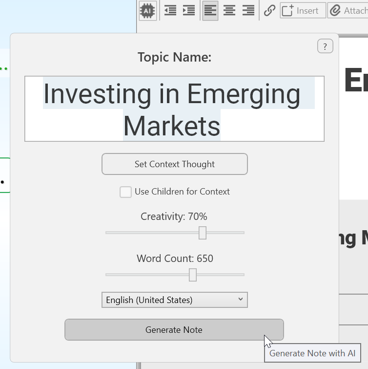

**Figure 206. Modifying the AI options**

Your new note will be populated word by word. Output will match the language of the input text. While the note is generating, it is not possible to navigate to another thought or brain tab.

Once completed you can scroll through the new note to review what AI has generated. When your review is complete, select one of three options in the banner above the note to either Accept changes, Redo (opens the AI pop up window with the most recent settings) or Discard.

**Modifying Existing Notes with AI**

There are many ways that existing notes can be modified and/or improved with the help of AI. After each modification, you can review the edit prior to clicking on Accept, Redo or Discard. Additionally, you’ll see a drop-down menu that will allow you to view the original note, new note, or merged note to help you decide if you would like to keep the changes. Merged notes will display new text in green highlights and removed text in red highlights with strikethrough.

TheBrain allows you to transform your entire existing note or a selection within a note with the following options:

**Summarize Note**

Regardless of the note length, a summery of its content will be added to the bottom of the note. Longer notes may have longer summeries.

**Rewrite Note**

Rewrite any note in a unique style or format. There’s no limit to the parameters you can provide to TheBrain AI. Try one of the following styles to see the different types of results:

Poetry •

• Patent Application

• Motivational

• Formal or Casual

Modern Slang •

• Legal

• News-Report Style

• William Shakespeare

**Correct Spelling & Grammar in Note**

Corrects all spelling and grammar mistakes and/or suggests new options.

**Tip:**

After a Correct Spelling & Grammer in Note modification, it may be a good time to review changes in the merged view before accepting AI’s alterations.

**Figure 207. Viewing Merged Changes**

**Organize Note**

AI will review the content of your note and restructure it accordingly. Typically, this will result in a shorter and more concise note.

**Expand Note**

Taking quick notes, or just jotting down a bulleted list or outline? Let AI turn this fractional data into a complete and well structured note.

**Auto-Complete Note**

Writer’s block?... AI will pick up where you left off and complete your existing note for you. This feature will even finish your content and line of thinking if you stopped mid-sentence.

**Extract Action Items From Note**

AI will review the contentment of the note and generate a checklist at the bottom of the note for action items that were referenced and need to be completed.

**Translate Note**

Convert an entire note, or just the selected text to any one of 78 different languages.

**Using Drag and Drop within Notes**

You can move images, links, and text in a note via drag and drop. You can also drag note content to external applications.

- To move text, first select the text, then drag the selection
- To move an image or link, start dragging it, then drop it when the cursor is where you want the image or link to be

Press the **Escape** key to stop dragging.

**Tab Key Functionality in the Notes Editor**

When you’re typing in the Notes editor, the **Tab** key performs different functions based on:

▪ Where the cursor is

▪ Whether text is selected

**Tab**

key reverses the direction of the action. For example, wherever pressing

**Tab**

shifts text to the right, pressing

**Shift**

+

**Tab**

shifts text to the left.

As in most text processing software, holding the **Shift** key while pressing the

**If no text is selected and the cursor is within or at the start of a paragraph:**

▪ The **first line** of the paragraph (whether it is one line or many) is indented approximately five spaces each time the **Tab** key is pressed.

**When the cursor is in a list item (bullets/check boxes/numbered lines):**

▪ The entire list entry is indented approximately five spaces each time the **Tab** key is pressed.

**When the cursor is in a title, subtitle, heading, or subheading:**

▪ The level of the heading is decreased each time the **Tab** key is pressed. The heading level is increased each time **Shift**+**Tab** is pressed. For example, to change a Heading 4 to a Heading 3, you would click in the text and press **Shift**+**Tab**. (Heading 3 is a “higher level” than Heading 4.)

**When the cursor is in a table:**

▪ Pressing the **Tab** key moves the cursor to the next cell.

Tab characters can’t be inserted into the middle of a line of text. If you want to align text into columns, it’s most efficient to format using a table.

**Collapsing and Expanding Notes Sections**

You can collapse sections of your notes based on headings, tables, and list items. This helps you navigate through large documents more easily. Collapsing lets you focus on a particular area while writing or reviewing content. When you’re ready, you can expand any or all sections.

**Two ways to expand or collapse Notes sections:**

- Hover over the area to the left of the notes, then click the down-arrow to the left of the section to collapse the entire list. This symbol will become a right- arrow which you can click to expand the section.

Or

- Right-click in the area where there are notes, then click an option of your choice. Optionally, before you right-click, click in a specific section if you want to collapse or expand just that section.

Choices on the context menu include: **Collapse All Except Here**, **Expand All**, **Collapse All**, **Expand Here**, and **Collapse Here**.

**Figure 208. Options for Expanding or Collapsing Note Sections**

**Choosing a Notes Style**

You can choose the style of the notes in the brain that’s open by clicking the **Notes Style** button in the content area toolbar. The style you choose applies globally to all notes in a single brain, so you can choose a style that matches the

look of each of your brains. You can use a different style for each different brain in TheBrain window.

Notes style and formatting will be preserved if you copy and paste a note’s content from one thought into another. To easily copy an entire note, right click

anywhere inside the note to use the

**Select All**

option.

From the note’s context menu, you can also select Copy as Text or Copy as

HTML for pasting into other applications.

▪ To select a style, click in the **Notes** tab, click the **More** button, then click the **Notes Style** command (or just click the **Notes style** button if the toolbar is expanded), then click a style of your choice from the **Edit Notes Style** box.

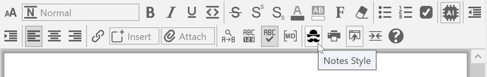

**Figure 209. Setting the Notes Style**

Note Styles also follow a “responsive web design guidelines” approach which is a fancy way of saying that any note you create will look great whether it is viewed on a 30” monitor or a 4” mobile device.

You can also apply a Notes Style to a Theme, so that it will be in place when

you use that theme with another brain. The techniques for fine-tuning the various Style attributes are the same, whether you start in the content area or the

**Brain Theme**

dialog box. For details about viewing and changing the appearance of notes in the content area, please see Changing the Content Area’s Default Attributes beginning on page 49.

**Figure 210. Appearance of Some Notes Styles**

Each Note Style has a set of paragraph styles that help you format your notes

consistently. If you don’t choose a paragraph style, the text is automatically attached to a paragraph style named “Normal.”

**Figure 211. Paragraph Styles**

Paragraph styles apply to entire paragraphs. To select one, just click anyplace

with the paragraph, then click the paragraph style of your choice. If you change to a different Notes Style, the text will change accordingly, based on the paragraph styles you’ve selected.

**Changing Text Size in Notes**

In addition to changing the size of text by choosing different notes and paragraph styles, you can quickly adjust text to a size that is most comfortable for you. It’s as easy as clicking the **AAText Size** button, then dragging the slider up or down!

**Figure 212. Slider for Making Note Text Larger or Smaller**

**Paragraph Alignment**

Quickly adjust paragraph alignment to left, center or right. Place your cursor anywhere in a paragraph and click on the desired justification.

**Figure 213. Paragraph Alignment**

**Custom Font Family for Selected Text**

Place your cursor anywhere in a paragraph, then click the **Font** button to select from of over 900 font families. Fonts are consistent across platforms, so your notes will look the same on Windows, macOS and mobile devices.

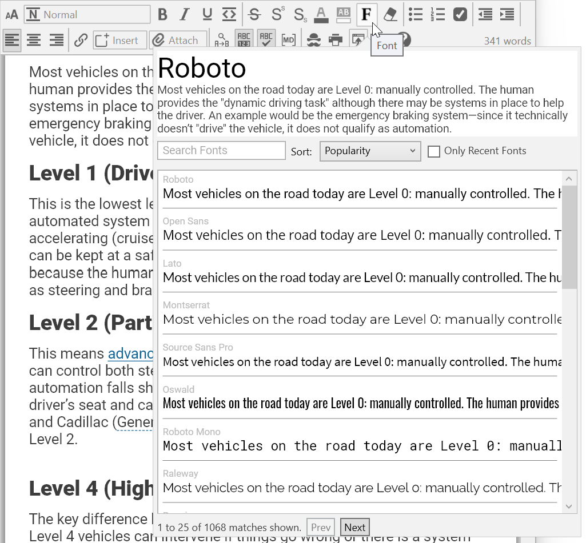

**Figure 214. Fonts**

Move through large sections of the font list using the **Next** and **Previous** buttons.

**Adding Tables**

Create tables inside of the content area by clicking on **Insert** and selecting **Insert Table**. Tables can also be created by copying and pasting from Excel, Word or tables in other notes. When Show Markdown is active, to start a new table, type a word or sentence surrounded by pipe symbols, such as: “|this is a new table|.” Tables can include formatting and images, and cells can be right, center or left justified, using the content area toolbar buttons or with markdown formatting.

**Figure 215. A Table Inserted in the Content Area**

When adding a table, you may select the number of columns and rows. More

can be added at a later date if necessary.

**Figure 216. Inserting a New 7x6 Table**

pipe characters and optional justification tags). The header will not be visible

when editing and will completely disappear when printed or in view mode. To make a table with no header, leave the cells in the header row empty (only

Multiple cells can be selected at once for group formatting by clicking and

dragging, or use the arrows above or next to a column or row. Right click on an

arrow to select from the following options:

- Justify Left
- Justify Center
- Justify Right
- Duplicate
- Delete
- Move Up/Left
- Move Down/Right

When multiple cells are selected:

- Press the delete key to clear the cells. If an entire row or column is

selected, it will be removed.

- Cut, copy and paste can be used to move cells within a table or from one

table to another.

- You can even select a group of cells, copy it, then paste elsewhere in the

document to create a new table.

- If normal content (not made of multiple cells) is copied and then multiple

cells are selected prior to pasting, the content will be duplicated into every

selected cell.

**Table Controls**

Edit any cell by clicking inside that cell and using the available buttons in the

content area toolbar. Only formatting options that are available will be accessible,

others will be greyed out.

Click and drag on any bar in your table to adjust the column width. Select arrows

on the left for rows and on the top for columns to then drag and drop to move its

location in the table.

Click anywhere in an existing table and then click on the table icon on the upper left-hand corner of the table to activate a **Table Controls Bar** below the content area toolbar.

**Figure 217. Table Control Bar**

From here, you can move selected rows and columns left, right, up, down or duplicate the selected cells. Buttons will only appear for options that are possible depending on which cells are selected. From the Table Controls Bar, the Table Theme Editor can also be opened.

Additional commands are available by right clicking in a table, such as Move, Justify, Select All in Table, Split Table and Toggle Table Toolbar.

**Table Theme Editor**

Selecting Table Theme Editor from the Table Controls bar will open a pop-up window that allows you to further customize the color settings of the entire table and/or the first row. New cells and content added to the existing table will then follow the same color settings. A sample table will display the colors that are being selected. The following options are customizable:

- Text
- Background
- Alternate Row Background (every other row, starting with row 1)
- Table Lines
- First Row Text, Background and Lines
- First Column Text, Background and Lines

**Figure 218. Table Theme Window**

Over 20 different **Prebuilt Styles** are also available from the Table Theme Editor.

**Inserting a Table of Contents**

You can easily add a Table of Contents into any existing note. The Table of Contents will provide quick links to all Titles, Subtitles, Headings, and Subheadings. You can also see a quick pop-up Table of Contents.

**To insert a Table of Contents:**

▪ Click in the note where you want the Table of Contents to begin, then click the **Insert** button and select **InsertTable of Contents** option in the content area toolbar. When **Show Markdown** is activated, type **[/toc/]**.

The Table of Contents that is created will only include the content that appears below it.

**Figure 219. Table of Contents**

**To delete a Table of Contents:**

▪ Click just above the Table of Contents, then press the **Delete** key, or click just after the Table of Contents, then press the **Backspace** key.

**To view a pop-up Table of Contents:**

▪ For a quick pop-up window that contains the note’s Table of Contents, right- click in the note or press **Ctrl+T**.

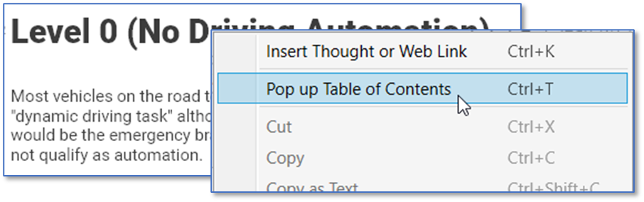

**Figure 220. Pop Up Table of Contents**

**Spell Checking**

A spell checker is automatically at work for your notes. Possible misspellings are automatically highlighted and you can right-click to view suggestions. Click the

suggestion of your choice to replace the misspelled word. You can customize the dictionary by adding words to it.

**Figure 221. Spell Checker in a Note**

If you prefer not to see misspellings flagged as you type:

▪ Click in the **Notes** tab, click the **More** button, then click the **Check Spelling** **as You Type** command (or just click the **Check Spelling as You Type** button if the toolbar is expanded).

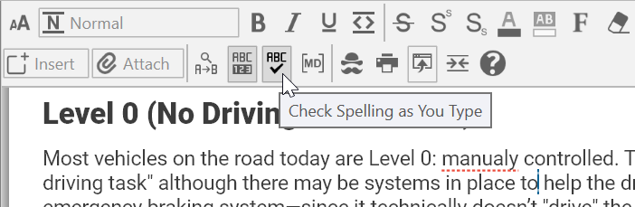

**Figure 222. Disabling Spell Checking**

This is a toggle command. When you want to turn the feature on again, follow

the same procedure.

Real-time spellchecking also applies to creating and editing thought names.

**Inserting Horizontal Rules**

You can insert horizontal rules (lines) for organizing notes into sections visually.

▪ Click in the note where you want the horizontal rule to appear, click the **Insert** button, then click the **Insert Horizontal Rule** command.

▪ Horizontal Rules can also be added manually by typing 3 hyphens, even when Markdown is hidden.

**Figure 223. Inserting a Horizontal Rule**

Typing 10 hyphens will create a Page Break in the note; however, this option is only enabled when Show Markdown is activated.

**To remove a horizontal rule:**

▪ Click within the rule to select it, then press the **Delete** key. If there is a rule between two paragraphs, the rule will also be deleted if you select and delete the paragraphs before and after it.

**Creating Check Box Lists**

You can create a quick check box list and mark the items as complete or

incomplete. You can either create the list as you type or turn any existing text into a check box list after you select it.

1. Click in the note where you want to type the first item to appear, click in any paragraph, or select multiple paragraphs.

2. Click the **Toggle Checkbox List** button in the content area toolbar.

3. When a task is complete, click the check box to display a check mark or click it again to remove the check mark if you decide the task isn’t complete after all.

**Figure 224. Formatting Text as a Check Box List**

**To see ALL of your To-Do items in one place:**

▪ Click the **Right Panel** button in the upper-right area next to the Search box or click the **To Do List** command on the **View** menu.

**Figure 225. Two Ways to Open the To Do List for All Thoughts**

The To Do List panel is displayed:

**Figure 226. A To Do List for All Thoughts**

When you click a check box in one location, such as the To Do List panel, it is automatically checked off in the other location (the thought) and vice versa.

**Linking to Thoughts in Notes**

TheBrain has a built-in feature that automatically marks note text that matches any thought in your brain with a blue dotted underline. You can then choose to quickly create a link to that thought. This is explained in the Thought Mentions section beginning on page 206.

**Creating Web Links**

Web links can easily be inserted, edited, and identified within your notes for the active thought. Use any of these three ways:

▪ Type in the URL, or

▪ Paste in the URL from the clipboard after you copy it (any selected note text is automatically linked to the URL), or

▪ Drag the URL in from a browser

The web link will be identified and processed automatically.

Hyperlinked text in notes can be displayed and activated in several different ways. In TheBrain Preferences open the Notes Editor tab. Under User Interface, the option to Show Link Target in Pop-Up can be selected. This will show the full URL of a hyperlink in Notes when clicking on the linked text. Additionally, the

option for Clicking Links in Notes can be set to Follows Link (automatically launches URL in default browser) or Moves cursor (places cursor in the text

without activating the URL).

**Figure 227. A Target Link Pop-Up on Hyperlinked Text**

Videos from YouTube are embedded into notes in a playable form automatically. Just drag and drop from your browser into your notes.

**Figure 228. Dragging a Web Link into a Note**

▪ The URL will be replaced with the title of the page it links to—and you can easily edit the title by clicking within it and using standard typing and deleting techniques. If you delete the brackets around the link text, the connection to

the URL will be broken—just use the **Undo** command on the **Edit** menu or press **Ctrl-Z** if you delete a bracket by accident.

**Figure 229. Revising Link Text in a Note**

Copying an image pasted in a note will put the image on the clipboard.

**Fast Linking and Creating Thoughts from Notes**

Pressing **Ctrl/Cmd+K** is a shortcut to:

• Insert a link to an existing thought

• Create a new thought

• Link to a URL

• Edit or remove a link

**After you press Ctrl/Cmd+K:**

1. An edit box opens so you can begin typing a URL or the name of the thought you want to perform any of these activities on. Or, if you select text or a URL first, that text will appear in the edit box.

2. Double-click the entry that appears to insert a link to that item in the note.

For example, double-clicking “Volunteer Opportunities” in the example below creates a link to that thought in the notes for “Goals.”

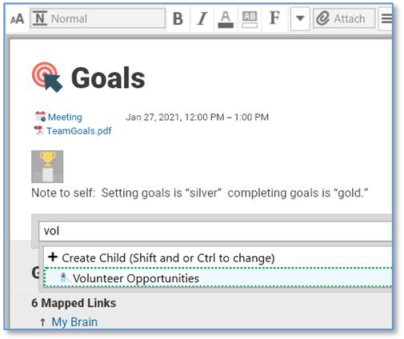

**Figure 230. The Ctrl/Cmd+K Shortcut**

3. If an existing link is selected, you’re ready to begin editing it. To remove the link, just delete its name in the edit box.

4. If you type a URL, it will be inserted.

The link command includes all the features of **Quick Thought Creation** so you can insert all types of relationships easily.

Alternatively, you can type

**[[**

to link or create thoughts.

**Capturing and Inserting Images in the Content Area**

You can take a screen capture of virtually anything you can see on the screen and then insert the image into the content area.

▪ Click the **Insert** button in the content area toolbar and select **Capture and** **Insert Image**.

▪ Your brain will be hidden temporarily and red crosshairs will appear on the screen in place of your cursor.

▪ Click and drag a rectangle around the area to be captured as an image in your note.

**Figure 231. Capture Image from the Content Area Toolbar**

**Mathematical Expressions**

Insert LaTex mathematical expressions directly into your notes by using the Insert button in the toolbar or placing the proper text surrounded by $$. A real time display of your mathematical expressions will be displayed while editing.

Example of a mathematical expression:

**Input:**

$$mr\left(\frac{2\pi}{T}\right)2 = G\frac{mM}{r2} \rightarrow T2 = \left(\frac{4\pi2}{GM} \right)r3 \rightarrow T2 \propto r3$$

**Result:**

mbols can be found at or

rtcut of $$ can still be used to insert mathematical expressions.

**Details on Images in Notes**

Select an image in a note to see its size as a percentage. The size display will update as the image is being resized.

**Figure 232. Image Size Displayed as a Percentage When Selected**

**Find and Replace in Notes**

Click the **Find & Replace** button in the content area toolbar to open the **Find** and **Replace** fields. Type the text you’re searching for in the **Find** field and the replacement text in the **Replace** field. All matches to the **Find** field will be highlighted in the note. Use the arrow keys move back and forth between each occurrence to preview when you’ll be replacing. Use the **Replace** button to replace specific instances one at a time, or the **All** button to replace all instances of your search criteria.

Your cursor will remain on the current selected highlight when you close the Find/Replace fields.

The

**Find**

field can be used independently, without content in the

**Replace**

field if you are just looking for specific text to be highlighted within a long note.

**Printing Notes**

To print the active note, press

**Ctrl**

- P or click the

**More**

button, then click the

**Print**

command (or just click the

**Print**

button if the toolbar is expanded). The

**Print**

dialog box will open and you can fine-tune your print request.

**Figure 233. Printing a Note**

**Exporting Notes**

Click the Export button in the content area Toolbar. You will have the following

options:

- **Create Document** – You will have the option to create a PDF, HTML,

Markdown or Text file. Custom settings that are selected will be

remembered for future exports. Customizable settings include:

o**Options**

▪ Thought Titles

▪ Thought Labels

▪ Links and Mentions

▪ Use web thought URLs

▪ Force white page

o**Format**

▪ PDF

▪ HTML

▪ Markdown

▪ Text

o**PDF Options**

▪ Page size

▪ Orientation

▪ Text Size

▪ Page number footer

o**Markdown Options**

▪ Convert to “CommonMark”

- **Open in Browser** – Note will open as HTML in your default web browser.

**Additional Note Features**

**Word and Character Count**

The number of words for each note displays in the bottom-right corner of the

content area toolbar. Hovering over the word count for each individual note will

display the character count of that note. You can toggle the display on or off by

selecting the **Show Word Count** button on the expanded content area menu or

the compact toolbar’s drop-down menu.

**Search Web from Notes**

Select any text in your note and press **F4** on your keyboard (or your customized

Web Search keyboard shortcut) to open the Web Search dialog box, pre-

populated with the selected text.

**Delete By Word**

The content area supports keystrokes to delete by word, rather than one

character at a time:

▪ **Ctrl+Backspace** = Delete to start of current word (equal to **Ctrl+Shift+Left**,

**Backspace** on macOS)

▪ **Ctrl+Delete** = Delete to start of next word (equal to **Ctrl+Shift+Right**, **Delete**

on macOS)

**`Search Brain for`**

Select a word or phrase in any note and right click. Select the option of **Search**

**Brain for “Selected Text”** to see if that word or phrase appears elsewhere

within the same brain.

**Edit Link Context Menu Commands**

Once a link has been added to notes, you can right-click on it to edit it. If the link is a URL, you can edit its text. If the link is to a thought, you can search for and select a different thought.

**Resizable Images and Videos**

Images and videos that have been pasted into a note can easily be resized. Click on the image or video to highlight it. Each image will have eight resizing points. Click and drag on any resizing point to resize the image.

**Copying Images from Notes**

When a picture in the content area is copied (by right-clicking it and selecting the **Copy** command), pasting into Paint or Word will paste the image itself.

Pasting into notepad or some other text-only application will paste the markdown text that references the picture.

Additionally, you can right-click an image in the content area and select **Copy as Image**.

**Adding and Viewing Thought Attachments**

In addition to notes, each thought in your brain can have content associated with it such as web pages and a multitude of file attachments. You can drag and drop attachments, create them from scratch, and use any of the other options

provided by the **Attach** button in the content area toolbar. To access your attachments, just click their links in the content area.

**Figure 234. The Attach Button in the Content Area**

**Attaching Files**

You can use standard “drag and drop” techniques to add file attachments into your brain from other programs to a thought or to create new thoughts.

**To drag and drop one or more items into the Content Area of a thought:**

1. Make sure the thought to which you want to add the attachment is currently the active thought and that the content area is visible.

2. Position the window containing the item you want to attach so that it and the content area are both visible, then drag the selected item to the blank area under the thought name in the content area. A dashed outline around

the thought name shows you that you’re about to attach the file to that thought. You can select multiple items and drag them all at the same time.

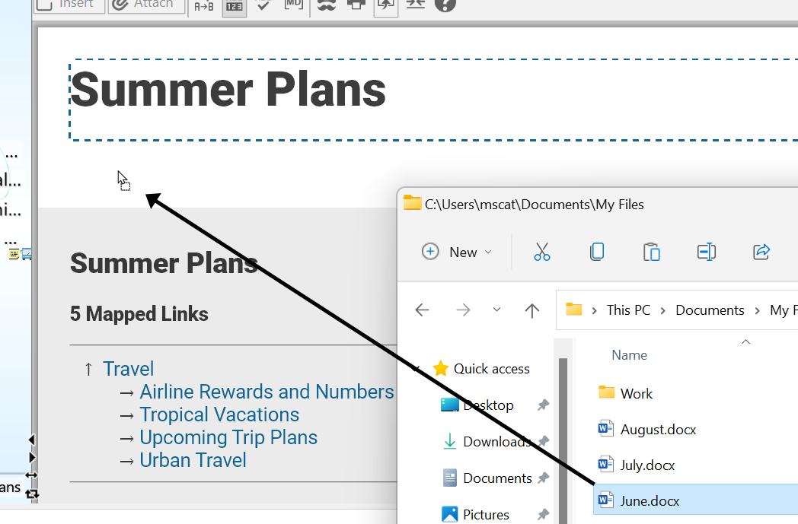

**Figure 235. Dragging and Dropping a File into the Content Area**

**Specifying your Drag and Drop Preference**

By default, all files that you drag and drop into your brain will create a copy of the original file. You can easily change the default to suit your environment. Please see the Behavior Preferences section on page 64 for information about viewing and changing the “On drag and drop of files” setting.

**Tip:**

You can also override the current drag and drop setting in the

**Preferences**

window by holding down the following keys as you drag and drop:

**In Windows**

**InmacOS**

▪Link to file = **Alt** ▪ Link to file = **Ctrl**

▪Move file = **Shift** ▪ Move file = **Cmd**

▪Copy file = **Ctrl** ▪ Copy file = **Alt**

**Attaching Links to Files and Folders without Dragging**

You can also add a file attachment to the active thought without dragging and dropping.

**To insert a link in the active thought to a file or a folder:**

1. Click the **Attach** button in the content area toolbar.

2. Click **Link to File** or **Link to Folder**, navigate to the item, then click the **Open** button.

**Figure 236. Using Link to File to Add a File Attachment**

4. The content area will display the details of the new attachment.

**Figure 237. Content Area after a Link to a File is Attached**

From here you can click the **X** button to return to the notes, click the up-arrow button to open the attachment, use the left- and right-arrow buttons to move back and forth between other attachments in the same thought or to move back to the notes, or click the **Actions** button to access more choices for handling the attachment.

**Action Menu for Files**

▪ **Open**: Open the selected attachment in its default application.

▪ **Rename**: Change the name of the selected attachment.

▪ **Properties:** Display all attributes of the selected file in a separate dialog box; based on the default application, there may be properties you can change.

▪ **Delete**: Delete the selected attachment (you will be not be prompted to confirm the deletion but you can use the **Edit** menu to **Undo** the deletion).

▪ **Copy**: Copy the selected attachment to the clipboard; you can then paste the attachment elsewhere in your brain.

▪ **Cut**: Place the selected attachment into the clipboard; the attachment will be removed from its current location when it is pasted elsewhere in your brain.

▪ **Move File into/out of Brain**: Switch this attachment between internal and external storage; if you are moving the file out of your brain, you will be prompted to specify the destination folder.

▪ **Copy File into/out of Brain**: Switch this attachment between internal and external storage; if you are moving the file out of your brain, you will be prompted to specify the destination folder.

▪ **Copy File Path**: Copies the location so that you can paste it elsewhere, including the Search box; for example, you may want to see if the file is elsewhere in your brain.

▪ **Show in Explorer**: Shows where the file resides outside of your brain.

▪ **Encrypt**: Ensures that it is impossible to recover the file contents without a password.

**Attaching Web Pages**

Adding URL attachments to your brain is a simple process. TheBrain’s built-in browser will display each web page in the content area.

TheBrain’s built-in browser has recently been updated and supports more types of web content than ever before. Many web pages can event be interactive (Google Docs, Sheets, etc.) from within the content area.

The easiest method for linking a web page into your brain is to simply drag and drop it into your brain. Click on the URL icon in the address bar of any browser and drag into one of several different locations to add the web page as an attachment:

▪ Drag and drop to the plex to create new thoughts. The thought name will be the URL of the web page or what is contained in the `<title>` tag of the URL, which you can easily rename as you would any other thought. A link to the page will appear under the thought name in the content area and clicking that link will open the page in TheBrain’s built-in browser. Online non-HTML content, such as online .PDF files will be renamed with the file name.

▪ Drag and drop onto existing thoughts in the content area. This will simply add the web page as an additional attachment link. The thought name will not be updated.

▪ Drag and drop into the body of an existing note for a hyperlink.

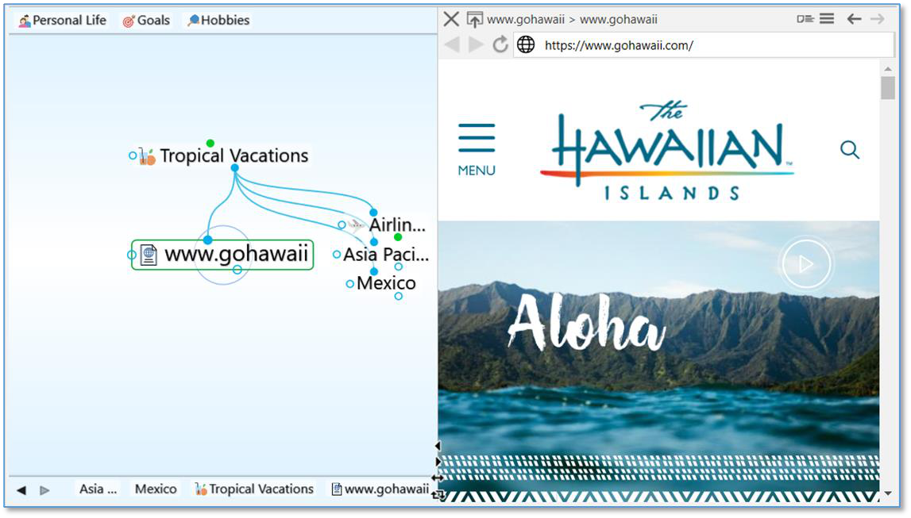

**Figure 238. TheBrain’s Built-In Web Browser**

**Adding a Web Page by Typing or Pasting its URL**

You can also add a web page attachment to the active thought by clicking the **Attach** button in the content area.

▪ Click **Link to URL**, paste or type the URL address into the empty field, then press the **Enter** key.

**Figure 239. Adding a Web Page Attachment using the Attach Button**

If the URL you are attaching to your thought already exists as an attachment on another thought, you’ll have the option to cancel, add, navigate to the Attachment or replace the attachment.

The name of the duplicate URL will be displayed in the warning message.

**Figure 240. URL Exists**

TheBrain’s built in browser allows you to open archived web pages for

attached URLs. In the context menu for any URL attachment, select

**Open Using Wayback Machine**

.

**Attaching Video and Sound Files**

TheBrain 13 includes a built-in media player that can enables playback of several common video and audio files.

To activate the video player, select a video file attachment. The video will be previewed and the player controls will be shown near the bottom of the window. To activate the audio player, use an audio file attachment.

The primary controls are: play/pause, advance by 10 seconds, and rewind by 10 seconds. There is also a timeline that can be dragged to go directly to a specific time in the video and a button to open the file in an external player. The numbers at the left of the timeline show the amount of time that has elapsed while the numbers at the right of the timeline show the amount of time remaining.

As the window is resized, the video player and its controls scale to fit within the available space with the controls appearing in a translucent overlay on top of the video when insufficient vertical space is available.

A fading animation is utilized to hide and display the controls as necessary when video is playing. For audio files, the controls are displayed in the center of the available space and do not fade out at any time.

**Figure 241. TheBrain’s Built-In Media Player**

**Supported File Types**

| Media Type | Windows and macOS | Windows Only | macOS Only |
| --- | --- | --- | --- |
| Video | mov, mp4, h264, h263, mpeg, mpg, avi, mkv, wmv | mkv | 3gp |
| Audio | mp3, wav, aac, ts, flac | pcm, wma | aiff, ac3 |

**Tip:**

Attachments can be moved between thoughts by using drag and drop directly from the content area to another thought that is visible in the plex.

**Action Menu for URLs**

An attachment that is a web page has a slightly different menu—and it’s also slightly different based on whether it’s showing in the note or with the attachment “in place,” meaning in TheBrain’s built-in browser. Access the menu by either right-clicking attachment in the note or by the **Actions** menu button in the content area where the web page is displayed.

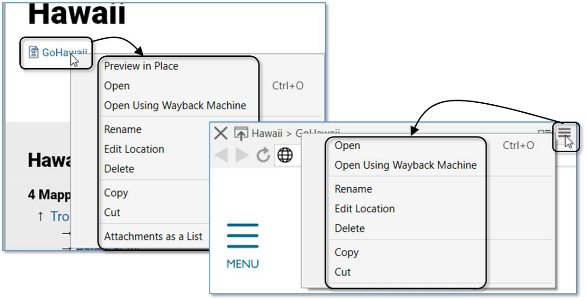

**Figure 242. URL Attach Menu in Notes and in Place**

▪ **Preview in Place**: Open the page within the content area in TheBrain’s built-

in browser.

▪ **Open**: Open the selected web page in its default application.

▪ **Open Using Wayback Machine**: Open an archived web page for the URL.

▪ **Rename**: Change the name of the selected attachment (not the URL itself).

▪ **Edit Location**: Change the URL address for the selected attachment.

▪ **Attachments as a List**: By default, attachment links appear one after

another, wrapping to a new link when there are more than fit in one line. This

option shows each link in a separate paragraph.

The rest of the commands work as they do for file attachments.

When a thought’s attachments are modified, the modification date of the

thought is also automatically updated, improving the accuracy of your searches

and filters.

**Viewing Attachments as a Slideshow**

Use the **Next** and **Previous** navigational arrows in the top-right corner of the content area toolbar to browse through attachments.

**Figure 243. Next and Previous Arrows**

**To view attachments as a slide show:**

▪ Click the first attachment, then click the **Next** button to display the next attachment.

▪ For multi-page attachments, click a thumbnail to jump to a specific page.

To return to the notes, just click the Close button (**X)** at the start of the Notes ▪

toolbar (or keep clicking the **Previous** button until the notes appear).

**To view pictures in notes as a slide show:**

▪ Double-click the image you want to see first to maximize it, then click the **Next** button to display the next picture.

**Figure 244. A Picture from Notes in Slideshow Mode**

**Working with Multiple Attachments**

You can add multiple attachments to thoughts and you can have many types of attachments for a single thought. For example, if you have a thought for a person, you might attach their blog as a web page, and their resume in a file—all in the same thought.

Multiple attachments can be brought into TheBrain at a single time using drag and drop or copy/paste.

When there is more than one attachment, the number of attachments is displayed on the thought icon. For example, the thought shown below has two attachments:

**Figure 245. Number of Attachments Indicator**

For keyboard navigation, when opening a list of attachments for a single thought, the first attachment will automatically be selected.

**Keyboard Commands for Selected Attachments**

You can use your keyboard to move the cursor from notes, up into the

attachments area to select individual attachments that are associated with a thought. Once an attachment is selected, the following keyboard shortcuts can be used:

- **Space** = Open/Preview
- **Enter** = Rename
- **Backspace/Delete** = Delete (confirmation prompt will display)
- **Ctrl/Cmd+C** = Copy

**Cut/Copy Attachments Within a Brain**

Existing attachments within a brain can be cut or copied onto your clipboard. You can then paste to a new thought in the same brain, a different brain, or to a different directory/location on your system. Right click on an attachment, or use the arrow keys to navigate the cursor up to a selected attachment while editing a note

**Creating an Event as an Attachment**

You can use the

**Create Event**

command on the

**Attach**

menu in the content area toolbar to add events to your thoughts. Please see the Managing Events section on page 229 for details.

**Adding a Template File to Your Brain**

There may be types of files that you create frequently that share a common look and feel. For example, you may prepare correspondence using a common letterhead. You can designate template files that will be at your fingertips whenever you create attachments.

**To create a template file:**

1. Click the **Attach** button in the content area, then click the **Add File from** **Template** command.

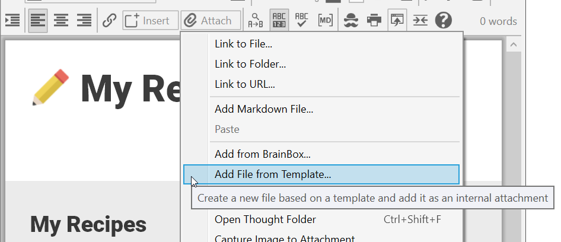

**Figure 246. Adding a File from a Template**

2. In the **Create File from Template** tab, any previously created templates will appear under the “User Templates” heading and the built-in templates will appear under “System Templates.” Click the file type of your choice.

**Figure 247. Selecting a Template**

3. The associated application will open and you can begin creating your file. Save as usual. After you close the file, TheBrain window will appear. Note that you can switch back and forth between windows—including

TheBrain—as usual, as you’re working. By default, the new file will have the same name as the active thought and it will be saved as an internal file.

Remember to click on **Template Help** under the **Attach** button if you want to add new and/or custom file types to your existing template list.

**Tip:**

If you edit one of the files in your templates folder, save it under a new name in order to preserve your original template.

**Pasting an Image as an Attachment**

If you have copied an image, you can click the **Attach** button in the content area, then click **Paste Image**. The image will become both an attachment for the active thought and its icon. Common file types such as .jpg, .gif, .png and .svg will all preview in TheBrain content area.

Additionally, multiple image files can be copy/pasted or drag/dropped into TheBrain as attachments at a single time.

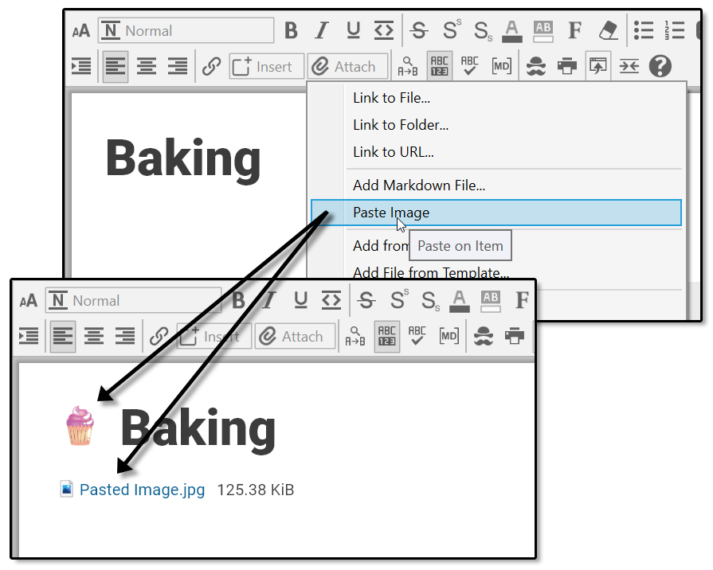

**Figure 248. Pasting In an Image**

**Using the “Save As” Command**

You can use any application’s “Save as” command to create a new file inside your brain. For example, if you have opened a Word file that is an internal attachment to a thought, you would click the

**File**

menu, click the

**Save as**

command, then enter the name of the new file to create. The new file will automatically appear in a tab of the thought’s content area.

**Viewing Related Thoughts in the Content Area**

Have you ever wondered whether content in one thought’s note is referencing another thought in the same brain or even if the thought you are on is being

referenced in another note—but you figured it might be too complicated to go searching? Without your having to do anything, the content area displays all

related thoughts.

Related thoughts do not have to be visible in the plex in order to display in the content area.

**Thought Mentions**

When a thought name appears within notes, your brain recognizes it automatically as a “mention.” Both plural and singular forms of the text are recognized, so exact matches are not required.

**Figure 249. A Thought Mention Underlined in a Note**

Right-click on a Mention in a note to either link to or activate this thought.

**Figure 250. Context Menu When Right-Clicking on a Mention**

Below the note are options for displaying more related content within the same brain by opening Mapped Links, Backlinks, or Unlinked Mentions in a footer that can appear below the note:

**Mapped Links:**

Thoughts that are connected in the plex as parents, children, jumps, or siblings (but do not necessarily have text in common)

**Backlinks:** Thoughts whose notes link to the active thought

**Unlinked Mentions:** Thoughts whose notes contain the name of the active thought⎯even if not explicitly linked

Click on any thought name in this display to navigate to that thought. Right click on any thought name to open a context menu with the following options for modifying the relationship between the active thought and the selected thought:

- Link as Parent
- Link as Jump
- Link as Child
- No Mapped Link (unlink)

While mapped links refer to thought names, backlinks and mentions display both the names of the related thoughts and the context of the notes in which they appear.

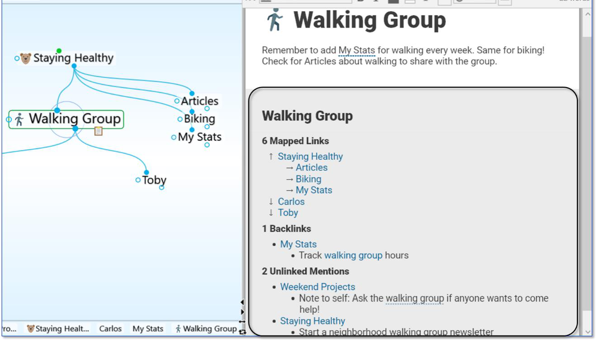

**Figure 251. Content Area with Related Thoughts in the Footer**

**Using Related Thought Links**

You can activate any related thought by clicking its link in the content area footer. This enables you to add content to one note from another via links or mentions.

**Figure 252. Two Kinds of Links for Related Thoughts**

- Click asolid**blue link** to activate that thought.
- In the footer, click a dashed underline link to display the **Link this Mention**

command. Once it’s linked to the existing mentioned thought, it will move

from the **Unlinked Mention** section to the **Backlinks**section in the

content area.

**Figure 253. After an Unlinked Mention is Linked**

Note that while links appear in **blue** by default, you can easily change their

color. To do so, select

**Brain Theme**

in the

**Options**

menu, then click the color

of your choice on the **Colors** tab for the **Links** entry. Click **Save Theme** to

save your change.

**Hiding or Showing Related Thoughts**

To hide mapped links, backlinks, or unlinked mentions in the content area:

- Right-click in the Notes area, then click **Show Mapped Links, Show**

**Backlinks**, and/or **Show Unlinked Mentions** in the context menu.

To restore the thought names and/or links and mentions:

- Right-click within the Notes area and click **Show Mapped Links, Show**

**Backlinks**, and/or **Show Unlinked Mentions** in the context menu.

Note that hiding or showing related thoughts is global and applies to your entire brain.

**Figure 254. Context Menu Below Notes**

You can also use the **Notes Editor** tab in **Preferences** to hide or display links and mentions in the content area.

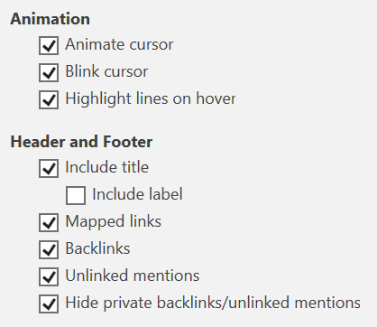

**Figure 255. Links and Mentions Section in Notes Editor Preferences**

**Collapsing and Expanding Related Thought Sections**

When you hover over the area to the left of the related thoughts, you’ll see down- and right-arrows.

- Click the down-arrow to the left of the current thought name to collapse the entire list. This symbol will become a right-arrow which you can click to expand the entire list.
- Click any other down- or right-arrow to expand or collapse that section or item.

**Figure 256. Collapsing or Expanding Sections**

You can also collapse and expand sections within note text in a similar way when Heading styles are used.

**Aggregating Content**

The data in your brain can be aggregated automatically with just a few simple mechanics. When data is aggregated, you can see content from notes about the same subject throughout the thoughts in your brain all at the same time. This ability is powerful and magical!

In the example below, the four backlinks comprise every note that begins with a

“George” heading throughout the brain, organized by the name of the thought

that contains one or more “George” headings.

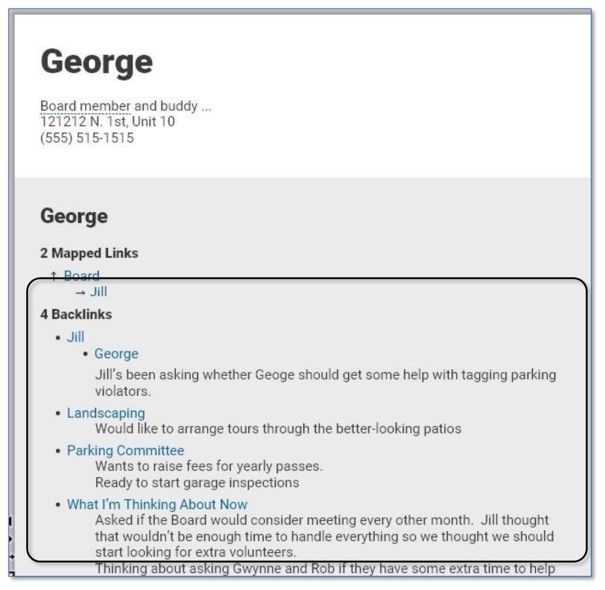

**Figure 257. Aggregated Data for “George”**

**To prepare data to be aggregated:**

1. Create a thought whose name represents the information you want to see aggregated. In the Figure 257 example, that thought name is “George.” 2. In any thought that has information about “George” (following this example), precede the information with a standalone paragraph. This paragraph should simply have the text that matches the name of the thought for which you want aggregated data—“George” in our example. The text should be attached to a Heading stye.

**Figure 258. “George” is Formatted as a Heading 3**

3. Link the Heading by right-clicking it, then selecting **Link (*thought name*)**.

**Figure 259. Linking the Heading to the Thought of the Same Name**

4. In this scenario, the backlink content on the George thought will display all text until it comes to the next #3 (Heading) formatted text.

Any time you activate the “George” thought, you’ll see the information

aggregated, as in Figure 257.

When selecting text in a note, you will have the option to

**Add Linked**

**Thoughts to Selection**

if backlinks are also selected.

**BrainBox**

BrainBox lets you send information to your brain quickly and easily. Just click the icon in the top-right corner of TheBrain for Windows or macOS for instant access. Use BrainBox for adding information on the go, from your desktop, from the web, anything that you want to quickly capture into your brain, to be categorized later.

To add content from the web tnsion in

your preferred browser. Go to and follow the instructions there.

**Accessing BrainBox**

**The BrainBox Button**

At any time, when you have a brain open, use the **BrainBox** button in the upper-right corner of the window to add previously captured content into your brain. 1. Click on a brain to open it.

2. Navigate to the desired thought where you want to add your content. 3. Click on the BrainBox icon to display its content.

4. Hover over or click any item to display the choices for the item.

**Figure 260. The BrainBox Button**

5. From here, the file or web page can be:

▪ Added as an internal attachment on a new child thought below the current active thought. The new thought name will be the file or web page name

▪ Added as an internal attachment to the active thought

▪ Opened in its default application

▪ Renamed, deleted and other actions applied from the context menu button

▪ The context menu will also allow you to either **Move** from BrainBox to the active thought or **Copy** from BrainBox

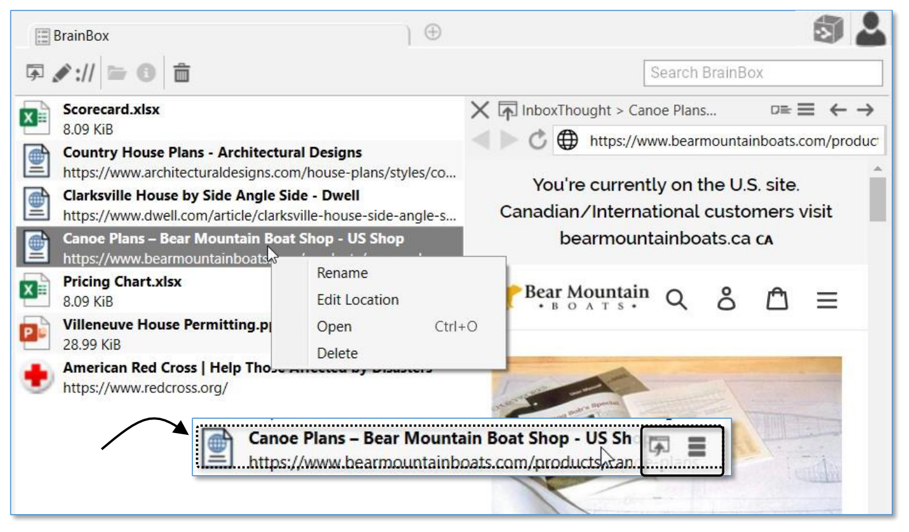

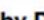

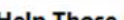

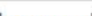

**BrainBox**

**The BrainBox Tab**

An alternative way to view and manage the content of your BrainBox is available by opening BrainBox in its own tab.

**To open BrainBox in its own tab:**

▪ Click the **Open BrainBox** button, click the drop-down **Show Commands** menu, then select **Open BrainBox in New Tab**.

**Figure 261. The BrainBox Tab**

Use the **BrainBox** tab to review, edit or delete existing content in your BrainBox. If you move your BrainBox tab to a new window, you can then drag and drop items into another Brain. You may also select multiple items in BrainBox at a single time to drag into a Brain or right click and delete.

**OR on**

**mouseover**

**Figure 262. Editing Content of The BrainBox**

1. Point to or click an item listed in the BrainBox to select it.

2. Use the context menu or the choices that appear on mouseover to: ▪ Open item in its native application for preview

▪ Edit the file or link name

▪ Edit the URL

▪ Open in Explorer or Finder

▪ Delete the item from your BrainBox

Multiple items can be selected in BrainBox allowing you to move, copy or delete multiple items at one time

.

**Figure 263. Working with Multiple Attachments in BrainBox** Additionally, from the BrainBox **Show Commands** menu, you can access the cumentation available at

**Sending Web Pages to BrainBox**

Add information from any web browser with a single click. When you find a page you want to capture to be organized later in TheBrain, just click the BrainBox extension button or bookmarklet (depending on your browser).

You must be logged into your brain account at in the browser you are using in order for the web pagd into your BrainBox. If you are not logged in, clicking on the BrainBox extension from your browser will prompt you to do so in the status screen. Once you have logged in, return to the desired web page and click the BrainBox button again.

You can use the browser extension or bookmarklet from any computer, even if TheBrain application is not installed on that device.

**Figure 264. Clicking on the BrainBox Extension**

**Sending Files to BrainBox**

Send copies of individual files into your BrainBox to be organized and associated with thoughts at a later time. No additional setup for this feature is required.

**Windows File Explorer *Send to* Integration**

From Windows File Explorer, right-click on any file and select **BrainBox** from the **Send to** submenu. TheBrain will be started if it is not already running and the file will be added to BrainBox. To set up the Windows File Explorer integration, install and run TheBrain 13.

**Figure 265. Sending a File to BrainBox**

**macOS Dock Drag and Drop**

Launch TheBrain application if it is not running already. From any Finder window, drag and drop any file to TheBrain icon in the macOS Dock. The file will be added to BrainBox. You can also drag the icon from the title bar of many macOS apps.

**Producing Reports Producing Reports**

Reports are an excellent way to manage large groups of thoughts in your Brain.

To open a brain's Report area, click the **View** menu then click the **Report** command. You may also click on the **Right Panel** button next to the search box. The report pane is resizable.

**Figure 266. Viewing the Report Area**

**Selecting Report Criteria**

The **Thoughts** drop-down list includes the following options and each selection provides additional criteria choices for fine-tuning your reports.

**Figure 267. Thought Options for Reports** You can run reports based on the criteria discussed below.

**By Types/Tags**

The **By Types/Tags** option in the **Thoughts** drop-down helps you filter thoughts in your Report by checking for specific thought Types and Tags for thoughts and/or for links. All thoughts or links that don’t meet the criteria will be excluded from the report. By default, thoughts of any Type will be included.

▪ Click the field to the right of **Types** (which will display “Any” if no Types have been selected yet), then select the check box for each thought Type to be included. Click outside of the list to close it.

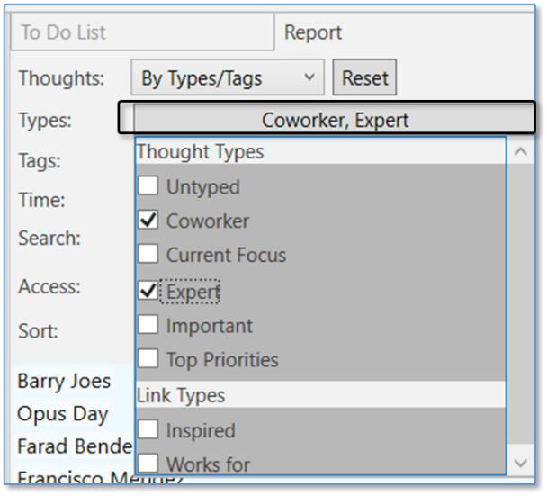

**Figure 268. Selecting Thoughts by Types**

Use the **Tags** field to filter thoughts based on your assigned Tags.

**Figure 269. Filtering a Report by Tags**

Clicking on a Tag in the list will add a “**+**” next to it, indicating that you want to list thoughts that have that Tag. Clicking the same Tag again will add a “**-**“ next to it.

This indicates that you do not want thoughts with that Tag listed. Clicking the same Tag once more will remove it from your list of filtered Tags.

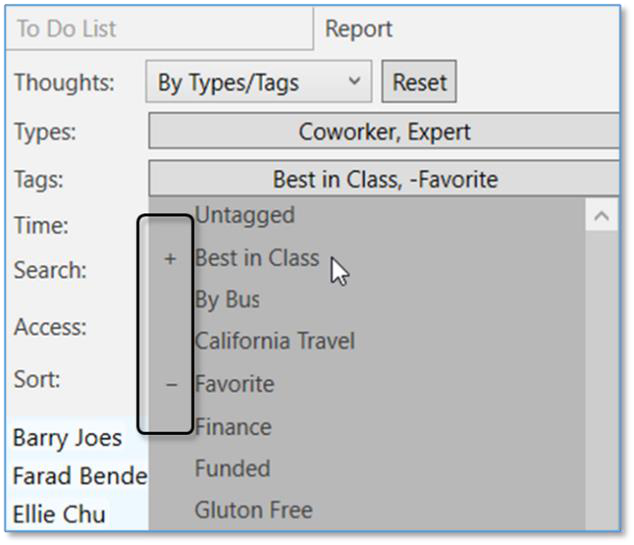

**Figure 270. Filtering With and Without Tags**

Use Types and Tags together in a report for some incredibly powerful thought filtering. When your report is displayed, you can click on any result to

immediately navigate to the thought.

**Forgotten Thoughts**

The Forgotten thoughts selection allows you to quickly view and access any thoughts you have forgotten in a brain.

**Figure 271. Forgotten Thoughts Report**

With **Forgotten** selected in the **Thoughts** drop-down, you can use the menu button to add all forgotten thoughts in your report to your Selection, remove all forgotten thoughts in your report from your Selection, permanently delete all forgotten thoughts in your report, or remember all forgotten thoughts in your report.

**Figure 272. Choices for Forgotten Thoughts**

As soon as you click any forgotten thought in the list, a “Showing Forgotten thoughts” message will display above the plex. Click any forgotten thought in the report to display that thought in the plex.

**Figure 273. Showing Forgotten Thoughts**

**Parentless Thoughts**

Select **Parentless** in the **Thoughts** drop-down to quickly view and access any thoughts that do not have a parent.

**Figure 274. Parentless Thought Report**

Viewing a Parentless Thought Report is great for tying up any loose connections or finding groups of disconnected "satellite thought clusters" in your brain for easy reconnection and clean-up.

Orphan thoughts will also appear in a Parentless Thought Report. Jump

thoughts (when they have no Parent) will frequently appear in this report as well.

**Orphan Thoughts**

Select **Orphan** in the **Thoughts** drop-down to quickly view and access any thoughts that do not have any other connections.

**Figure 275. Orphan Thought Report**

Viewing an Orphan Thought Report is an excellent way to find lost thoughts or thoughts that may have inadvertently been disconnected at some point. Is there a thought you know you had in your brain? Try running an Orphan Thought Report to see if it was previously unlinked by accident.

**Duplicate Names**

Select **Duplicate Names** in the **Thoughts** drop-down to quickly view and access multiple thoughts with the same name.

**Figure 276. Duplicate Names Report**

Viewing the Duplicate Thoughts Report can help you organize and manage your brain to make sure you are getting the most out of your information with quick access to the most important thoughts.

**By Attachments**

Select **By Attachments** in the **Thoughts** drop-down to quickly view and access all thoughts that have an attachment. By default, only internal attachments will be included and you can use the Type drop-down list to fine-tune as needed.

**Figure 277. By Attachments Report**

**Filtering by Modification or Creation Date**

All report options except **Duplicate Names** can be further narrowed down using

the **Time** drop-down selections. This is incredibly useful for finding information

modified within a specific date range and allows for even more in-depth reporting.

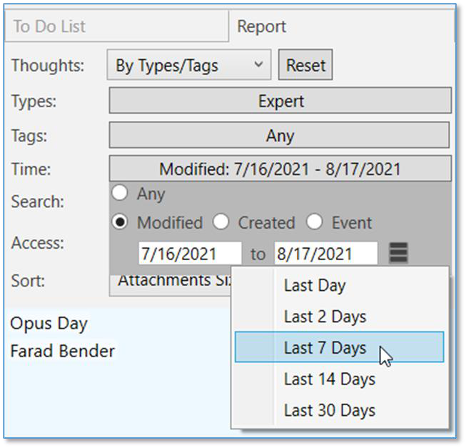

**Figure 278. Filtering Thoughts in a Report by Modified Date**

▪ Select **Modified**, **Created**, or **Event** to specify what the date range should

pertain to. For example, select **Modified** if you want to see thoughts you

made changes to within a specific period of time.

▪ Click in the first date field to display a calendar, then select a date; click in the

“to” date to select an end date.

▪ Additionally, you can click on the context menu button to select from a preset

list of date ranges:

o Last Day

o Last 2 Days

o Last 7 Days

o Last 14 Days

o Last 30 Days

▪ Select **Any** if you want to remove the time criteria.

**Sorting Report Results**

Use the **Sort** drop-down to switch the list order of your report results between

**Name**, **Date Modified**, and **Attachment Size**.

▪ Reports sorted by Name will appear in ascending order, A-Z

▪ Reports sorted by Date Modified will appear newest first

▪ Reports sorted by Attachment Size will appear with the largest total

attachment sizes highest in the list

**Figure 279. Sorting Thoughts in a Report**

**Refreshing or Resetting Report Results**

▪ Click the **Refresh** button to update the list of thoughts that match your report

criteria.

**Figure 280. The Refresh Button**

▪ Click the **Reset** button to clear all report criteria except the **Thoughts** field

and the **Sort** field selections.

**Figure 281. The Reset Button**

**Adding Report Results to the Selection Panel**

▪ Click the menu button, then click **Add All to Selection**. All report results will

be added to the Selection panel where you can apply actions to the thoughts

all at one time. Right-click in the Selection area to see your choices.

**Figure 282. Adding Report Results to the Selection Panel**

**Saving and Accessing Reports**

Reports can be saved and used again at any time.

**To save a report:**

1. Click the **Save as** command on the menu.

2. Type a name for your report, then click the **OK** button.

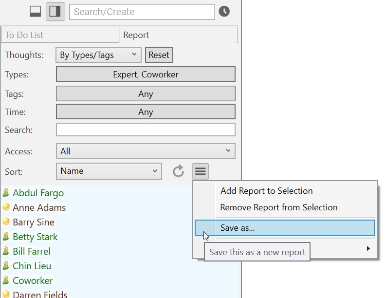

**Figure 283. Saving a Report To open a saved report:**

1. Click the **Saved Reports** command on the menu.

2. Click the name of the report you want to open.

**Figure 284. Saving a Report**

**Viewing a List of Recent Changes**

You can view a quick report of all changes you’ve made recently to thoughts.

Your thought modifications are now logged and instantly viewable in a chronological display of the previous 1,000 created and modified thoughts.

Modifications can include:

▪ Renaming

▪ Editing, adding or deleting attachments

▪ Any edit to the thought notes

▪ Renaming

▪ Linking or unlinking to another thought

To view your recently modified thoughts, simply click on the clock icon to the right of the Search box. Modified thoughts will be displayed starting with the current date. When you hover over a thought, a comprehensive, time-stamped report of the exact modification(s) appear in a pop-up next to the name.

**Figure 285. Recently Modified Thoughts and Links**

**Find and Replace**

Find and replace all occurrences of text within thought names and labels, link labels, external attachment paths and URLs.

▪ Includes support for regular expressions.

▪ Can be applied to the entire brain or to a group of selected thoughts.

▪ Changes are undoable however it is still highly recommended that you create a brain Archive (.brz) prior to performing a large Find and Replace operation on an important brain.

**To begin replacing:**

1. Open the **File** menu, select **Utilities**, then select **FindandReplace**. 2. Enter the text to be replaced and the text to replace it with.

3. Specify where the text occurs. The available locations are: ▪ Thought Names

▪ Thought Labels

▪ Link Labels

▪ External Attachment Paths

▪ Attached URLs

4. Use the check boxes to specify whether letter case is to be ignored and if

you want to use regex (regular expressions, which allow sophisticated

pattern matching capabilities).

5. Preview your results prior to executing the change and click **Replace** when

you’re ready.

**Figure 286. Find and Replace**

Additionally, the content area toolbar has its own Find and Replace functionality.

**Statistics**

Curious about the content of your brain? Click the **File** menu and select

**Statistics** to view in-depth details such as:

▪ Date Generated

▪ Last Sync Date

▪ Number of Thoughts

▪ Number of Links

▪ Average Number of Links per Thought

▪ Internal File Size and Total Icon Size

▪ Number of Notes, Attachments, Web Links, Icons and more …

**Managing Events**

Your brain has its own built-in Calendar. You can access it from the content area or the Timeline View to add and modify events and integrate them with your thoughts. You can view your Calendar a day, week, month, or year at a time.

TheBrain also has several different ways to assist you with managing your time, so you’ll know when events are taking place, when content was edited and when projects are due.

**Creating an Event**

You can create a new event from the content area or from the Timeline. Both methods give you full access to all event settings. Events support spellcheck and markdown formatting in their descriptions.

**Creating an Event from the Content Area**

1. Select the thought with which the new event will be associated.

2. Click the **Attachment** button in the content area toolbar, then click **Create** **Event**.

Events created from the content area are automatically associated with the active thought, but you can easily detach them.

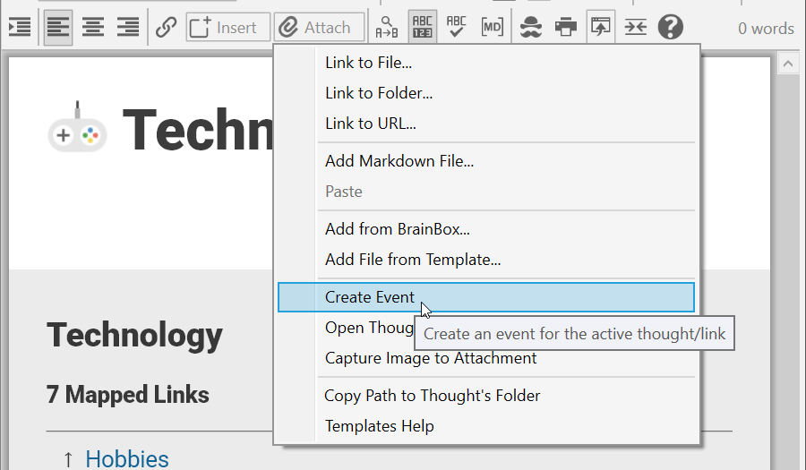

**Figure 287. Creating a New Event in the Content Area**

Use the event editor pop-up to enter details about the event. By default, the name of the event is the name of the active thought.

As shown below, you can specify start and stop times and dates and add a label, description, and location in the event editor pop-up. You can make the event recurring and set up a reminder. You can also color code an event—so that all events of a specific type (personal, marketing, finance, etc.) will appear in your Timeline view in an identifiable color. Event will inherit from colors from

associated thoughts.

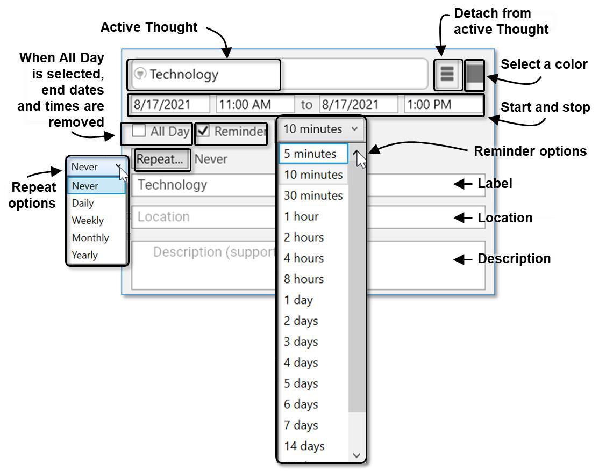

**Figure 288. The Event Editor**

**Creating an Event from the Timeline**

1. Unless it is already open, display the Timeline by clicking the **Timeline** command in the **View** menu or the **Timeline** button to the left of the Search box.

**Figure 289. Launching TheBrain Timeline**

2. Drag on the time ruler at the bottom to select the start and stop times of the event. After you finish dragging, the event editor will be displayed. By default, this will be a standalone event, not associated with the current active thought. You can easily attach it to the active thought by clicking **Attach to** “*active thought*” in the event editor menu.

**Figure 290. Click and Drag to Create a New Event**

Please see the Navigating in Timeline View section on page 235 for

information about using the Timeline and 1-click fine-tuning based on your preferences.

**Responding to Event Reminders**

Reminders appear when the brain containing the event is open.

**Figure 291. TheBrain’s Event Reminder Pop-Up**

From the **Reminder** window, you can snooze for a designated amount of time or

dismiss the reminder. Dismissing the reminder does not delete the event in your

timeline.

**Editing and Deleting Events**

**To edit or delete an event from the Content Area:**

▪ In the content area for the Thought associated with the event, right-click the

event you want to work with, then choose a command from the context menu.

Choose **Properties** to edit the details of the event.

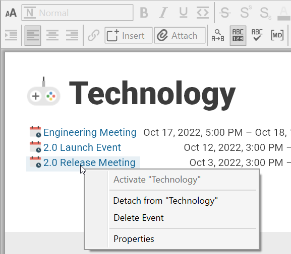

**Figure 292. Editing and Deleting Events in the Content Area**

**To edit or delete an event from the Timeline:**

▪ To edit, click the event to open the event editor pop-up.

▪ To delete, right-click the event on the Timeline, then click **Delete Event**. You can also delete the event by selecting **Delete Event** in the event editor pop- up.

**Figure 293. Editing and Deleting an Event in the Timeline**

**Navigating in Timeline View**

▪ Drag in the background of the timeline up and down to zoom in and out.

**Figure 294. Click and Drag Up and Down to Zoom** ▪ Drag left and right to scroll through time.

▪ Buttons allow you to switch between day, week, month and year view. Or, navigate to a specific day in the mini calendar.

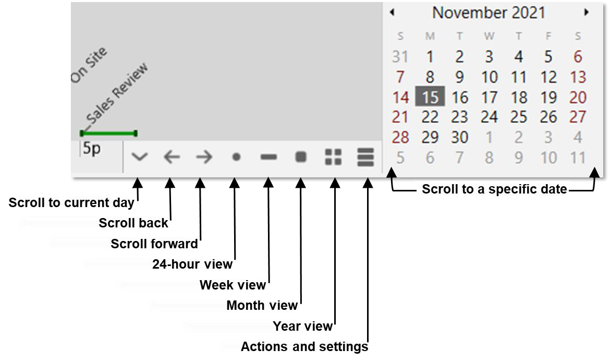

**Figure 295. TheBrain Timeline Buttons**

Events associated with **Forgotten Thoughts** will only appear in the timeline if

Forgotten Thoughts are being viewed in the plex. Like the faded display in the plex, the thought’s event will also appear as faded text.

**TheBrain Icons**

TheBrain includes nearly 2000 built-in icons for your thoughts, Types, and Tags. Choose from 22 different categories such as Animals, Emojis, Food, Multimedia, and Technology, to name a few. Here are some examples:

**To select a Brain icon to be added to a thought:**

1. Right-click the thought, then click **Select Stock Icon** or open the **Thought Properties** dialog box, click the thought icon box, then click the **Select Stock Icon** command.

**Figure 296. Two Ways to Access Select Stock Icon**

2. Select the Browse radio button and choose a category from the list

below. The name of the icon will appear when you hover over it. Click

on an icon to add it to the active thought.

**Figure 297. The Food Category**

Additionally, you may select one of the other radio buttons:

▪ **Search**—Type a keyword to filter all icons that match that result

▪ **Suggestions**—Automatically filters the icon list by using the thought name as

the search criteria

▪ **Random**—72 random icons will appear; click the **Shuffle** button to see a new

set of icons

▪ **Recent**—Displays all recently selected icons

**Online Menu Options**

The **Online** menu in TheBrain toolbar provides access to your Cloud Services settings from your desktop client and helps you share thoughts and brains

quickly.

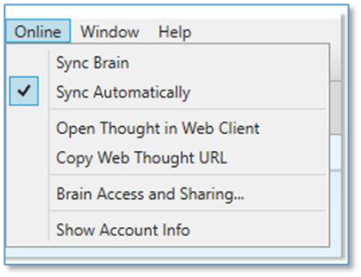

**Figure 298. Online Menu Options**

Click the **Online** menuin TheBrain’s toolbar to access the following features:

**Sync Brain**—Synchronizes the current opened brain to your Cloud account.

**Sync Automatically**—Toggle on or off automatic synchronization, once your

brain is already synchronized to your Cloud account.

**Open Thought in Web Client**—Launches a Browser window and automatically loads the current brain/thought from TheBrain Cloud.

**Copy Web Thought URL**—Copies the current active thought’s online URL to your system clipboard. This saves you the hassle of launching a new browser window to log into your Brain Cloud account and navigating to a specific thought

in order to acquire its URL.

**Copy Web Thought URL**

and

**View in Browser**

will only work if you have synchronized your brain to TheBrain Cloud.

**Brain Access and Sharing**—This is a quick way to switch a brain’s Access Control Level (public or private), copy the brain’s online URL or grant a new TeamBrain member access. You may also type in an email address to share a

read-only copy of your brain with someone else.

**Show Account Info**—Easy access to managing your external accounts and logging out of TheBrain Cloud.

**Using Mobile Versions of TheBrain**

Access your ideas and information on all your devices—including iOS and Android. TheBrain for mobile devices combines the best of note-taking, file synchronization, and mind mapping apps to give you the ultimate digital memory everywhere you go.

The iOS and Android apps include the ability to sync your brain so you can access it without an Internet connection. Once you download your brain locally to your mobile device, just click the **Sync** button after making edits or if edits have been made to TheBrain Cloud.

**Figure 299. Syncing TheBrain on iPhone**

e at

**Share, Synchronize, and Back Up Your Brains**

You can use TheBrain Cloud to publish and share your brain. People can view your published brains whether or not TheBrain is installed on their machines.

**To create a Brain account:**

1. Go to then click the **Log In** button in the top-right area

**Figure 300. Sign Up Button**

2. Click the **Sign up** button.

**Figure 301. Login Button**

3. Complete all fields in the **Sign Up** form, then click the **Sign Up** button. You will see a message explaining that a confirmation notice has been sent to the email address you provided. When you receive the message, follow its instructions to click the link and activate your account.

Allow a few minutes for the email to be delivered. Check your spam folder if the message doesn’t arrive within a reasonable amount of time.

4. Now you can return to the www.thebrain.com page and click the **Login** button to log in using the information you provided when you signed up.

**Synchronizing Your Brain**

With TheBrain and TheBrain Cloud Services you can use your brain on multiple computers and synchronize changes. Any changes you make to your brain on one machine will be reflected on every other machine through synchronization!

Cloud synchronization is protected using 128-bit AES Encryption. (This is the same encryption used by the US government to protect classified information.)

Port 443 is used for encrypted syncs. If your IT staff is using a firewall, you can ask them to add WebBrain.com and api.thebrain.com to the white list of your company's firewall. If your IT staff is using a proxy, you will need to try setting up a Proxy connection via TheBrain by using the options found in TheBrain’s Preferences > System tab.

Make sure you have created an account on TheBrain.com before you begin synchronizing. Some Cloud services require a subscription fee.

**To synchronize your brain:**

1. Open the brain you wish to sync. Click the cloud icon in the menu bar, or click the **Online** menu, then click the **Sync Brain** command.

**Figure 302. The Cloud Icon in the TheBrain Toolbar**

**Figure 303. Sync Brain Command**

2. Click the **Upload** button to upload this local brain.

**Figure 304. Confirming Upload**

3. A progress indicator shows you the upload is taking place, followed by a brief confirmation message.

You can keep working while the synchronization process is continuing in the

background. If there is an interruption during an initial upload of your brain, TheBrain will offer to resume from where it was stopped the next time you synchronize.

3. When the process is complete, just go to the other computer on which you want to access your brain. Open TheBrain application and log in. From the list of available brains, click on TheBrain thumbnail, then click the

**Download** button when it appears.

**Figure 305. Download for Local Use**

4. To synchronize at any time, click the cloud icon in the menu bar or the **Sync Brain** command in the **Online** menu. The active copy of your brain will include the latest changes.

Once your brain has been synced, your brain will be automatically set to auto-

sync. To turn this feature off, click the **Sync Status** button next to the Cloud icon

in the tool bar.

**Figure 306. The Sync Status Button**

The Sync Status will also display if local changes or online changes are available

or if the sync is up to date. The last sync date will also be displayed.

Brain thumbnails in your list of available brains will indicate if a brain is local only,

local and online (synced) or online only.

**Figure 307. Brain Location Indicators**

**Editing Your Online Brain**

The desktop application has more available features than the web client, but you

can still access and edit your online brains by performing any of the following

activities:

▪ Create and Forget Thoughts

▪ Change thought locations (child to jump)

▪ Unlink thoughts

▪ Set Pins

▪ Edit Notes

▪ Add Attachments

You can only edit brains that YOU own.

**To edit notes in your online brain:**

▪ Click in the content area and make any changes you like. The revised note

will be saved automatically as soon as you click on another thought.

**Sharing Your Online Brain**

All brains synced to are private and not accessible to

other users without entials. To share a Version 12 brain

with other users:

▪ Open the brain in your local desktop application

▪ Click the **Online** menu, then click **Brain Access and Sharing…**

▪ You have two different options for sharing your brain:

o**Option 1:** Click the **Allow Public Access** check box and **share the Web**

**Link** with others. This is a great option for sharing your brain with a large

group of other users or other users that do not use TheBrain software.

Anyone with the URL will be able to view your brain in read-only mode in

their web browser.

o**Option 2:** Leave **Allow Public Access** unchecked and type in an email

address to **invite individual users** to access your brain. This is a good

option if you want other users to be able to download a local, read-only

copy of this brain to their desktop app. The other users must have

TheBrain installed and be logged in to their Brain account with the email

address you specified.

**To prepare your brain to be shared:**

1. Activate the thought that you want to be the Home thought when your brain

is viewed. It will be the first thought your viewers see.

▪Right-click the thought, then click the **Set as Home Thought**

command

The current wallpaper and color theme will be included in your published brain.

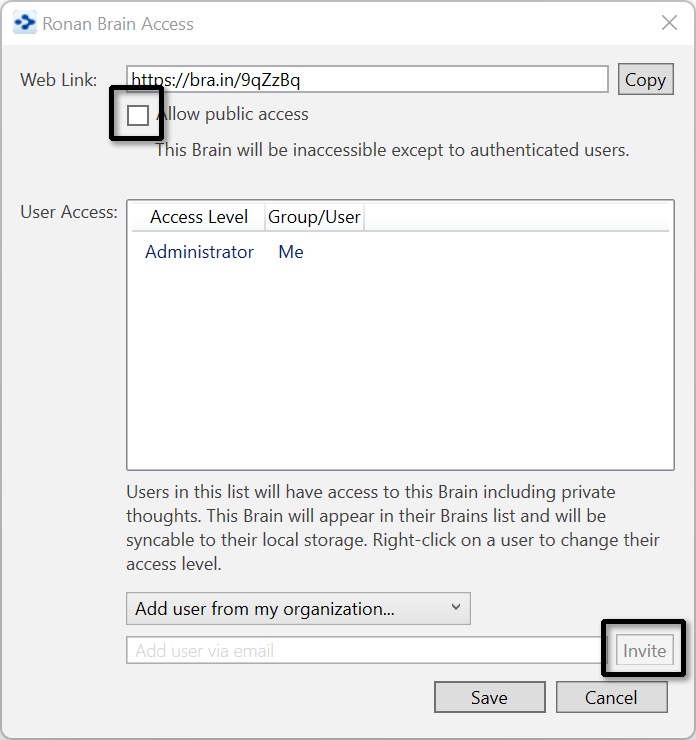

**Figure 308. Brain Access and Public URL**

**Creating a Brain Archive to Send Your Brain to Others**

You can send your brain as an email attachment. To make the attachment as small as possible, you can use TheBrain’s **Backup to Brain Archive** feature to create a compact file.

**To create a Brain Archive:**

1. Click the **File** menu, then click the **Backup to Brain Archive** command.

2. In the **Backup to Brain Archive** dialog box, select either of the Access Control options.

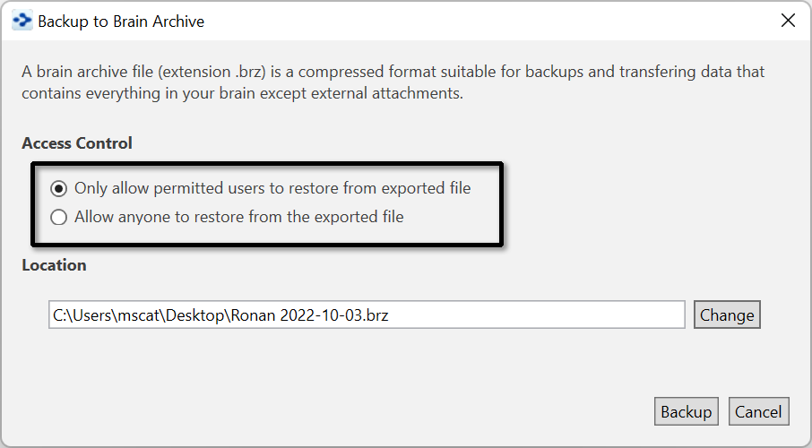

**Figure 309. Create Brain Archive Options**

3. If necessary, click the **Change** button to change the file name or the folder where the archive file will be saved. Do not change the filename extension, which is .BRZ. Click the **Backup** button to create the archive file.

Make a note of where you are saving your archive file so that you can locate it easily when needed.

A brief message will display in the toolbar area as the archive is created.

Brain Archive files are NOT .zip files. You should not use zip file utilities to modify or access your archive files as doing so may corrupt them.

**Copying Thoughts into Other Applications as an Outline**

You can copy thoughts from the Selection panel into other programs such as Microsoft Word or Excel and the thoughts will be formatted as an indented hierarchical list.

**To copy one or more thoughts into another program as an outline:**

1. Select all of the thoughts you want to include in the outline (**Ctrl**-click on a thought to add it to the selection or use the commands on the **Edit** menu to quickly create a selection).

2. Right click in the Selection panel and then click the **Copy as Text Outline** command.

**Figure 310. Copying Thoughts as an Outline**

3. Open the other application and click where the outline version of the thoughts should be inserted.

4. Right-click and then click the **Paste** command on the context menu (or click the **Edit** menu and then click the **Paste** command).

**Figure 311. Samples of Outlines Created by Pasting Thoughts from TheBrain**

**Copying Outlines with Notes**

You can copy selected thoughts along with their notes and place them in a tabbed outline.

1. Select the thoughts to be copied, then right-click in the Selection panel to open the context menu.

2. Click the **Copy as Text Outline with Notes** command.

3. Switch to Word or any other text application of your choice and press **Ctrl**-V (or use the program’s command for pasting).

**Pasting a Text Outline as New Thoughts**

You can select tab-delineated text in another application, copy it, then paste it into your brain. Each paragraph of text will become a child thought (and possibly an attachment) of the active thought, based on the formatting of the text.

Pasted outlines may include labels, attachments, and notes. If a URL is included, it is added as an attachment to the thought in the outline entry above the entry containing the URL.

**How TheBrain converts content from the source file:**

▪ Each line that ends with an “Enter” or “Shift-Enter” becomes a thought

▪ A multi-line paragraph with no manual line breaks becomes a thought

▪ Indentation created using tabs show hierarchical relationships

▪ Lines starting with a hyphen (-) are added as notes

▪ Lines starting with a plus sign (+) are added as web link attachments

▪ If a pipe (|) symbol is inserted, content to the left of the pipe will be the thought name and content to the right of the pipe will become a label (if all content is in the same paragraph)

**Example:**

The following text adds a thought named “Steve Jobs” with the label “Founder of Apple,” a link to Wikipedia, and a note containing a quotation.

Steve Jobs | Founder of Apple

+ http://en.wikipedia.org/wiki/Steve_Jobs -"I want to put a ding in the universe."

---

**Figure 312. Example Thought from Text with a Pipe, Link, and Note**

**Importing Information into Your Brain**

**Importing Folders and Mind Maps**

**Figure 313. Importing Folders and Mind Maps**

You can import folders and Mind Maps into your brain. When you import a folder, it becomes a child thought of the active thought.

**To Begin Importing:**

1. Activate the thought that will receive the imported information.

2. Click the **File** menu, then click the **Import** command.

**For a Folder:**

▪ Click**Folders**, select the **Add to** … button, click the **Select Folder** button, navigate to the folder of your choice, then click the **OK** button. Click the **Import** button as soon as it becomes available. Click the next **Import** button to confirm that you understand this import can’t be undone. Each folder will become a thought, every file inside the folder will become and attachment, and any subfolders will become child thoughts.

**For a Mind Map:**

▪ Click**MindManager (.mmap)**, select the **Add to** … button, click the **Select** **File** button, navigate to the file of your choice, then click the **Open** button. Each of the topics or ideas will become a separate child thought of the active

thought.

**Importing TheBrain 8 XMLs**

Version 8 brains that have been exported into an XML format (or properly-formatted XML that has been generated outside of TheBrain) can easily be

imported back into another brain as a child of the active thought.

1. Activate the thought that will receive the imported XML.

2. Click the **File** menu, click the **Import** command, then select the **Add to** …

button.

3. Click **TheBrain 8 XML**, click the **Select File** button, navigate to the file of your choice, then click the **Open** button.

**Merging Brains**

You can merge two brains together by importing a Brain Archive file (.BRZ):

1. Open the brain that you want to merge into another brain, click the **File** menu, then click the **Backup to Brain Archive** command.

2. Note the location for the new .BRZ file, then click **Backup**.

3. Open the brain that will receive the merged brain, navigate to the thought where you want the .BRZ file to be added as a child, click the **File** menu, then click the **Import** command.

4. Select the **Add to “*open brain name”* and link to “*active thought name”*** option, then click **Brain Archive (brz)** in the list.

**Figure 314. Merging Brains**

5. Click the **Select File** button, then navigate to and open the initial .BRZ file you created in the first step. Click the **Import** button. You will be prompted

to confirm that you want to continue, since importing a .BRZ file can’t be undone.

The only brain that is changed is the one that is open when you begin the merge procedure. The brain you select during step 1 is not changed at all.

**Encrypting Individual File Attachments**

You can encrypt individual file attachments within your brain using the **Encrypt** command on an attachment’s context menu.

AES 256 bit encryption ensures that without the password, it is impossible to recover the file contents from the encrypted file—even with administrator access to the machine where the file is stored on a local computer or remote cloud server.

Encrypted files cannot be searched and can only be decrypted via Windows and macOS versions of TheBrain. These files are completely inaccessible even to your hosting provider whether that be a private TeamBrain Enterprise Server or TheBrain Technologies Cloud Server.

**To encrypt a file:**

1. Right-click the attachment, then click **Encrypt** in the context menu.

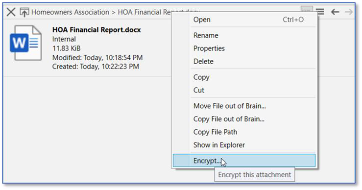

**Figure 315. After Clicking on the Attachment’s Context Menu**

2. Type in the prompt you want the user to see when they attempt to open the file, type a password, click the check box confirming that the file cannot be opened if the password is lost, then click the **Encrypt** button.

**Figure 316. Example Encryption Details**

3. Whenever someone attempts to open the file, they’ll see the prompt you entered. They will have to enter the correct password, then click the **Decrypt** button. After that the file can be opened by clicking on it.

**Figure 317. Decrypting and Opening the File**

To modify an encrypted file, you will first need to permanently decrypt the file. The easiest way to do this is to open the document and **Save As** a new document. Make and save the new modification and return to TheBrain to encrypt the new file.

**Exporting**

TheBrain features several export options. Export your brain data directly to:

▪ **Folders**—Exports the thoughts in your brain by converting them to a folder hierarchy.

o Each thought becomes a folder containing the attachments and notes within it.

o The folder structure attempts to mimic the parent-child relationships between thoughts with parentless thoughts at the top level.

o Shortcuts on Windows and symbolic links on macOS are used to represent thoughts that are under multiple parents.

▪ **Text Outline** (.txt file)—Creates a text outline of thoughts, notes and URLs.

o Indented hierarchy mimics parent-child relationships between thoughts.

o Notes are exported as lines starting with a - (dash)

o URLS are added lines starting with a + (plus)

▪ **JSON Files**—Exports your brain data in JSON format.

o Thoughts, links and other types of data are each exported in their own .json file.

o Attachments and notes are exported into folders based on the ID of the thought or link they are attached to.

o This gives you access to 100% of your data in an open and easily parsed modern text format.

**To export your brain:**

▪ Select **Export** from the **File** menu

▪ Select the output (Folders, Text or JSON) and click on **Export**

▪ The output location must be an empty directory

▪ To export just a portion of your brain, add thoughts first into TheBrain’s Selection panel and then check the option to **Only export the selection** in the **Export** window.

**Figure 318. Exporting a Brain to Folders**

**TheBrain API**

TheBrain can now be controlled by a full-featured REST API. Designed for experienced programmers, the API opens up a world of possibilities. Access to a rich set of functions for querying, creating and modifying all types of data is included. Create thoughts automatically in response to events in the real world. Automate processes for moving thoughts through a workflow. Implement custom import/export logic. Control your brain from your watch or with your voice. These are just a few of the applications that are now open to pursue. Get started now at **https://api.bra.in**.

**Figure 319. TheBrain API**

The available endpoints provide a wide array of capabilities for data access such as: getting thoughts, links, attachments, and notes, performing searches, and exploring the network of connections. Write access is also supported so you can

programmatically create, modify, and delete thoughts, notes, links, attachments, and more.

To assist you in getting started, we have developed a selection of example projects in several widely-used frameworks that showcase the process of making API calls within your program. The Blazor app contains the most example calls.

The Python and Node apps demonstrate the overall structure and creating a thought.

**Glossary**

**Activate** To bring a thought to the center of the plex and make it the active thought.

**Active thought**

**Application**

**Backlinks**

The thought you are working on right now. The active thought occupies the center of the plex. The active thought’s details are described in the **Thought** tab. A thought that is not active can be activated by clicking it, its pin, or its name in a list and pressing **Enter**.

A program such as a word processor, web browser, game, or photo editor.

Thoughts whose notes link to the active thought. Backlinks appear in the content area in a footer under the notes.

**Brain** A collection of associated thoughts each of which can

have content. TheBrain can create multiple brains.

**Child thought**

**Content Area**

A thought with at least one parent. Children of the active thought appear in the child zone, below the active thought. In turn, the active thought is a child of any thought that appears above it in the parent zone.

The content area shows content attached to the active thought or a moused-over thought, depending on the current preference settings. Content can include notes, attachments, links, and web pages that display in the content area’s built-in browser. The content area also automatically displays an area showing Mapped Links, Backlinks, and Unlinked Mentions—related content that has commonalities with the active thought.

**Delete** The complete removal of a thought and/or its content

from a brain. Deletion is permanent.

**Drag and drop**

To use this feature, select the item you want to drag, click the mouse button and drag the item to where you

want it to appear.

**Forget** To remove a thought from TheBrain without deleting it, its links, its content, or its note. Forgotten thoughts can be “remembered.”

**Forgotten thought** A thought that is removed from TheBrain without deleting it, its links, its content, or its note. Forgotten thoughts can be “remembered.”

**Gate** The active thought and its close relatives have three

circular “gates,” each of which is used to link to a

specific relation: The parent gate is above a thought; the child gate is below it; and the jump gate is beside it. A gate is hollow when there are no links through it, and solid when links exist.

**Home thought**

**Jump thought**

The Home thought is the main or top thought of your brain. It is the thought that is activated when you click the **Home** button in the Brain toolbar.

A jump thought is linked to another thought through its jump gate and appears in the jump zone to the left of the active thought. Activating a jump thought produces a more significant reconfiguration of the plex than

activating a child thought or parent thought. This is because jump thoughts of the active thought are related exclusively to the active thought and not to other

thoughts in the plex.

**Link** The act of connecting thoughts thereby establishing

close relations. Also, the line connecting two thoughts

in the plex.

**Link Type**

**Mapped Links**

A category of links that allows you to distinguish how thoughts are related visually. For example, you could

have a Link Type called “writes” set so that links between authors and books display brown with the label “writes.”

Thoughts that are connected in the plex as parents, children, jumps, or siblings (but do not necessarily have text in common). Mapped links appear in the content area in a footer under the notes.

**Navigate** To move from thought to thought by activating thoughts.

**Notes** Every thought can have notes, which are displayed in the content area. Notes can hold any combination of text, images, sound, or shortcuts. The Notes editor includes a word processor.

**Parentthought**

**Parentless**

**thought**

**Past Thought list**

A thought that has at least one child. A parent thought is linked to its child thoughts through its child gate. The active thought is a parent of any thought displayed in its child zone, below it. Parent thoughts of the active

thought appear in the parent zone, above the active thought.

A thought without a parent thought. A parentless thought is often a jump thought or a thought

representing a subject heading or organizer. Usually, the first thought in a brain (generally named after the user) is a parentless thought.

The scrollable list of thoughts at the bottom of the plex, arranged in the order activated. The most recently activated thought is the rightmost thought in the list.

**Pin** An entry point to a brain. Click a pin to activate its thought. A pin is created by dragging a thought to the area immediately below the menu bar. The pin stays there until it is removed by being dragged into the menu bar or title bar. You can also create a pin of the active thought from the thought menu.

**Plex** The visible portion of your brain; it includes the active thought, its close relations, and the links between them. It also includes the Search box, the Past Thought List, and navigation tools.

**Remember**

**Search box**

A thought that has been removed from the plex by

“forgetting” can be remembered by selecting **Showing Forgotten Thoughts** on the **Options** menu, right-

clicking the thought, then selecting **Remember*thought name*** on the context menu.

The field in the top-right area of the plex. Type text in this field to perform an Instant Activation search.

**Siblings** Two or more thoughts with a common parent. When a thought that has siblings is active, its siblings are displayed in the sibling zone, to the right of the active thought.

**Template** A file used as the basis for creating other files.

Template files can be added to the window of the **Add** **Attachment** dialog box.

**Thought** The basic unit of a brain. A thought can represent anything the user wants it to. A thought can have content in the form of a file, shortcut, or web page, or it can be devoid of content and simply act as a subject heading or organizer.

**Thought Type**

A way to categorize thoughts and give them distinct colors. For example, you can have a “Person” thought type so that all thoughts that are people display as green.

**Timeline** The Timeline is the visual tool for using TheBrain’s

built-in calendar. Use it to create, edit, and view events

which can be associated with specific thoughts.

**Unlinked** Thoughts whose notes contain the name of the active

**Mentions** thought⎯even if not explicitly linked. Unlinked mentions

appear in the content area in a footer under the notes.

**Styles** Notes may be formatted using any of TheBrain’s built-in

Styles, which are combinations of font, color, and size.

By default, notes appear in a style called “Modern.”

**Unlink** Unlink thoughts that you no longer want to be related to

any other thought in your brain, or when you want to

remove a superfluous link. You cannot unlink a

thought’s only Link to the active thought.

**URL** Universal Resource Locator; the address of a web site.

**Wander** The option to step randomly through TheBrain, to let

you see thought associations.

**Zones** Areas in the plex devoted to specific relations of the

active thought. There are four zones: the parent zone

above the active thought, the child zone below it, the

jump zone to its left, and the sibling zone to its right.

TheBrain 14 User Guide 261
